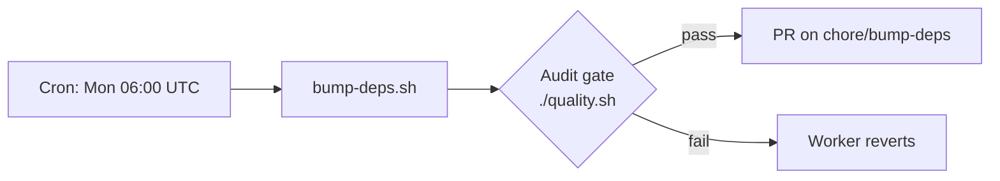

# GRQ Health Monitoring System

A distributed health monitoring system that tracks the status of multiple hosts across different operating systems and timezones. The system provides a beautiful web dashboard to visualize host health status with location tracking, historical records, and smart health logic.

## 🤖 AI Assistant Instructions

**IMPORTANT: This README serves as the primary specification document for the AI assistant working on this project.**

### Before Making Any Changes:
1. **ALWAYS read this entire README first** to understand the current system architecture and specifications
2. **Check the current version** in `run.sh` and increment it for any code changes
3. **Run `./update_version.sh`** after making changes to sync version across all files
4. **Update this README** if you modify system behavior, add features, or change specifications
5. **Test changes** on both desktop and mobile views when applicable

### Current System Specifications:

#### Log Viewer Auto-Scroll Behavior:
- **Function**: `scrollToFirstIssue()` in `log-viewer.html`
- **Current Logic**: 
  1. Find the first issue of any type in DOM order (error, stack trace, or warning)
  2. Scroll to that first issue
  3. If no issues found, stay at the top
- **Highlighted Issues**: ERROR, Exception, Error:, ⚠️ (warning emoji), WARNING, Warning:, DEBUG:
- **Stack Trace Detection**: 
  - JavaScript stack traces: Lines matching `/^\s+at /` pattern
  - C stack traces: Lines matching `/^\s+\d+\s+[^\s]+\s+0x[0-9a-fA-F]+/` pattern (allows periods, hyphens, and other valid characters in binary/library names, requires hex address to avoid false positives from git messages)
- **All issues are counted** in the dashboard exception count

#### Exception Detection in run.sh:
- **Authoritative signal (Issue #127)**: When the log contains
  `[stage-failure-health] failures=N firstStage=S firstExitCode=C firstHitLine=L`
  (emitted by GRQ#2313), `scan_log_errors` trusts that line over every other
  heuristic:
  - `failures=0` → run classified as **successful**; any noisy
    "Task failed with status N" line is ignored.
  - `failures>0` → run classified as **failed**; `exception_count=N` and the
    summary names `firstStage`, `firstExitCode`, `firstHitLine`.
- **Reporting warnings (Issue #127)**: `[reporting-warning] …` lines are
  counted into a separate `reporting_warning_count` field on the per-user
  and per-host JSON, surfaced in `docs/index.json` so operators can
  distinguish three states:
  1. Healthy — `exception_count=0`, `reporting_warning_count=0`.
  2. Healthy with transient reporting issues — `exception_count=0`,
     `reporting_warning_count>0`.
  3. Failed — `exception_count>0`.
- **Legacy fall-back**: Logs without `[stage-failure-health]` (predating
  GRQ#2313) continue to use the original heuristic classifier below.
- **Stack traces**: Lines with "Exception", "Error", "MEMETIC" followed by stack trace lines
- **Missing commands**: "No such file or directory" errors
- **Warning emojis**: Lines containing "⚠️"
- **Permission errors**: "Permission denied", "access denied", "EACCES"
- **All exceptions trigger health updates** regardless of heartbeat timing
- **Excluded**: Lines containing `[MemoryMonitor]` are filtered out before scanning — these are operational cache-clearing messages, not real errors

#### Multi-user Hosts (per-user heartbeats):
- **Problem**: Some machines run multiple unix users; one user's heartbeat can mask another user's stuck state if we only store a single host heartbeat.
- **Storage**: `docs/index.json` stores a per-host `users` map keyed by username, each with its own `heart_beat_ts` (and related fields).
- **Health logic**: The dashboard treats the host as unhealthy if **any discovered user** is stale (uses the *oldest* user heartbeat for host health classification).
- **Logs**: `run.sh` writes only `docs/<HOST>/node-<user>.log` (one file per user). The generic `node.log` is no longer created.

#### Market Feed Repository Freshness:
- **Manual updates**: Each background task updates `docs/repos.json` immediately after it finishes, recording its latest commit/publish timestamp.
- **Helper script**: Use `helpers/update_repo_timestamp.sh` to update (or create) the entry for a service.
  ```bash
  # Record the current run for the dividends service
  ./helpers/update_repo_timestamp.sh --name "dividends"

  # Back-fill with an explicit unix timestamp
  ./helpers/update_repo_timestamp.sh --name "FX" --timestamp 1752806400
  ```
- **Output**: `docs/repos.json` keeps a simple list of objects with `name` and `last_commit_ts`. Example:
  ```json
  {
    "repos": [
      { "name": "dividends", "last_commit_ts": 1752806400 },
      { "name": "FX", "last_commit_ts": 1752720000 }
    ]
  }
  ```
- **Visualisation**: `docs/dashboard.js` and `docs/simple.html` fetch `docs/repos.json` and classify warning/error states (36h/72h thresholds) entirely on the client. The helper script intentionally does no health scoring.

#### Version Management:
- **Primary version**: Stored in `run.sh` VERSION variable
- **Auto-sync**: `./update_version.sh` updates all HTML/JS files
- **Required**: Increment version for any code changes

## Features

- **Cross-platform compatibility**: Works on macOS, Ubuntu, and AWS Linux
- **Automatic health checks**: Monitors uptime, disk space, memory usage, CPU load, and network connectivity
- **Smart updates**: Only updates when heartbeat is older than 12 hours
- **Beautiful dashboard**: Modern web interface with real-time health status
- **Location tracking**: Shows where each host is located with emoji indicators
- **Historical records**: Maintains information about dead machines and MacBook Airs
- **Smart health logic**: 
  - Known dead machines don't affect system health
  - MacBook Airs are expected to be offline and only marked critical after 7 days
  - Slow machines are identified and tracked separately
- **Dynamic page title**: Changes between "GRQ Healthy" and "GRQ Unhealthy" for uptime monitoring
- **GitHub Pages integration**: Automatic deployment of the dashboard
- **Timezone awareness**: Handles hosts in different timezones correctly

## System Requirements

- Bash shell
- `jq` (optional, for better JSON handling)
- `git` (for automatic commits and pushes)
- Basic Unix tools (`uptime`, `df`, `free`, `ping`, etc.)

## Quick Start

1. **Clone the repository**:
   ```bash
   git clone <your-repo-url>
   cd GRQ-health
   ```

2. **Make the script executable**:
   ```bash
   chmod +x run.sh
   ```

3. **Run the health check**:
   ```bash
   ./run.sh
   ```

4. **View the dashboard**: The dashboard will be available at your GitHub Pages URL once you push the changes.

## How It Works

### The `run.sh` Script

The script performs the following operations:

1. **System Information Collection**:
   - Uptime (in seconds)
   - Free disk space (in GB)
   - Memory usage percentage
   - CPU load average
   - Operating system information
   - Network connectivity status
   - Timezone information

2. **Health Check Logic**:
   - Checks if the last heartbeat was more than 12 hours ago
   - Only updates if an update is needed (prevents unnecessary writes)
   - Creates backup of existing JSON file before updates

3. **Data Storage**:
   - Updates `docs/index.json` with current host information
   - Uses hostname as the key for each host's data
   - Maintains timestamp of last heartbeat

4. **Git Integration**:
   - Automatically commits changes
   - Pushes to remote repository
   - Triggers GitHub Pages deployment

### Enhanced JSON Data Structure

The system uses a simple structure where each hostname is a key:

```json
{
  "GRQ-23": {
    "uptime": 86400,
    "free_disk_space": "50",
    "disk_usage_percent": "39.7",
    "mem_usage_percent": "65.2",
    "cpu_load": "1.25",
    "timezone": "AEST",
    "os_info": "macOS",
    "os_version": "15.5",
    "network_status": "connected",
    "heart_beat_ts": 1704067200,
    "location": "Newport Office",
    "info": "Mac m4",
    "emoji": "🍭"
  },
  "GRQ-2": {
    "death_date": "5 May 2024",
    "location": "Silicon Heaven",
    "emoji": "💀",
    "os_info": "",
    "info": ""
  },
  "Tina's": {
    "location": "Out 'n about",
    "emoji": "🕊️",
    "os_info": "Mac",
    "info": "Mac m3",
    "last_seen": "2 Jun 2025",
    "sample_rate": "1m 1s"
  }
}
```

### Repo Freshness JSON (`docs/repos.json`)

```json
{
  "repos": [
    {
      "name": "FX",
      "last_commit_ts": 1752806400,
      "warning_days": 1.5,
      "error_days": 4,
      "business_days_only": true
    },
    {
      "name": "shareprices2025Q3",
      "last_commit_ts": 1752720000
    },
    {
      "name": "commodities",
      "last_commit_ts": 1752600000
    },
    {
      "name": "Listings",
      "last_commit_ts": 1752806400,
      "warning_days": 5,
      "error_days": 6
    },
    {
      "name": "Quality",
      "last_commit_ts": 1776265324,
      "last_failure_ts": 1776300000,
      "last_failure_log": "logs/Quality/20260417-013200.log",
      "last_failure_exit_code": 1,
      "last_failure_message": "3 shellcheck errors"
    }
  ]
}
```

The dashboard calculates status from `last_commit_ts`:
- **ERROR** (red): Last commit more than the error threshold (default: 2 business days)
- **WARNING** (yellow): Last commit more than the warning threshold (default: 1 business day)
- **OK** (green): Last commit within the warning threshold

**Weekend grace period (Issue #47)**: Repos using default thresholds count only business days (weekdays), so a normal weekend without commits does not trigger false alarms. Repos with explicitly configured `warning_days` and/or `error_days` continue to use calendar days.

**Per-repo thresholds**: Each repo can optionally specify `warning_days` and `error_days` to customise the thresholds (in calendar days). If not specified, defaults to 1 business day (warning) and 2 business days (error). For example, the "Listings" repo uses 5 days for warning and 6 days for error.

**Weekend-aware repos (Issue #67)**: Repos that only receive data on weekdays (e.g., FX market feeds that run Monday–Friday) can set `"business_days_only": true` to skip weekends when calculating staleness, even with explicit thresholds. Without this flag, explicit thresholds count calendar days/hours. With it, only business days are counted, preventing false alarms on Monday mornings.

**Hour-grain thresholds (Issue #105)**: Repos that report frequently — for example Vibe Coders that should check in every hour — can specify `warning_hours` and/or `error_hours` instead of (or in addition to) the day-based thresholds. When either hour field is set it takes precedence over `warning_days`/`error_days`, and the elapsed time is compared in calendar hours so dead workers are flagged within hours rather than waiting ~24h for the day-grain check.

```json
{
  "name": "Vibe Coder:GRQ-23",
  "last_commit_ts": 1777588547,
  "warning_hours": 4,
  "error_hours": 8
}
```

**Vibe Coder 8-hour dead threshold (Issue #112)**: Vibe Coders call `helpers/repos.sh` frequently while alive; the rate limit in `repos.sh` keeps the heartbeat to at most one update per hour. So if the heartbeat is more than 8 hours old, the worker is dead and the dashboard flags it as `error`. The default Vibe Coder configuration is `warning_hours: 4`, `error_hours: 8`.

**Task failure tracking (Issue #76)**: Each repo entry can optionally include failure fields to record the most recent failed run:
- `last_failure_ts` — Unix timestamp of the last failure
- `last_failure_log` — path to the stored log file, relative to `docs/` (e.g., `logs/Quality/20260417-013200.log`)
- `last_failure_exit_code` — (optional) the non-zero exit status of the failed task
- `last_failure_message` — (optional) a one-line summary of the failure

When a successful run occurs (`last_commit_ts > last_failure_ts`), the failure fields are left in place so operators can still inspect the most recent failure, but the dashboard treats them as stale. Log files are stored under `docs/logs/<task-slug>/` with a retention cap of 5 files per task. Task slugs are derived from the task name with unsafe characters replaced by hyphens.

**⚠️ Security note**: Log file contents are committed publicly. Callers must ensure logs do not contain secrets or sensitive data before passing them to `repos.sh --failed --log`.

The "last updated" timestamp shown in the dashboard is calculated from the most recent `last_commit_ts` among all repos.

#### Recording failures

```bash
# Record a successful run (unchanged)
./helpers/repos.sh "Quality"

# Record a failed run with log capture
./helpers/repos.sh "Quality" --failed --log /path/to/run.log

# Record a failed run reading log from stdin
./helpers/repos.sh "Quality" --failed --log - < run.log

# Optional: include exit code and message
./helpers/repos.sh "Quality" --failed --log /path/to/run.log --exit-code 1 --message "3 shellcheck errors"
```

External task runners (e.g. a Quality gate in a worker repo) should follow the copy-paste patterns in [`helpers/REPO_HEALTH_SNIPPET.md`](helpers/REPO_HEALTH_SNIPPET.md), which documents both the inline if/else form and a sourceable `report_repo_health` helper that picks success vs. failure automatically from `$?`. See [Reporting failures with a log file](helpers/REPO_HEALTH_SNIPPET.md#reporting-failures-with-a-log-file) for the full caller contract (flags, public-log warning, retention).

### Enhanced Health Status Classification

- **Healthy**: 
  - Heartbeat within 24 hours
  - Disk usage under 90%
  - OS version up to date
- **Warning**:
  - Disk usage at or above 90% (with hysteresis: clears only when dropping to or below 87%)
  - A host can remain in warning state between 87% and 90% until it drops below the clear threshold — this hysteresis band prevents status oscillation when disk usage hovers near the boundary
  - Outdated OS version
  - Heartbeat within 24 hours
- **Critical**: 
  - No heartbeat for 24+ hours (except MacBook Airs)
  - MacBook Airs only marked critical after 7 days offline
- **Dead**: Known dead machines (don't affect system health)
- **Historical**: MacBook Airs and other mobile devices

## Dashboard Features

The enhanced web dashboard (`docs/index.html`) provides:

- **Real-time statistics**: Total hosts, healthy, warning, and critical counts
- **Host cards**: Individual cards for each host with detailed information
- **Location display**: Shows where each host is located with emoji indicators
- **Historical section**: Displays dead machines and MacBook Airs
- **Filtering**: Filter by health status (all, healthy, warning, critical)
- **Auto-refresh**: Updates every 60 seconds
- **Responsive design**: Works on desktop and mobile devices
- **Visual indicators**: Color-coded status indicators and borders
- **Dynamic title**: Changes between "GRQ Healthy" and "GRQ Unhealthy"

### Emoji Legend

- 💀 Dead machines (in Silicon Heaven)
- 👌 Healthy machines
- 🐌 Slow machines
- 🏭 Mac Studio/Workstation
- 👴🏻 Old Linux machines
- 🍭 Mac m4 machines
- 🚀 High-performance machines
- 🕊️ MacBook Airs (mobile)

## Manual Host Management

You can manually edit `docs/index.json` to add or modify hosts:

### Adding a New Active Host
```json
{
  "GRQ-24": {
    "uptime": 0,
    "free_disk_space": "100",
    "disk_usage_percent": "20",
    "mem_usage_percent": "10",
    "cpu_load": "5%",
    "timezone": "AEST",
    "os_info": "macOS",
    "os_version": "15.5",
    "network_status": "connected",
    "heart_beat_ts": 1752728062,
    "location": "Newport Office",
    "info": "New Mac",
    "emoji": "🍭"
  }
}
```

### Marking a Host as Dead
```json
{
  "GRQ-25": {
    "death_date": "15 Jun 2025",
    "location": "Silicon Heaven",
    "emoji": "💀",
    "os_info": "Linux",
    "info": "Old server"
  }
}
```

### Adding a MacBook Air
```json
{
  "New MacBook": {
    "location": "Out 'n about",
    "emoji": "🕊️",
    "os_info": "Mac",
    "info": "Mac m4",
    "last_seen": "15 Jun 2025",
    "sample_rate": "2m 30s"
  }
}
```

## Setup Instructions

### 1. Repository Setup

1. Create a new GitHub repository
2. Clone it to your local machine
3. Copy the files from this project
4. Enable GitHub Pages in your repository settings:
   - Go to Settings → Pages
   - Source: Deploy from a branch
   - Branch: main/master
   - Folder: /docs

### 2. Host Configuration

For each host you want to monitor:

1. Clone the repository to the host
2. Make the script executable: `chmod +x run.sh`
3. Set up a cron job for regular execution:
   ```bash
   # Edit crontab
   crontab -e
   
   # Add this line to run every 6 hours
   0 */6 * * * /path/to/GRQ-health/run.sh
   ```

### 3. Dependencies Installation

#### Ubuntu/Debian:
```bash
sudo apt update
sudo apt install jq bc
```

#### macOS:
```bash
brew install jq bc
```

#### AWS Linux/Amazon Linux:
```bash
sudo yum install jq bc
# or for newer versions:
sudo dnf install jq bc
```

## Configuration

You can modify the following variables in `run.sh`:

- `HEARTBEAT_THRESHOLD_HOURS`: How often to update the heartbeat (default: 8 hours)
- `USER_STALE_HOURS_DEFAULT`: How long before a user is marked as stale (default: 24 hours)
- `JSON_FILE`: Path to the JSON data file (default: docs/index.json)

### Heartbeat vs Stale Threshold

**IMPORTANT**: The stale threshold must be significantly larger than the heartbeat threshold to avoid false positives.

- **Heartbeat threshold (8 hours)**: How often `run.sh` updates the heartbeat timestamp
- **Stale threshold (24 hours)**: How long before a user is marked as "stale" on the dashboard

If processes run hourly but the heartbeat only updates every 8 hours, marking a user as stale after exactly 8 hours would cause false positives. The default stale threshold of 24 hours (3x the heartbeat threshold) provides adequate margin for timing variations.

You can override the stale threshold per-host via the environment variable `GRQ_USER_STALE_HOURS`.

## Uptime Monitoring

The page title automatically changes to:
- **"GRQ Healthy"** when all active hosts are healthy
- **"GRQ Unhealthy"** when any active host is critical

This allows uptime monitoring services to check the page title for system health status.

## Troubleshooting

### Common Issues

1. **Script fails to run**:
   - Check if bash is available: `which bash`
   - Ensure script is executable: `chmod +x run.sh`
   - Check for required commands: `which uptime df ping`

2. **JSON parsing errors**:
   - Install `jq`: The script will work without it but with limited functionality
   - Check JSON syntax: `jq . docs/index.json`

3. **Git push fails**:
   - Ensure you have write access to the repository
   - Check if remote is configured: `git remote -v`
   - Verify authentication is set up

4. **Dashboard not updating**:
   - Check GitHub Pages settings
   - Verify the workflow ran successfully in Actions tab
   - Clear browser cache

### Debug Mode

Run the script with debug output:
```bash
bash -x run.sh
```

## Security Considerations

- The script runs with the same permissions as the user executing it
- No sensitive information is collected or stored
- Hostnames are used as identifiers (ensure they don't contain sensitive data)
- Consider using SSH keys for git authentication instead of passwords

## Testing

### Unit Tests vs Benchmarks

- **Unit tests** verify functionality — call a function with test data and assert on the result. They must not validate performance (timing).
- **Benchmarks** measure performance — dedicated scripts that compare execution time. Benchmarks are expected to take time and must not run inside unit tests.
- **Why?** Unit tests run in parallel, making timing measurements unreliable.

### "What" Tests vs "How" Tests

All tests must be **"what" tests** — they check **what** the code produces, not **how** it is implemented:

- **Good ("what" test):** Call `getHealthStatus("host", data)` and assert the return value is `"warning"`.
- **Bad ("how" test):** Grep the source code for `grep -q 'anyUserStale'` to check if a variable name exists.

"How" tests break whenever you refactor (e.g., renaming a variable, switching algorithms) even though the behaviour is unchanged. They offer no real value.

### Writing JS Tests

The project uses `deno` to run pure functions extracted from `docs/dashboard.js`:

```bash
source tests/extract-functions.sh
run_js_test '
    const result = getHealthStatus("host", { heart_beat_ts: 1700000000 });
    if (result === "healthy") {
        console.log("TEST_RESULT:my-test:PASS:correct status");
    } else {
        console.log("TEST_RESULT:my-test:FAIL:expected healthy, got " + result);
    }
'
```

Test protocol: JS prints `TEST_RESULT:<name>:<PASS|FAIL>:<detail>`, the shell harness parses these lines.

### Test File Conventions

- Test files: `tests/test-*.sh` (run by `quality.sh`)
- Helper files: `tests/*.sh` without the `test-` prefix (not run as tests)
- CSS tests: Extract CSS property values with `sed` and compare directly

### What NOT to Do in Tests

- Do **not** grep source files for patterns, variable names, or function bodies
- Do **not** check that one function calls another
- Do **not** use `extract_function ... | grep` patterns
- Do **not** reduce iteration counts to make performance tests faster — create proper benchmarks instead
- If a function requires external services (e.g., GitHub API), skip the test rather than faking it with grep

## Contributing

1. Fork the repository
2. Create a feature branch
3. Make your changes
4. **Always update the version number** in `run.sh` when making code changes
5. **Run the version update script**: `./update_version.sh` to sync version across all files
6. Test on different operating systems
7. Submit a pull request

### Version Management

When making code changes, you must:
1. Update the `VERSION` variable in `run.sh` (e.g., from "1.0.32" to "1.0.33")
2. Run `./update_version.sh` to automatically update version numbers in all HTML and JavaScript files
3. This ensures version consistency across the entire project

## Dependency Maintenance

Third-party GitHub Actions are pinned to commit SHAs and refreshed by an
automated weekly job. The flow looks like:



### SHA pinning convention

Every `uses:` line in `.github/workflows/*.yml` is pinned to a 40-char
commit SHA, with the human-readable version recorded as a trailing
comment. Never replace the SHA with a moving tag (e.g. `@v4`) — pinning
to a SHA defends against supply-chain attacks where a release tag is
re-pointed at malicious code. When the SHA is bumped, update the `# vX.Y.Z`
comment in lock-step so reviewers can see the version change at a glance.

```yaml
- uses: actions/checkout@de0fac2e4500dabe0009e67214ff5f5447ce83dd # v6.0.2
```

### `bump-deps.sh`

`./bump-deps.sh` walks every `uses:` line in `.github/workflows/*.yml`,
resolves each action's latest release tag to its commit SHA, and rewrites
the SHA + version comment in place. After applying bumps it runs
`./quality.sh` as the audit gate; any failure exits non-zero so the
worker can revert the change.

Flags:

- `--dry-run` — print the planned bumps without writing files; the audit
  gate is skipped.
- `--quarantine-hours <H>` — override `VIBE_BUMP_QUARANTINE_HOURS` for
  this run. Must be a non-negative integer.
- `--help`, `-h` — print full usage and exit.

Run a manual bump locally:

```bash
# Preview the bumps without touching files
./bump-deps.sh --dry-run

# Apply bumps and run the audit gate
./bump-deps.sh

# Use a longer quarantine window (e.g. 72h)
./bump-deps.sh --quarantine-hours 72
```

### Scheduled workflow

`.github/workflows/bump-deps.yml` runs `./bump-deps.sh` on a weekly
schedule at **06:00 UTC every Monday** — outside Australian business
hours so any resulting PR is ready at the start of the week. It can also
be triggered on demand via `workflow_dispatch` from the Actions tab.

The workflow opens (or updates) a PR titled `chore: bump GitHub Action
SHAs` on branch `chore/bump-deps`. It does not run on `pull_request` so
the PR does not retrigger itself.

### Quarantine policy

External actions are quarantined to dodge fast-flagged supply-chain
attacks: a release is only eligible to be bumped once it is at least
`VIBE_BUMP_QUARANTINE_HOURS` old (default 24 hours). Internal actions
under `stSoftwareAU/*` skip the quarantine and bump immediately, since
we control the upstream.

### Audit gate

After applying bumps, `bump-deps.sh` invokes `./quality.sh` as the audit
gate. If quality checks fail, the script exits non-zero and prints the
offending bump diff so the worker can revert the change per the
VibeCoding #1613 contract. The scheduled workflow only opens a PR when
the audit gate passes.

### Reviewer responsibilities

Before merging an auto-generated `chore: bump GitHub Action SHAs` PR:

- Confirm each new 40-char SHA matches the release tag listed in the
  trailing `# vX.Y.Z` comment (spot-check on GitHub).
- Confirm only `.github/workflows/*.yml` files changed — no unrelated
  edits should appear.
- Confirm CI is green; the audit gate has already run, but a fresh CI
  run on the PR branch catches any flakiness.
- For any new external action, confirm the upstream repository looks
  legitimate (recent activity, real maintainer, not a typosquat).

## License

This project is open source. Feel free to modify and distribute as needed.

## Support

For issues and questions:
1. Check the troubleshooting section
2. Review the script output for error messages
3. Open an issue in the GitHub repository

## Documentation

For detailed documentation about the dashboard features and data structure, see [docs/README.md](docs/README.md).