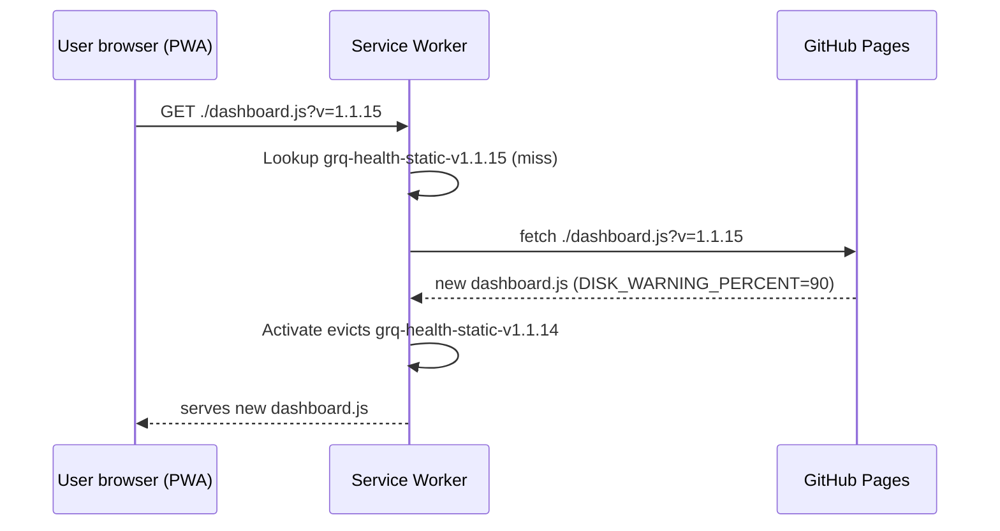

## Summary
PR #132 raised the disk-usage warning threshold from 80% to 90% in
`docs/dashboard.js`, but did not bump `VERSION`. The dashboard is a PWA:
`docs/sw.js` caches `./dashboard.js?v=<VERSION>` under
`grq-health-static-v<VERSION>`, so clients with the service worker
installed kept serving the old cached file and continued to flag hosts
in warning at 81–87% with the message `High disk usage: X% (>= 80%)`.

This PR bumps `VERSION` from `1.1.14` to `1.1.15` via `run.sh` and runs
`./update_version.sh` so the service worker cache name, static-cache
name, and every `?v=` cache-buster in `docs/sw.js` and
`docs/index.html` rotate to `1.1.15`. Existing service-worker
installations invalidate their old cache and fetch the new
`dashboard.js` with `DISK_WARNING_PERCENT = 90`. A new
`tests/test-version-consistency.sh` regression test asserts these
versions stay in sync so any future change that bumps `run.sh` but
forgets `sw.js` (or vice versa) fails the quality gate. Closes #133.

## Evidence
Screenshot from issue #133 showing the cached-old-code symptom — three
hosts flagged warning at 81.8% / 81.6% / 86.9% with the literal
message `(>= 80%)` even though `dashboard.js` on `Develop` reads 90%:

Cache-invalidation flow once this PR lands:

Local quality run: 49 / 50 tests pass. The lone failure
(`test-gitleaks-workflow`) is pre-existing on `Develop` and was also
called out as pre-existing by PR #132.

## Test Plan
- [x] Added `tests/test-version-consistency.sh` — asserts `run.sh`
      `VERSION` matches `docs/dashboard.js` `const VERSION`,
      `docs/sw.js` `// Version`, `CACHE_NAME`, `STATIC_CACHE_NAME`, the
      `dashboard.js?v=` entry in the SW static-file list, and the
      `styles.css?v=` / `dashboard.js?v=` / `sw.js?v=` cache-busters in
      `docs/index.html`. 8 assertions, all PASS after the bump.
- [x] Existing `tests/test-thresholds-constants.sh` still passes
      (`DISK_WARNING_PERCENT === 90`, `DISK_WARNING_CLEAR_PERCENT === 87`).
- [x] Existing `tests/test-disk-hysteresis.sh` and
      `tests/test-disk-warning-message.sh` continue to pass against the
      90 / 87 thresholds.
- [x] `quality.sh < /dev/null` — 49 / 50 pass; only pre-existing
      `test-gitleaks-workflow` failure remains (unchanged from
      `Develop`).
