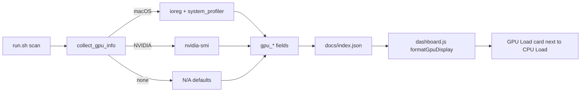

# PR Summary — Issue #136: Record and display GPU usage per host (cross-platform)

## Summary

Adds per-host **GPU** metrics that mirror the existing CPU card. GPU data is
collected during the same `run.sh` scan, persisted into `docs/index.json`, and
shown as a **GPU Load** card next to **CPU Load** on the dashboard. Collection
is strictly **non-privileged** (no `sudo`, no `powermetrics`) and every value
degrades gracefully to `N/A` rather than erroring or blocking the scan.

Closes #136.

### What was added

- **Apple Silicon** — live `Device Utilization %` and GPU memory in use via
  `ioreg -r -d 1 -c IOAccelerator`; chipset model + core count via
  `system_profiler SPDisplaysDataType`.
- **NVIDIA (Linux/Windows)** — utilisation %, VRAM used/total, temperature and
  product name from a single `nvidia-smi` call.
- Other vendors (AMD, Intel integrated) and non-GPU hosts report `N/A`.

New `index.json` fields: `gpu_load`, `gpu_model`, `gpu_cores`, `gpu_memory`,
`gpu_breakdown`.

### Key files

- `run.sh` — new `collect_gpu_info()` sets the `gpu_*` variables; the JSON
  output and escaping were extended. Pipelines use `|| true` so a no-match
  `grep` cannot abort the scan under `set -euo pipefail` (older chips that lack
  the `ioreg` key still report `N/A`).
- `docs/dashboard.js` — pure `formatGpuDisplay()` (in the unit-tested region)
  plus a **GPU Load** card in `createHostCard`.
- `README.md` — documents the collection approach and the new fields.

> **Note on scope:** `docs/simple.html` is a summarised status page and does not
> render per-host CPU cards, so there is no CPU card to mirror there — the GPU
> card lives in the full dashboard (`docs/dashboard.js`) where the CPU card is.

## Flow



## Evidence

A headless browser / Playwright MCP was **not available** on the build host, so
no PNG screenshot could be captured. Instead:

- A static, openable render of the card markup (using the real `styles.css`)
  is committed at `docs/evidence/issue-136-gpu-card.html`.
- The exact strings the card renders, produced by `formatGpuDisplay()`:

  ```
  [GRQ-25 (Apple M4 Pro, real)]  ->  GPU Load: 4% (16 cores, Apple M4 Pro)  |  0.36 GB in use
  [NVIDIA host]                  ->  GPU Load: 30% (NVIDIA GeForce RTX 3080)  |  2048 / 8192 MB  |  65°C
  [Host with no GPU data]        ->  GPU Load: N/A
  ```

- Live collection on the build host (GRQ-25, Apple M4 Pro) produced
  `4% | Apple M4 Pro | 16 | 0.36 GB in use | N/A`, and these real values were
  written into `docs/index.json` for GRQ-25.

## Test Plan

- `tests/test-gpu-display.sh` — unit tests for the pure `formatGpuDisplay()`
  helper: Apple full string, NVIDIA without core count, bare-number
  normalisation, all-N/A, N/A-load-with-known-model, `unknown`/empty handling,
  and partial fields.
- `tests/test-gpu-collection.sh` — extracts `collect_gpu_info()` and exercises
  it with **stubbed** `nvidia-smi`/`ioreg`/`system_profiler` so it is
  hardware-independent and cross-platform: NVIDIA host, no-GPU host (all
  `N/A`), Apple Silicon host, and the regression case where the `ioreg`
  utilisation key is absent (must not abort under `set -euo pipefail`).
- `./quality.sh` passes for all GPU-related tests, JSON validity and version
  consistency.

### Pre-existing failure (out of scope)

`./quality.sh` reports one failing test, `test-gitleaks-workflow`
(`Missing gitleaks-action step or GITHUB_TOKEN env`). This failure is
**pre-existing and unrelated** to this change — it reproduces on a clean tree
with the working changes stashed, and no `.github/` files were modified here.
