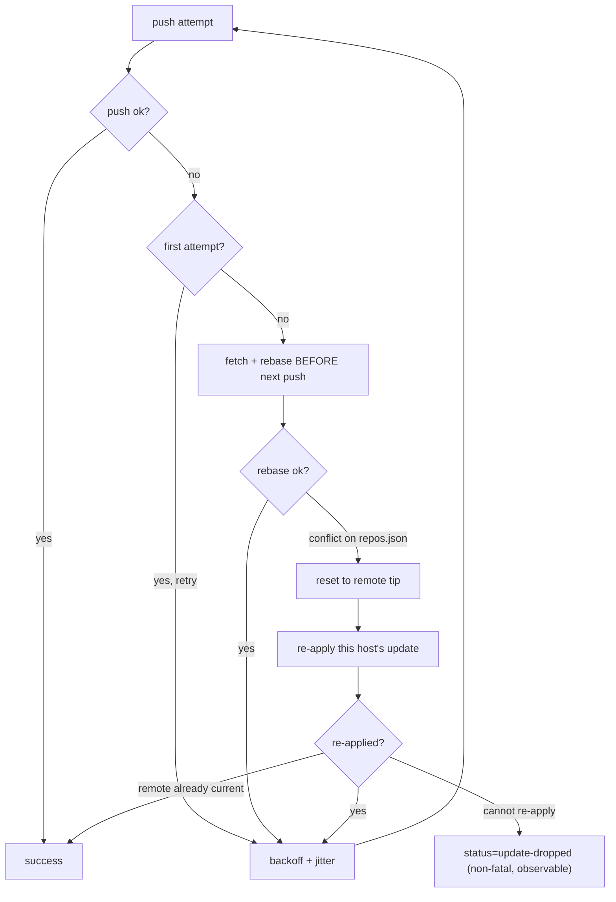

# repos.sh: push retry loop no longer silently drops a host health update

## Summary

Fixed two defects in the `helpers/repos.sh` push retry loop that could lose a
host's health update — surfacing as a stale/unhealthy tile on the dashboard.
Closes #139.

**Defect 1 — the final attempt had no fetch+rebase recovery.** Recovery was
gated by `if [ "$attempt" -lt "$GIT_PUSH_MAX_ATTEMPTS" ]`, so the last attempt
re-pushed a now-stale commit with no fresh base and failed
(`status=failed reason=push-failed`). The loop is now **rebase-before-push**:
every retry fetches and rebases onto the latest remote tip *before* pushing, so
even the final attempt lands on a fresh base. The first attempt still pushes
optimistically (the Step 1 `git pull` already freshened the base), keeping the
common uncontended path a single push. The inter-attempt backoff is now
**jittered** (`grq_apply_jitter`, 0–2s by default) to de-sync a fleet that all
collided at the same instant.

**Defect 2 — the rebase-conflict path silently reported success while
discarding the update.** On a `docs/repos.json` rebase conflict the loop reset
to remote, set `GIT_PUSH_SUCCESS=true` and broke — dropping the update with no
signal. It now resets to the fresh remote tip and **re-applies this host's
update** on top (via the idempotent `update_repos_json_*` helpers, keyed on the
host name) and keeps retrying, so the update reaches the remote. If the update
genuinely cannot be re-applied (e.g. a failure-mode log consumed from stdin is
no longer on disk) it is surfaced as a distinct, non-fatal
`status=update-dropped` instead of being masked as success.

## Evidence

Backend/CLI change — no web interface to screenshot. Verified via TDD: the new
regression test fails against the unfixed code (defect 1 → `push-failed`,
defect 2 → host entry missing from remote) and passes after the fix.

Before this change the final attempt skipped box **E**, and box **G** jumped
straight to `success` — silently dropping the update.

## Test Plan

- Added `tests/test-repos-push-final-attempt.sh`:
  - **Defect 1**: a `sleep` shim deterministically advances the remote during
    the final backoff; asserts the host update still reaches the remote, the
    concurrent commit is preserved, no unpushed backlog remains, and the run
    does **not** report `push-failed`.
  - **Defect 2**: a `docs/repos.json` rebase conflict; asserts the host entry
    is re-applied and pushed to the remote (not dropped) and the remote's
    competing entry is preserved.
  - **Jitter**: `grq_apply_jitter` returns the base unchanged for base `0` or
    ceiling `0`, and otherwise stays within `[base, base+ceiling]`.
- Updated `tests/test-graceful-failure-recovery.sh` Test 5 to set
  `GRQ_PUSH_JITTER_MAX=0` so the exact backoff-sequence assertion stays
  deterministic (jitter is intentional new behaviour, covered by the new test).
- Existing suites pass unchanged: `test-repos-push-rebase`, `test-push-retry`,
  `test-push-rebase-quiet`, `test-repos-failure`, `test-stage-failure-health`,
  `test-graceful-failure-recovery`.
- `./quality.sh` passes except the pre-existing, unrelated
  `test-gitleaks-workflow` failure (present on `HEAD` before this change).
