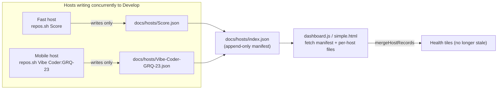

# PR Summary — Issue #140: per-host health files remove Develop-branch push contention

## Summary

Health tiles for slow/mobile, high-latency hosts (e.g. `Vibe Coder:GRQ-23`)
went **stale** because every host wrote its health to the single shared
`docs/repos.json` on one `Develop` branch. With ~19 hosts pushing to that one
file, a high-latency host lost the push race on every retry and its whole
update was dropped, so its `last_commit_ts` never advanced and the tile tripped
the staleness threshold.

This PR removes the contention by giving **each host its own artefact**:

- `helpers/repos.sh` now writes `docs/hosts/<slug>.json` (one object per host)
  instead of the shared `docs/repos.json`, and registers the host's slug in an
  **append-only** manifest `docs/hosts/index.json` (written only when a new host
  first appears, so an established fleet leaves it untouched).
- `docs/dashboard.js` and `docs/simple.html` fetch the manifest, load each
  per-host file, and **merge them at render time** (`mergeHostRecords`). They
  fall back to the legacy shared `docs/repos.json` when the manifest is absent
  (older deploys).
- The existing 25 entries in `docs/repos.json` were migrated into per-host files
  under `docs/hosts/`, preserving every config field (`warning_days`,
  `error_hours`, `business_days_only`, …). `docs/repos.json` is retained
  read-only as the dashboard fallback.

Because per-host files are single-writer, their commits rebase cleanly against
each other — no host's update is dropped on a content conflict, so a slow host
is no longer starved by fast ones. The existing push-retry/reapply machinery
(Issues #117/#139) is retained; the only shared file that can still conflict is
the rarely-touched manifest, handled by taking the remote copy then
re-registering this host's slug.

Closes #140.

## Evidence

This is primarily a backend/CLI + client-data-flow change. Playwright MCP was
not available in this environment, so evidence is captured via the data
pipeline and tests rather than a screenshot.

**End-to-end merge verified against a live static server** serving `docs/`
(replicating exactly what the browser does — fetch manifest → fetch each
per-host file → `mergeHostRecords`):

```
merged repos: 25
missing vs legacy: none
extra vs legacy: none
GRQ-23 record: {"error_hours":8,"last_commit_ts":1782876486,"name":"Vibe Coder:GRQ-23","warning_hours":4}
```

The per-host merge reproduces the exact same 25 repos (with config fields
intact) that the legacy `repos.json` produced, and the fallback path
(`manifest 404 → repos.json`) was verified to yield 25 repos too.

### Data flow



## Test Plan

- **New** `tests/test-per-host-health.sh` (8 assertions):
  - `repos.sh` writes `docs/hosts/<slug>.json` with the authoritative name and
    registers the slug in the manifest.
  - Two hosts get independent files and both appear in the manifest.
  - Re-running a known host does **not** duplicate the manifest entry
    (append-only, no shared-content churn).
  - Config fields (`warning_days`/`error_days`/`business_days_only`) survive a
    success update while `last_commit_ts` advances.
  - `mergeHostRecords` drops nulls/invalid records and de-duplicates by name
    (later record wins); returns `[]` for non-array input.
- **Adapted** existing `repos.sh` tests to assert on the per-host files
  (documented business-logic change — data moved from `docs/repos.json` to
  `docs/hosts/<slug>.json`):
  - `tests/test-repos-failure.sh` — failure fields, log capture, slug
    sanitisation, retention now read `docs/hosts/<slug>.json`.
  - `tests/test-repos-status-line.sh` — seeds host files; status-line
    (skipped/updated/added/…) semantics unchanged.
  - `tests/test-repos-push-rebase.sh` / `tests/test-repos-push-final-attempt.sh`
    — the push-retry/rebase/reapply machinery now lands the host's per-host
    file; the remote's competing `repos.json` commit is still preserved.
- `./quality.sh`: 54/55 passing. The single failure, `test-gitleaks-workflow`
  ("Missing gitleaks-action step or GITHUB_TOKEN env"), is **pre-existing and
  unrelated** — it fails identically on the clean base branch and touches no
  file in this PR.
- `shellcheck --severity=warning` clean on `helpers/repos.sh` and the new test.
- `dashboard.js` and `simple.html` inline scripts syntax-checked.

## Security self-check

- No secrets or hidden files staged; only `docs/hosts/*.json`, dashboard/HTML,
  `helpers/repos.sh`, tests, README, and version files.
- Per-host slug is derived by the existing `sanitise_task_slug` allowlist
  (alphanumeric/`-`/`_`); the dashboard `encodeURIComponent`s the slug before
  building the fetch URL, and repo names/fields remain HTML-escaped on render.
