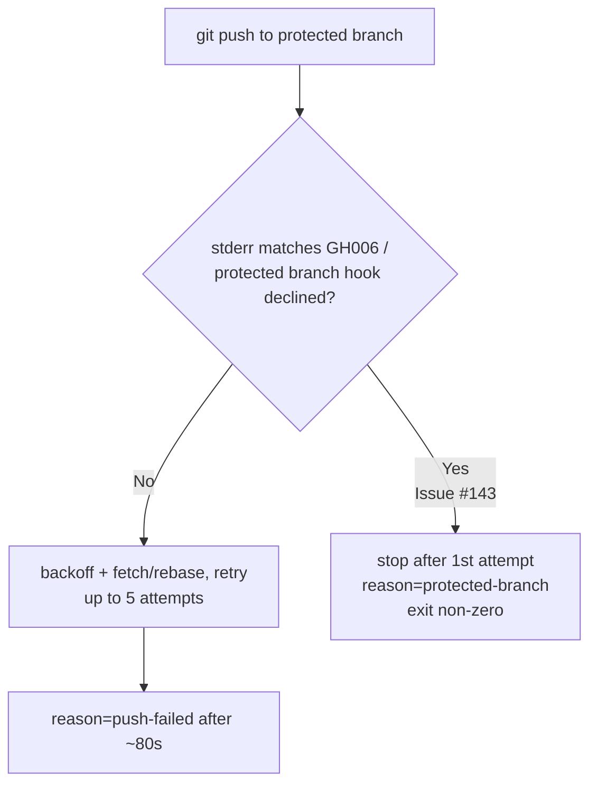

## Summary

The fleet's end-of-run health heartbeat (`helpers/repos.sh "Vibe Coder:<host>"`)
pushes directly to the protected branch. A host whose GitHub account has only
**`write`** permission cannot bypass the branch's required status checks, so
GitHub declines the push at the server hook with `GH006`
(`protected branch hook declined` / `required status checks are expected`).
This is **not** a transient conflict — every retry is rejected identically — yet
the old code burned the full 5-attempt / ~80s retry budget every cycle and then
reported the generic `reason=push-failed`, indistinguishable from ordinary
`docs/repos.json` contention or a network blip.

This change adds the **code mitigation** the issue explicitly requested: detect
the GH006 signature as a **non-retryable** outcome, fail fast after the first
attempt, and report a distinct `reason=protected-branch` status line so a policy
problem is told apart from ordinary contention.

- `helpers/git-retry.sh` — new `grq_is_protected_branch_error` classifies
  GH006 / `protected branch hook declined` / `required status check` stderr as
  a protected-branch rejection.
- `helpers/repos.sh` — the push retry loop stops immediately on a
  protected-branch rejection (no rebase+retry, which cannot help) and the exit
  status line carries `reason=protected-branch` instead of `push-failed`. The
  run still exits non-zero so the failure remains observable, and the local
  clone is still reset to the remote.
- `README.md` — documents the non-retryable protected-branch behaviour.
- Version bumped `1.1.18` → `1.1.19` (`run.sh` + synced dashboard assets).

**Scope note (admin/policy decision remains):** the mitigation makes the
failure fast and clearly labelled; it does **not** make write-only heartbeats
land. Choosing where the heartbeat lands — candidate fixes in the issue:
(1) grant the health-writer accounts bypass on the protected branch,
(2) exempt the `docs/hosts/**` + `docs/repos.json` path from the required
status checks, or (3) publish health data off the protected branch — is an
admin-only branch-protection decision that cannot be made in code. The distinct
`reason=protected-branch` signal is what lets operators recognise when that
decision is needed.

Closes #143.

## Evidence

**Backend/CLI change — no web UI to screenshot.** The issue is labelled
`needs-screenshot`, but the fix is entirely in the push path
(`helpers/repos.sh` / `helpers/git-retry.sh`); the dashboard is unchanged apart
from the routine version cache-buster, and a host rejected on the protected
branch still classifies as *in error* on its tile — the mitigation changes *how
fast the push gives up and how the failure is labelled*, not any pixel. Playwright
MCP browser tools and a headless browser binary were both unavailable in this
run, so — per the Error Recovery "Screenshot failures" guidance — evidence is
the automated test suite plus a live CLI demonstration rather than a screenshot.
The static dashboard was served locally (`helpers/server.ts`) and confirmed to
still render (`<title>GRQ Health Status</title>`, version `1.1.19`).

Captured test + live-run output:
[`docs/evidence/issue-143-protected-branch-test-output.txt`](../../evidence/issue-143-protected-branch-test-output.txt)

Live run of `repos.sh` against a `git` shim that declines every push with the
GH006 signature — one attempt, distinct reason, non-zero exit:

```text
Warning: git push failed (attempt 1/5): remote: error: GH006: Protected branch update failed ...
ERROR: git push rejected by protected branch (GH006) after 1 attempt(s); required status checks cannot be bypassed by this account
repos.sh status=failed reason=protected-branch name='Vibe Coder:GRQ-23'
Total git push attempts made: 1 (fail-fast = 1, not 5)
```

Retry behaviour before vs after:



## Test Plan

- Added `tests/test-repos-protected-branch.sh`:
  - **Part A** — `grq_is_protected_branch_error` unit coverage: detects the full
    GH006 reproduction, the `protected branch hook declined` phrasing, and the
    `required status checks are expected` phrasing (happy path); does **not**
    match a non-fast-forward rejection, empty stderr, or a rate-limit message
    (error/edge paths).
  - **Part B** — integration: a mock `git` shim declines every push with the
    GH006 signature; asserts `repos.sh` makes exactly **1** push attempt (no
    retry), emits `reason=protected-branch`, does **not** emit
    `reason=push-failed`, and exits non-zero.
- Regression evidence: the new test fails (6/10 assertions) against the pre-fix
  code and passes (10/10) after the fix.
- Existing related suites still pass: `test-push-retry.sh`,
  `test-repos-push-final-attempt.sh`, `test-repos-status-line.sh`.
- `./quality.sh` — all suites pass except the pre-existing, unrelated
  `test-gitleaks-workflow` failure (missing gitleaks-action step in the
  workflow YAML), which is untouched by this change.
