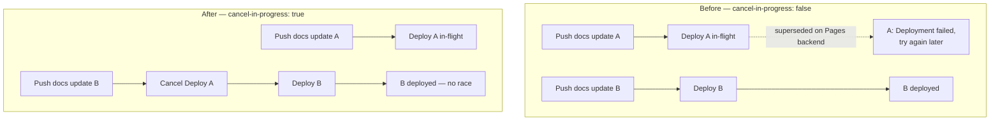

# PR Summary — Issue #148: Deployment action fails

## Summary

The **Deploy to GitHub Pages** workflow was intermittently failing with
`##[error]Deployment failed, try again later.` at the `actions/deploy-pages`
step.

Root cause: the health monitor pushes `docs/**` updates to the `Develop` branch
very frequently (many hosts, every few minutes). Each push triggers the deploy
workflow, so runs overlap. The concurrency block used
`cancel-in-progress: false`, which let queued deployments run and race on the
GitHub Pages backend — when a newer deployment supersedes an older in-flight
one, the older run is marked failed and reports "Deployment failed, try again
later.".

Fix: set `cancel-in-progress: true` in the shared `pages` concurrency group so a
newer run cancels an older in-flight deployment. Only the latest — and freshest
— health data deploys, which removes the race. The dashboard always wants the
most recent data, so cancelling a superseded deploy is the desired behaviour.

Closes #148.

## Evidence

This is a CI/workflow (YAML) change with no web interface to screenshot. Evidence
is the failing run and the parser-based tests.

Observed failure (run `28687107830`, and 6 more failures on 2026-07-03):

```
Created deployment for 0f7809c5..., ID: 0f7809c5...
Getting Pages deployment status...
##[error]Deployment failed, try again later.
```

Deployment flow before and after the fix:



## Test Plan

- Added `tests/test-deploy-concurrency.sh` (parses `deploy.yml` with a real YAML
  parser — no source grepping):
  - deploy.yml exists and is valid YAML
  - a concurrency `group` is declared (`pages`)
  - `cancel-in-progress` is `true` (the regression guard for this fix)
- Verified TDD: the new test failed against the old `cancel-in-progress: false`
  workflow and passes after the change.
- Existing `tests/test-deploy-deprecation-fix.sh` and
  `tests/test-deploy-workflow-pinned.sh` still pass — SHA pinning,
  `NODE_OPTIONS`, and the `github-pages` environment declaration are unchanged.

## Out of scope

`./quality.sh` reports two pre-existing failures unrelated to this issue (they
fail on the base branch with this change stashed, and neither touches the deploy
concurrency behaviour):

- `test-gitleaks-workflow` — gitleaks workflow config drift.
- `test-version-consistency` — `sw.js` pinned to version 1.1.19 while `run.sh`
  is 1.1.17.

These were left untouched per the change-scope guidance.
