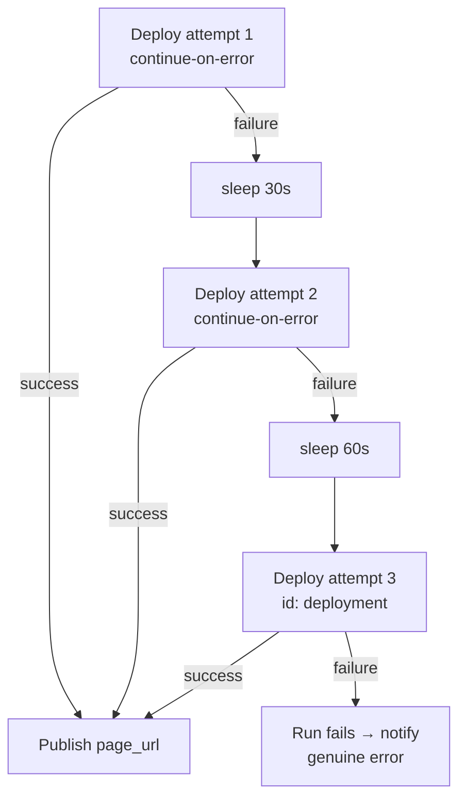

## Summary

GitHub Pages deploys intermittently failed because the health monitor pushes
`docs/**` to `Develop` every few minutes, so deploy runs contend on the Pages
backend and transiently report **"Deployment failed, try again later."** Each
`failure` run emailed the watcher (26 of the last 100 runs). Issue #148's
`cancel-in-progress: true` reduced but did not eliminate the failures.

This change retries the `actions/deploy-pages` step **in-run with backoff** so
transient contention is absorbed and only a genuine, persistent error surfaces
as a failed run (and an email). The change is confined to
`.github/workflows/deploy.yml` and adds no new dependencies. Closes #151.

### What changed

- The single deploy step is now **3 attempts** of `actions/deploy-pages`:
  - Attempts 1 and 2 set `continue-on-error: true` — a transient failure falls
    through to the next attempt instead of failing the run.
  - Backoff `sleep` steps (30s, then 60s) run only when the previous attempt
    failed — progressive backoff gives the backend time to clear.
  - Each retry attempt is guarded by `if: … outcome == 'failure'`, so we retry
    **only on failure** and never deploy repeatedly on success.
  - The final attempt keeps `id: deployment` and does **not** swallow errors —
    an exhausted retry budget is a genuine error that fails the run and
    notifies, exactly as before.
- The `github-pages` environment URL is preserved: it still references
  `steps.deployment.outputs.page_url`, with a fallback chain across the earlier
  attempts so the published URL stays observable regardless of which attempt
  won.

Behaviour unchanged from #148: a newer push still cancels in-flight attempts via
the shared `pages` concurrency group; a `cancelled` conclusion is not a failure.

### Evidence

Backend/CI-only change — there is no web UI to screenshot. Verified via the new
YAML-parsing test (below) and by re-running the existing deploy-workflow tests,
all of which pass.

### Test Plan

- Added `tests/test-deploy-retry.sh` — parses `deploy.yml` with a real YAML
  parser (matching the existing #148/#146 test style) and asserts:
  - ≥3 `actions/deploy-pages` attempts (the retry budget);
  - every non-final attempt sets `continue-on-error: true`;
  - the final attempt does **not** swallow errors and keeps `id: deployment`;
  - each retry is guarded by an `outcome == 'failure'` condition;
  - failure-guarded backoff `sleep` steps exist with non-decreasing waits;
  - the environment url preserves `steps.deployment.outputs.page_url`.
  Written first and confirmed failing against the pre-change workflow (1 attempt),
  then passing after the change (10/10).
- Re-ran the existing workflow tests — `test-deploy-concurrency.sh`,
  `test-deploy-workflow-pinned.sh`, `test-deploy-deprecation-fix.sh` — all pass,
  so SHA-pinning, concurrency, and the `github-pages` environment url are intact.

### Note on unrelated pre-existing failures

`./quality.sh` reports two failures that are **pre-existing and unrelated** to
this change (they also fail on a clean checkout of the base branch):
`test-gitleaks-workflow` (missing gitleaks-action step) and
`test-version-consistency` (`sw.js` cache version drift vs `run.sh`). These are
out of scope for issue #151 and were left untouched.
