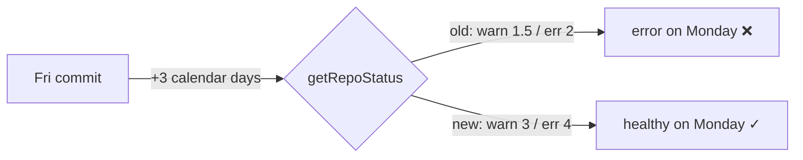

## Summary

Raised the staleness thresholds for the **Company Reports** and **Shareprices**
tasks so a benign "no changes to commit" weekend (introduced by
stSoftwareAU/GRQ-marketdata#89, which records neither a success heartbeat nor a
failure on such days) no longer flags a false warning every Monday morning.

For both tasks:

- `warning_days`: 1.5 → **3**
- `error_days`: (was unset, defaulting to 2) → **4**
- **Calendar** counting is kept deliberately — `business_days_only` is **not**
  set (decision recorded in GRQ-marketdata#89, Round 1 Q2).

The thresholds live in two places that both feed the dashboard: the per-task
host files (`docs/hosts/Company-Reports.json`, `docs/hosts/Shareprices.json`)
and the aggregated `docs/repos.json` that `dashboard.js` fetches for repo
health. Both copies were updated so they stay consistent (mirroring the existing
FX precedent, where the same config appears in both).

With calendar `warning_days=3`, a task whose last commit was Friday and is
checked the following Monday (3 calendar days) is now healthy; the previous
`warning_days=1.5` / default `error_days=2` config flagged it as an error.

Closes #154.

Refs: stSoftwareAU/GRQ-marketdata#89

## Evidence

Backend/data-only change — no web UI was altered, so no screenshot applies. The
change is verified by unit tests exercising the real `getRepoStatus()` dashboard
function plus assertions on the committed JSON config.



New test output (`tests/test-staleness-weekend-thresholds.sh`):

```
Results: 8 passed, 0 failed
All Issue #154 threshold tests passed!
```

### Pre-existing failures (out of scope)

`./quality.sh` reports two failures that also fail on a clean tree before this
change and are unrelated to it: `test-gitleaks-workflow` and
`test-version-consistency`. They are not touched by this data-only change.

## Test Plan

Added `tests/test-staleness-weekend-thresholds.sh`, which:

- `weekend-healthy-monday` — Friday commit checked Monday (3 calendar days) is
  `healthy` under the new thresholds.
- `old-threshold-would-flag` — reproduces the bug: the old
  `warning_days=1.5`/default config flags a non-healthy state on Monday.
- `calendar-warning-3p5-days` / `calendar-error-4p5-days` — confirms calendar
  (not business-day) counting: 3.5 days → `warning`, 4.5 days → `error`.
- Config assertions — `docs/repos.json` and both `docs/hosts/*.json` files carry
  `warning_days=3`, `error_days=4`, and no `business_days_only`.
