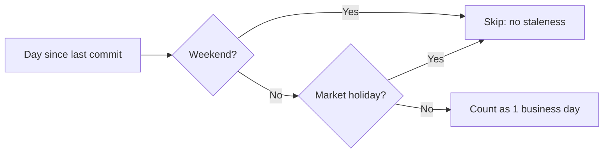

# PR Summary — Issue #155: Holiday-aware staleness

## Summary

Made GRQ-health market-holiday aware so that a public holiday which extends a
weekend (e.g. a Monday holiday) no longer burns into a repo's staleness budget.
Business-days counting (`business_days_only`, Issues #47/#67) already skipped
weekends; it now also skips US (NYSE) and AU (ASX) market holidays. The result is
the asymmetry the issue asked for: **mid-week silence — where every elapsed day is
a trading day — accrues staleness faster and alerts sooner than a
holiday-extended weekend gap of the same wall-clock length.**

Changes:

- Added a `MARKET_HOLIDAYS` calendar (union of US NYSE + AU ASX, 2025–2027, UTC
  ISO dates, observed in-lieu where the actual date falls on a weekend) and an
  `isMarketHoliday(date)` helper in `docs/dashboard.js`.
- `countBusinessDays()` now skips holidays as well as weekends. Any
  `business_days_only` repo (e.g. `FX`) inherits holiday skipping automatically —
  no config change required.
- Documented the behaviour in `README.md` with a decision flowchart.
- Bumped version to 1.1.18 (`update_version.sh`) to keep `run.sh` and
  `docs/dashboard.js` in sync per the version-consistency gate.

Design note: the issue's second bullet (a separate mid-week weighting multiplier)
was explicitly "consider… open to design". The existing business-days mechanism
already delivers the mid-week-vs-weekend asymmetry; extending it to holidays
completes that signal without a parallel weighting system that would overlap with
the #154 calendar thresholds. Kept in scope accordingly.

Closes #155.

## Evidence

Backend/CLI change with no web UI to screenshot. Verified via the new unit test
suite driving the real pure functions through deno.



Test run (`./tests/test-holiday-aware-staleness.sh`):

```
Test 1: isMarketHoliday recognises US and AU holidays...
  PASS: au-holiday-recognised: 2026-01-26 is a holiday
  PASS: us-holiday-recognised: 2026-11-26 is a holiday
  PASS: ordinary-day-not-holiday: 2026-03-04 is not a holiday
Test 2: countBusinessDays skips holidays...
  PASS: count-skips-holiday: 1 business day across holiday-extended weekend
  PASS: count-plain-midweek: 3 business days mid-week
Test 3: business_days_only repo healthy across holiday-extended weekend...
  PASS: holiday-weekend-healthy: healthy across holiday-extended weekend
  PASS: midweek-more-suspicious: mid-week silence flagged warning
Results: 7 passed, 0 failed
```

## Test Plan

Added `tests/test-holiday-aware-staleness.sh` (TDD — written failing first, then
implemented):

- `isMarketHoliday()` recognises an AU holiday (Australia Day 2026-01-26), a US
  holiday (Thanksgiving 2026-11-26), and rejects an ordinary trading day.
- `countBusinessDays()` returns 1 across a holiday-extended weekend
  (Fri 2026-01-23 → Tue 2026-01-27, Monday = Australia Day) vs a control of 3
  for a plain mid-week span.
- `getRepoStatus()` keeps a `business_days_only` repo healthy across the
  holiday-extended weekend, while the same-length mid-week gap is flagged —
  proving mid-week silence is treated as more suspicious.

Existing weekend/threshold suites (`test-weekend-aware-repos.sh`,
`test-staleness-weekend-thresholds.sh`, `test-stale-threshold.sh`) continue to
pass — their March-2026 dates contain no holidays, so behaviour is unchanged.

## Known pre-existing failure (out of scope)

`./quality.sh` reports one failing test, `test-gitleaks-workflow.sh`
("Missing gitleaks-action step or GITHUB_TOKEN env"). This fails identically on
the clean baseline (verified via `git stash`) — it is a GitHub-workflow config
check unrelated to staleness logic and to this issue, so it was left untouched
per change-scope discipline. All other 58 checks pass.
