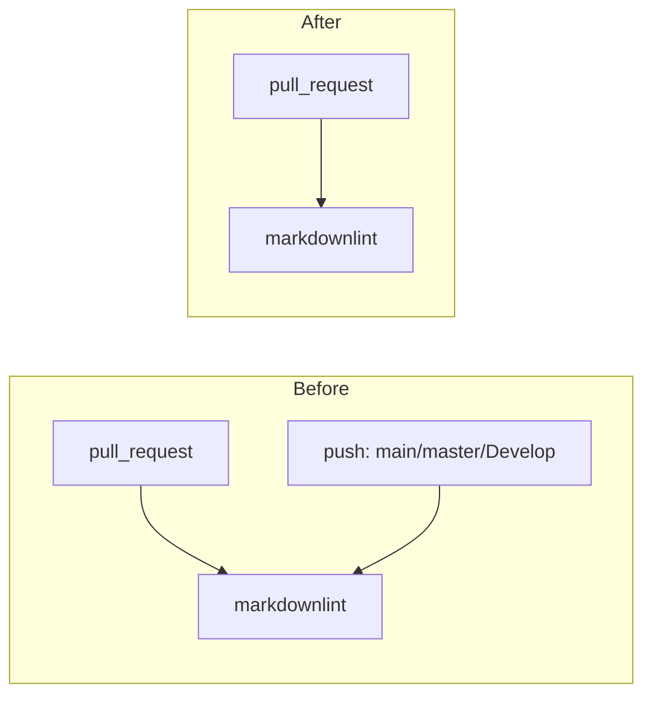

# PR Summary — Run the Markdown Lint workflow only on pull requests

## Summary

The `Markdown Lint` workflow (`.github/workflows/markdown-lint.yml`) previously
triggered on both `pull_request` (all branches) **and** `push` to `main`,
`master`, and `Develop`. Because every change reaches the default branch via a
PR, the `push` run only re-linted content already checked on the PR — a
redundant duplicate run.

This PR removes the `push:` trigger block entirely, so the workflow runs solely
on `pull_request` events. The lint job itself (checkout, setup-node,
markdownlint-cli2 install + run) is unchanged.

Closes #159.

## Evidence

This is a CI-config change with no web interface, so no screenshot applies. The
change is verified by the workflow test suite.

Trigger change:

## Test Plan

- Updated `tests/test-markdown-lint-workflow.sh`:
  - Added **Test 4b** asserting the `push` trigger is absent (workflow runs on
    `pull_request` only). This test fails against the old workflow and passes
    after the change.
  - Updated the header comment to reflect the pull_request-only trigger.
- `bash tests/test-markdown-lint-workflow.sh` → 13 passed, 0 failed.
- Existing `pull_request` / permissions / SHA-pinning / markdownlint-cli2
  assertions remain green — the lint job is untouched.

### Note on unrelated pre-existing failure

`./quality.sh` reports one failure in `test-gitleaks-workflow`
("Missing gitleaks-action step or GITHUB_TOKEN env"). This failure is
pre-existing on the base branch (confirmed by stashing these changes and
re-running the gate) and is unrelated to issue #159 — it is left out of scope.
