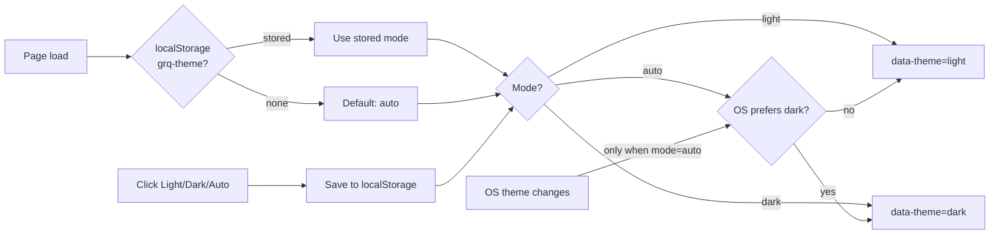

# Add light/dark/auto theme toggle with remembered choice (Issue #161)

## Summary

Added a light/dark/auto colour-theme selector to all three GRQ-health dashboard
pages (`docs/index.html`, `docs/simple.html`, `docs/log-viewer.html`). The
chosen mode is persisted in the browser's `localStorage` (`grq-theme`) and
restored on every visit. **Auto** is the default for first-time visitors: it
follows the OS `prefers-color-scheme` and reacts live when the OS setting
changes. The original purple-gradient design is the **light** theme; a new,
WCAG-AA-readable navy **dark** palette was added, and the offline (feed-lost)
brown styling is now theme-aware — a deeper brown in dark mode so the offline
state stays clearly distinguishable in both themes. Vanilla JS + CSS only, no
new dependencies, matching GRQ-actual-validation's conventions. Closes #161.

Key implementation choices:

- **`docs/theme.js`** — shared controller. Pure, unit-tested helpers
  (`resolveTheme`, `sanitiseThemeMode`) plus DOM wiring that builds the
  selector, persists the choice, and live-updates when the OS theme changes
  while in auto mode. DOM code is guarded behind `typeof document === 'undefined'`
  so the pure helpers can run under the Deno test harness.
- **`docs/theme.css`** — styling for the selector control only, so it can sit on
  any page background without pulling dashboard rules into the minimal pages.
- **`docs/styles.css`** — hardcoded colours refactored to CSS variables; a
  `[data-theme="dark"]` palette drives the dashboard surfaces (cards, tables,
  host cards, text) and the theme-aware offline browns.
- Each page's `<head>` has a tiny inline ``)
  would otherwise have grabbed the shim; the shim tag is written as
  `<script data-theme-init>` so it no longer matches the bare `<script>` those
  helpers key on. No test logic was modified.
- `./quality.sh` — 59/60 pass. The single failure, `test-gitleaks-workflow`, is
  **pre-existing and unrelated** to this change: it inspects
  `.github/workflows/gitleaks.yml`, which this PR does not touch.

## Security self-check

- No secrets or hidden files staged; only `docs/*` assets, `run.sh`, README, and
  a new test.
- Theme choice is read/written to `localStorage` only, validated through
  `sanitiseThemeMode` (allowlist of `light`/`dark`/`auto`) before use — an
  unexpected stored value falls back to `auto`. No user input reaches the DOM as
  HTML; the selector buttons are built from a fixed internal list.
