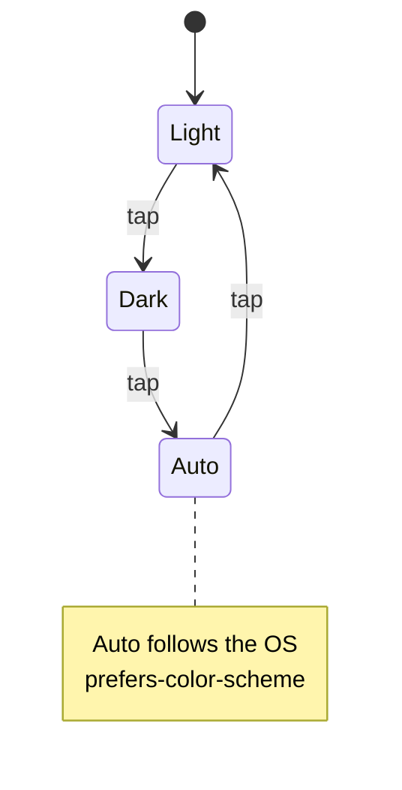

## Summary

Replaced the three-button light/dark/auto theme picker (added in #161) with a
single compact icon-only button that **cycles** Light → Dark → Auto → Light on
each tap. The wide three-button pill overlapped the header title ("GRQ
Unhealthy") on phone widths; the single 38 px round button no longer does. The
button shows the icon of the currently active mode (☀️ / 🌙 / 🖥️) and its
`aria-label`/`title` describe the current mode and the next tap's effect.

The choice is still persisted in `localStorage` (`grq-theme`) and applied before
first paint — the pre-paint init script, theme palettes and offline-brown
styling are unchanged; only the control changed. A focused mobile media query
(`@media (max-width: 576px)`) gives the centred title breathing room so it can
never run under the corner button. All three pages (`index.html`, `simple.html`,
`log-viewer.html`) share the updated `docs/theme.js` / `docs/theme.css`.

Closes #163.



## Evidence

Single cycling button, clear of the header title on a 390 px mobile viewport:

Light (☀️):


Dark (🌙):


Desktop (Auto 🖥️):


Interaction verified with Playwright — one button, correct cycle, persisted
choice, updating accessible label:

```
mode=light stored=light aria="Light theme active — tap to switch to Dark."
mode=dark  stored=dark  aria="Dark theme active — tap to switch to Auto."
mode=auto  stored=auto  aria="Auto theme active — tap to switch to Light."
mode=light stored=light aria="Light theme active — tap to switch to Dark."
button count = 1
```

## Test Plan

- Extended `tests/test-theme-toggle.sh` with unit tests for the new pure
  `nextThemeMode` helper on `globalThis.GRQTheme`:
  - `next-cycle` — `light→dark`, `dark→auto`, `auto→light`.
  - `next-wraps` — three taps return to the starting mode.
  - `next-invalid` — unknown/`null`/`undefined` current values sanitise to
    `auto` and therefore advance to `light`.
- Existing `sanitiseThemeMode` / `resolveTheme` tests and the per-page wiring
  checks (`theme.js` loaded + `#theme-toggle` placeholder present) remain and
  still pass — 14/14.
- `./quality.sh` passes for all suites except the pre-existing, unrelated
  `test-gitleaks-workflow` failure (present on a clean checkout of this branch,
  confirmed via `git stash`; untouched by this change).
