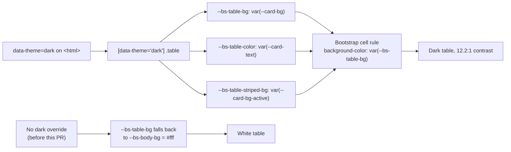

# Fix white Users table in dark mode

## Summary

In dark mode the per-host **Users** table rendered as a white block with black
text, glaring against the dark navy page. Closes #165.

**Root cause.** Bootstrap 5.3 resolves `--bs-table-bg` from `--bs-body-bg`
(white) and `--bs-table-color` from `--bs-emphasis-color` (near-black). The
dashboard themes itself with its own `data-theme` attribute rather than
Bootstrap's `data-bs-theme`, so Bootstrap stayed in its light theme and those
defaults survived — no dark override existed for `.table`.

**Fix** (`docs/styles.css`):

- `[data-theme="dark"] .table` re-points the table's own `--bs-*` variables at
  the existing dark card palette (`--card-bg`, `--card-text`,
  `--card-bg-active`, `--border-subtle`), so the table blends into the card
  instead of punching a white hole in it.
- `[data-theme="dark"] .btn-outline-secondary` lightens the **Log** buttons that
  sit inside that table — Bootstrap's mid-grey outline text drops to 3.0:1
  contrast once the surface behind it goes dark.

Light mode is untouched: the rules are scoped entirely under
`[data-theme="dark"]`.

Version bumped `1.1.20` → `1.1.21` and synced with `./update_version.sh`, per
the README workflow, so the changed stylesheet is cache-busted.

## Evidence

Captured with headless Chromium against the real dashboard served from `docs/`,
with the theme forced to dark and the host cards isolated so the table is in
frame. Before/after differ only by the `docs/styles.css` change.

### Before — white table on the dark page (reproduces the issue screenshot)


### After — table blends into the dark card


### Light mode unchanged


### Measured contrast

`tests/test-dark-mode-table.sh` reports the resolved colours:

```
PASS: dark-table-rule-exists — found a [data-theme="dark"] .table rule
PASS: cell-background-is-dark — --bs-table-bg luminance 0.0205 (needs < 0.2)
PASS: cell-text-is-light — --bs-table-color luminance 0.8128 (needs > 0.4)
PASS: cell-contrast-meets-aa — text/background contrast 12.24:1 (needs >= 4.5)
PASS: striped-row-is-dark — --bs-table-striped-bg luminance 0.0323 (needs < 0.2)
PASS: striped-contrast-meets-aa — striped text/background contrast 10.49:1 (needs >= 4.5)
PASS: border-is-subtle — border/background contrast 1.28:1 (needs < 4.5, i.e. subtle)
PASS: log-button-contrast-meets-aa — button text/table contrast 8.95:1 (needs >= 4.5)
```

### How the colour now resolves



## Test Plan

Added `tests/test-dark-mode-table.sh` (harness) and
`tests/dark-mode-table-check.js` (checker). The checker parses
`docs/styles.css`, resolves `var(--x)` references into the `[data-theme="dark"]`
palette, composites any translucent colours over the card surface, and computes
WCAG 2.1 relative luminance and contrast ratios. It asserts **outcomes**, not
colour literals — retuning the dark palette keeps the tests green, while
regressing to a light table fails them.

| Test | Asserts |
| --- | --- |
| `dark-table-rule-exists` | The dark theme overrides Bootstrap's table colours at all |
| `cell-background-is-dark` | Resolved `--bs-table-bg` luminance < 0.2 |
| `cell-text-is-light` | Resolved `--bs-table-color` luminance > 0.4 |
| `cell-contrast-meets-aa` | Body text ≥ 4.5:1 against the cell background |
| `striped-row-is-dark` | Alternate rows stay dark (the stripe caused the glare) |
| `striped-contrast-meets-aa` | Striped-row text ≥ 4.5:1 |
| `border-is-subtle` | Row separators visible but < 4.5:1, not Bootstrap's light grey |
| `log-button-contrast-meets-aa` | The in-table **Log** buttons ≥ 4.5:1 |

Regression linkage: with `docs/styles.css` reverted the suite fails on
`dark-table-rule-exists` (`no [data-theme="dark"] .table rule — Bootstrap's
white --bs-table-bg wins`); with the fix applied all 8 pass. The harness also
fails loud if the checker exits non-zero or produces no results, rather than
reporting a vacuous pass.

No existing tests were modified or removed.

## Quality gate

`./quality.sh` — 60 of 61 tests pass.

**Pre-existing failure, unrelated to this change:** `test-gitleaks-workflow`
fails on `Missing gitleaks-action step or GITHUB_TOKEN env`. Verified it fails
identically on a clean checkout with all of this PR's changes stashed — the test
asserts a `gitleaks/gitleaks-action` step that `.github/workflows/gitleaks.yml`
no longer uses (it now installs and runs the pinned Gitleaks CLI directly).
Left out of scope to keep this change focused; filed as
stSoftwareAU/GRQ-health#166.

## Security self-check

- No new input handling, network calls, or user-controlled data paths — the
  change is CSS variable declarations plus a read-only test.
- The checker reads exactly one file under `--allow-read=<path-to-styles.css>`;
  no write, network, or environment permissions are granted.
- No secrets, credentials, or hidden files staged. Temporary evidence-capture
  HTML harnesses served from `docs/` were deleted before committing.
- No new dependencies.
