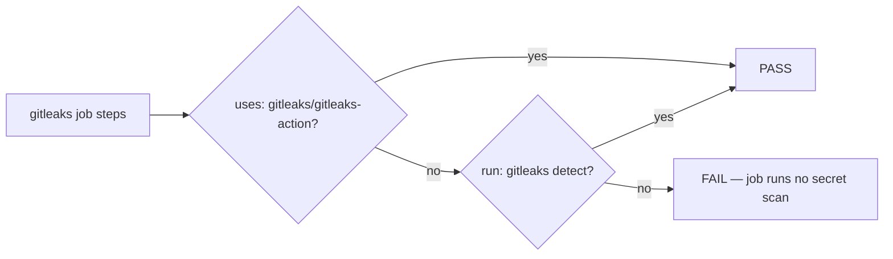

## Summary

`./quality.sh` failed on a clean checkout of `Develop` because Test 8 of
`tests/test-gitleaks-workflow.sh` asserted an implementation detail that
`.github/workflows/gitleaks.yml` had moved away from: a
`gitleaks/gitleaks-action` step carrying a `GITHUB_TOKEN` env. The workflow now
installs the pinned Gitleaks CLI release and runs `gitleaks detect`, which needs
no token — so the scan was working while the gate reported a failure.

Test 8 now asserts the **outcome** (the `gitleaks` job runs a secret scan)
rather than the mechanism, accepting either the action or the CLI. It still
rejects a job that runs no scan at all, so the gate keeps its teeth. SHA-pinning
of any action reference remains covered by Test 9. Closes #166.



Before, only the left branch passed; the committed CLI-based workflow took the
middle branch and was wrongly failed.

## Evidence

Backend/CI change — no web interface to screenshot, so the evidence is test
output.

Before (clean checkout, unmodified workflow):

```
  PASS: checkout step sets fetch-depth: 0
  FAIL: Missing gitleaks-action step or GITHUB_TOKEN env
  PASS: All uses: references are pinned to 40-char commit SHAs

Results: 8 passed, 1 failed
```

After:

```
  PASS: gitleaks job runs a secret scan (action or gitleaks detect CLI)
  PASS: All uses: references are pinned to 40-char commit SHAs

Results: 9 passed, 0 failed
```

New assertion-behaviour test:

```
Testing Issue #166: gitleaks workflow assertion is outcome-based
  PASS: test-gitleaks-workflow.sh is executable
  PASS: GITLEAKS_WORKFLOW_FILE override is honoured
  PASS: CLI form (gitleaks detect) passes the workflow test
  PASS: Action form (gitleaks/gitleaks-action) passes the workflow test
  PASS: Workflow with no secret scan is rejected
  PASS: Rejection message reports the missing secret scan
  PASS: The committed .github/workflows/gitleaks.yml passes

Results: 7 passed, 0 failed
```

Full gate: `./quality.sh < /dev/null` → **62 passed, 0 failed, QUALITY CHECK
PASSED**.

## Test Plan

- **Modified** `tests/test-gitleaks-workflow.sh`:
  - Test 8 rewritten to pass when any step in the `gitleaks` job either
    references `gitleaks/gitleaks-action` or runs `gitleaks detect` (whitespace
    collapsed so multi-line `run:` blocks match). Fails with a message naming
    the missing secret scan otherwise. No test was removed or commented out —
    the assertion was broadened from mechanism to outcome, which is the fix the
    issue asks for.
  - `WORKFLOW_FILE` now honours a `GITLEAKS_WORKFLOW_FILE` override so the
    assertions can be driven against fixtures; it defaults to the committed
    workflow, so normal runs are unchanged.
- **Added** `tests/test-gitleaks-scan-assertion.sh` — the regression test. It
  executes the real workflow test against three fixtures and asserts on exit
  codes and output, so it fails against the unfixed Test 8 (rejects the CLI
  form) and passes after the fix. It also guards the opposite regression: a
  workflow with no scan must still fail.
- **Added** fixtures under `tests/fixtures/gitleaks/`:
  - `action-form.yml` — scan via the SHA-pinned `gitleaks-action`.
  - `cli-form.yml` — scan via the pinned Gitleaks CLI release.
  - `no-scan.yml` — checkout only, no secret scan (must be rejected).

### Security self-check

- No secrets staged; the action fixture uses the standard
  `secrets.GITHUB_TOKEN` expression rather than a literal token value.
- No new dependencies, network calls, or user input handling — the change is
  confined to test assertions and inert YAML fixtures.
- Fixture workflows live under `tests/fixtures/`, not `.github/workflows/`, so
  they are never executed by GitHub Actions.
