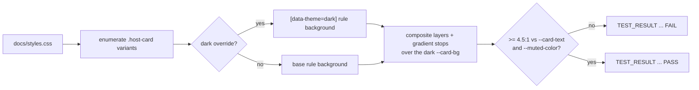

## Summary

Adds a WCAG contrast regression guard that covers **every** `.host-card` variant
in dark mode, rather than the three the existing checker names. Closes #172.

The same defect shipped three times — #165 (Bootstrap `.table`), #169 (`.mia`)
and #171 (`.mobile`, `.outdated-macos`): a component hardcodes a light
background, survives the `[data-theme="dark"]` switch, and the dark palette's
light text renders on it unreadably. Each was found by a human looking at a
phone screenshot because nothing in the suite covered the class of defect.

- `tests/dark-mode-card-check.js` **enumerates** the `.host-card.<variant>`
  rules in `docs/styles.css` (base cascade and dark theme, ignoring `::before` /
  `::after` decoration rules) and measures each one. A variant added later is
  covered with no test edit.
- For each variant it resolves the background the dark theme actually applies —
  the `[data-theme="dark"] .host-card.<variant>` override if present, else the
  base variant rule, else the inherited `.host-card` background — composites
  every background layer and **every gradient stop** over the dark `--card-bg`,
  and asserts ≥ 4.5:1 against `--card-text` and `--muted-color`.
- Translucent `rgba(...)` washes are composited before the ratio is computed,
  never treated as opaque; the `0.98` alpha on the old light gradients is the
  whole reason the defect is subtle.
- Discovering **zero** variants is itself a `FAIL`, and the discovered count is
  reported in the `TEST_RESULT` detail, so a stylesheet rename or a CSS-parsing
  regression cannot turn the guard green by vacuity.
- `tests/test-dark-mode-host-cards.sh` is the shell harness, following the
  existing `TEST_RESULT:<name>:<PASS|FAIL>:<detail>` convention. It is picked up
  automatically by `./quality.sh`, which globs `tests/test-*.sh`.
- CSS parsing and colour maths move to `tests/css-colour-lib.js`, shared by the
  new sweep and the existing `tests/dark-mode-table-check.js` (behaviour of the
  latter is unchanged — all 26 of its results still pass).

**Ordering:** both fix sub-issues (#170, #171) have already landed on
`milestone/169-tinas-macbook-unreadable-in-dark-mode`, so this test is green on
the branch it targets. Nothing needs quarantining. Its positive control against
`Develop` is below.

## Evidence

No UI change — this PR adds tests and documentation only, so there is nothing to
screenshot. The dashboard renders identically before and after; the evidence is
the checker's behaviour.



**Positive control — the checker run against the current `Develop` tree** (the
acceptance criterion that it goes red there, flagging exactly the three unfixed
variants):

```
TEST_RESULT:dark-mode-host-cards-variants-discovered:PASS:enumerated 8 .host-card variants from the stylesheet: critical, dead, healthy, historical, mia, mobile, outdated-macos, warning
TEST_RESULT:dark-mode-host-cards-mia-card-text:FAIL:--card-text on .host-card.mia (.host-card.mia) 1.12:1 at worst of 3 stop(s), stop 3 (needs >= 4.5)
TEST_RESULT:dark-mode-host-cards-mia-muted-color:FAIL:--muted-color on .host-card.mia (.host-card.mia) 2.38:1 at worst of 3 stop(s), stop 3 (needs >= 4.5)
TEST_RESULT:dark-mode-host-cards-mobile-card-text:FAIL:--card-text on .host-card.mobile (.host-card.mobile) 1.01:1 at worst of 3 stop(s), stop 3 (needs >= 4.5)
TEST_RESULT:dark-mode-host-cards-mobile-muted-color:FAIL:--muted-color on .host-card.mobile (.host-card.mobile) 2.15:1 at worst of 3 stop(s), stop 3 (needs >= 4.5)
TEST_RESULT:dark-mode-host-cards-outdated-macos-card-text:FAIL:--card-text on .host-card.outdated-macos (.host-card.outdated-macos) 1.09:1 at worst of 3 stop(s), stop 3 (needs >= 4.5)
TEST_RESULT:dark-mode-host-cards-outdated-macos-muted-color:FAIL:--muted-color on .host-card.outdated-macos (.host-card.outdated-macos) 2.32:1 at worst of 3 stop(s), stop 3 (needs >= 4.5)
```

**On this branch** (both fixes landed) all 8 variants pass, e.g.:

```
PASS: dark-mode-host-cards-mia-card-text — --card-text on .host-card.mia ([data-theme="dark"] .host-card.mia) 10.24:1 at worst of 4 stop(s), layer 1 stop 3 (needs >= 4.5)
PASS: dark-mode-host-cards-warning-card-text — --card-text on .host-card.warning (.host-card) 12.24:1 at worst of 1 stop(s), stop 1 (needs >= 4.5)
```

`./quality.sh`: 63/63 passed, including `test-dark-mode-host-cards` and the
unchanged `test-dark-mode-table`.

## Test Plan

New — `tests/test-dark-mode-host-cards.sh` (27 assertions, three stages):

1. **The real stylesheet** — every enumerated `.host-card` variant in
   `docs/styles.css` must meet 4.5:1 against `--card-text` and `--muted-color`.
2. **Self-test of the detector** against
   `tests/fixtures/dark-mode-cards/variants.css`, which pins the verdicts the
   checker must produce:
   - `fixture-good` (dark wash over `var(--card-bg)`) → PASS
   - `fixture-light` (light gradient, no dark override) → FAIL — the unfixed
     defect
   - `fixture-tail-light` (gradient starting dark, ending near-white) → FAIL —
     fails only if every stop is evaluated
   - `fixture-alpha-wash` (`rgba(255,255,255,0.04)`) → PASS — passes only if
     alpha is composited rather than treated as opaque
   - `fixture-alpha-solid` (`rgba(255,255,255,0.98)`) → FAIL
   - `.host-card.fixture-good::before` must not be enumerated as a variant
3. **Guard-degradation** against `tests/fixtures/dark-mode-cards/no-cards.css` —
   discovering zero variants must report FAIL, not a clean sweep.

Unchanged — `tests/test-dark-mode-table.sh` still passes all 26 results after
its helpers moved to `tests/css-colour-lib.js`. No existing test was removed or
modified.
