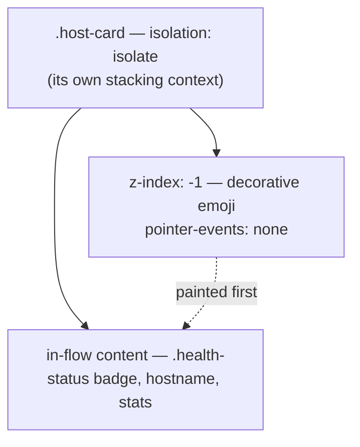

## Summary

The decorative 🌐 / 🏝️ / update emoji on `.host-card.mia`, `.host-card.mobile` and `.host-card.outdated-macos` are absolutely-positioned pseudo-elements anchored to the same top-right corner the `.health-status` badge occupies. They carried `z-index: 1`, so they painted over the badge in normal flow and clipped the last characters of "OFF THE GRID". Closes #173.

All six decorations (`::before` and `::after` on the three variants) now sit at `z-index: -1` with `pointer-events: none`, and `.host-card` carries `isolation: isolate` so a negative z-index paints above the card background rather than escaping to an ancestor stacking context and disappearing. The fix is independent of badge width, so it holds for every status string rather than just "Off the Grid"; the `@keyframes float` / `gentle-pulse` / `gentle-bounce` animations are untouched.

`z-index: 0` was deliberately **not** used: a positioned box still paints above in-flow content, so the badge would have stayed obscured. The emoji offsets were not nudged either — the badge width varies with the status string, so a fixed offset would only move the collision.

## Evidence

Rendered at the 1125px viewport width from the #169 screenshots, with the longest status string currently emitted ("Off the Grid").

Before — the 🌐 paints over the badge and "OFF THE GRID" reads "OFF THE GRI":

After — the full badge text is legible on all three decorated variants:

Automated verification, run against the unfixed stylesheet and the fixed one:

| Check | Unfixed | Fixed |
| --- | --- | --- |
| `tests/test-decoration-stacking.sh` | 12 failures (6 × painting order, 6 × pointer-events) | 42 checks, 0 failures |
| `tests/status-overflow.test.html` (decoration suite, headless Chromium) | 19 / 32 failed — badge obscured at the sampled points | 32 / 32 passed |
| `./quality.sh` | — | 64 / 64 passed |

## Test Plan

- **Added `tests/test-decoration-stacking.sh` + `tests/decoration-stacking-check.js`** — enumerates every `.host-card.<variant>::before/::after` rule in `docs/styles.css` (no fixed variant list, so a newly decorated variant is covered without a test edit) and resolves each decoration's CSS painting order (CSS 2.1 Appendix E) against the `.health-status` badge, plus `pointer-events` and the surviving animation. It fails on the unfixed stylesheet and on a `z-index: 0` "fix", so a reintroduced `z-index: 1` turns the quality gate red.
- **Added `tests/fixtures/decoration-stacking/variants.css`** — the checker's own self-test: known-good, plus known-bad `overlay` (`z-index: 1`), `flat` (`z-index: 0`), `escapes` (negative z-index outside a stacking context), `taps` (no `pointer-events`) and `frozen` (animation dropped) variants it must keep telling apart.
- **Added `tests/fixtures/decoration-stacking/no-decorations.css`** — guard degradation: a stylesheet with no decorations makes the checker go red rather than pass by vacuity.
- **Extended `tests/status-overflow.test.html`** with a decoration-stacking suite covering `.mia`, `.mobile` and `.outdated-macos` at dashboard column width and in a narrow column, using the longest emitted status string. Each case samples a 5 × 3 grid inside the badge with `document.elementFromPoint()` and asserts the badge (or a descendant) is top-most, then checks the rendered `::before`/`::after` computed styles for painting order, `pointer-events: none` and a live `animation-name`. The existing Issue #17 overflow cases are unchanged and still pass 10 / 10.
- **`./quality.sh`** — 64 / 64 passed.

## Notes

`run.sh` / `docs/dashboard.js` bump to 1.1.24 via `./update_version.sh`, so the edited `styles.css` is cache-busted for clients holding the old stylesheet.
