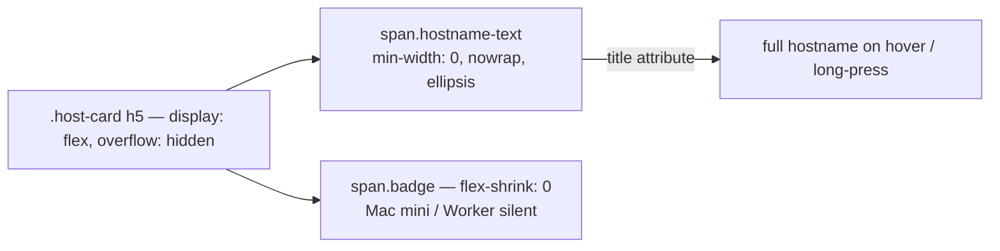

## Summary

`.host-card h5` carried `min-width: 0; overflow: hidden; text-overflow: ellipsis` with no `white-space: nowrap`. `text-overflow` only fires on text that overflows a **single** line, so the hostname wrapped rather than overflowing, the ellipsis never triggered and `overflow: hidden` had nothing to clip — `Tinas-MacBook-Air` dropped "Air" onto a second line and the taller header pushed into the "OFF THE GRID" badge (the #169 signature). Closes #174.

The header is a flex row, and a flex container cannot truncate its own children, so the ellipsis is applied to the hostname **text run** instead of the header. All four `<h5>` card templates in `docs/dashboard.js` (dead, historical, MIA and active) now wrap the hostname in `<span class="hostname-text" title="…">`, which carries `min-width: 0`, `overflow: hidden`, `text-overflow: ellipsis` and `white-space: nowrap`. `.host-card h5` becomes the flex row (so the plain MIA header gets the same treatment as the active one) and `.host-card h5 .badge` gets `flex-shrink: 0`, so the machine-type ("Mac mini") and "Worker silent" badges stay beside the ellipsis rather than being clipped away. The `title` attribute keeps the full hostname readable where the truncation is aggressive, i.e. on a phone.



## Evidence

**No screenshot: no browser was available on this host.** Playwright MCP was not configured for this run, and the Chromium build under `~/Library/Caches/ms-playwright/` hung without producing a frame on every invocation (headless old and new, sandboxed and not, including on a trivial `data:` URL) — so `tests/status-overflow.test.html` could not be rendered here. The browser cases were added anyway and run in any environment that has a working Chromium; the shell gate below is what CI enforces.

Automated verification, run against the unfixed tree and the fixed one:

| Check | Unfixed | Fixed |
| --- | --- | --- |
| `tests/hostname-truncation-check.js` on `docs/styles.css` + `docs/dashboard.js` | 13 failures across all 4 header templates (wrapping, inert ellipsis, no `title`, badge inside the truncating box) | 25 checks, 0 failures |
| `tests/test-status-overflow.sh` | red — Test 6 reports "13 hostname truncation check(s) failed" | 36 assertions, all pass |
| `./quality.sh` | — | 64 / 64 passed |

The unfixed verdicts, straight from the checker before the fix:

```text
TEST_RESULT:hostname-truncation-line-1154-cannot-wrap:FAIL:the hostname text run sits in
  <h5 class="mb-0"> with white-space: normal — the text wraps onto a second line instead of
  overflowing, so the ellipsis never fires
TEST_RESULT:hostname-truncation-line-1254-badges-not-clipped:FAIL:1 badge(s) beside the
  hostname, flex-shrink: 1 — a badge sits inside the truncating box and would be clipped away
```

## Test Plan

- **Added `tests/hostname-truncation-check.js`** — for every `<h5>` host-card header template in `docs/dashboard.js` it locates the element that actually holds the hostname *text run*, resolves the CSS applying to that element, and asks whether the resulting box can truncate: `white-space` cannot wrap, `overflow`/`text-overflow` make the ellipsis effective, the box can shrink below its content width, the full hostname stays discoverable via `title`, the header lays its children out in a row, and the badges sit outside the truncating box with `flex-shrink: 0`. It asserts an outcome rather than a declaration in a fixed selector, so the header may be restructured freely as long as the hostname still truncates with its badges intact — and it goes red the moment `white-space: nowrap` is dropped.
- **Extended `tests/test-status-overflow.sh`** with Tests 6–8. Test 6 sweeps the real stylesheet and dashboard (it failed with 13 failures before the fix and passes after — closing the gap left by Test 4, which only ever checked `min-width: 0`). Test 7 is the checker's self-test against `tests/fixtures/hostname-truncation/pre-fix.{css,js}`, the exact pre-fix state, where the wrapping, missing-`title` and clipped-badge verdicts must still come back FAIL. Test 8 is guard degradation: `no-headers.js` must make discovery go red rather than pass by vacuity.
- **Extended `tests/status-overflow.test.html`** with four Issue #174 browser cases (MIA and active header shapes, `Tinas-MacBook-Air` at 320px/360px, a longer name at a 280px phone width, and a short `GRQ-23` control that must *not* be truncated). Each measures the rendered result: the hostname's client rects must form exactly one line box, `scrollWidth > clientWidth` must match the expected truncation, the status badge must share the hostname's line and stay inside the card, and every machine-type / "Worker silent" badge must have a non-zero box inside the card bounds.
- **Updated `README.md`** with a "The hostname truncates, it never wraps (Issue #174)" section, including a Mermaid diagram of the header layout.
- Version bumped to 1.1.25 and synced with `./update_version.sh`.
