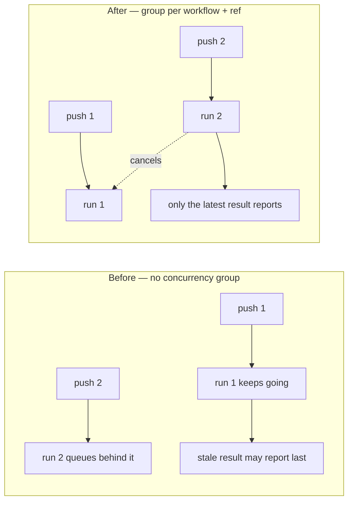

## Summary

The five `pull_request`-triggered check workflows — `dependency-review.yml`,
`gitleaks.yml`, `markdown-lint.yml`, `semgrep.yml` and `shellcheck.yml` —
declared no `concurrency:` block, so every push to a PR branch queued another
full run instead of cancelling the superseded one. That burns runner minutes and
lets a stale run report after a newer one on the PR checks tab.

Each of the five now declares:

```yaml
concurrency:
  group: ${{ github.workflow }}-${{ github.ref }}
  cancel-in-progress: true
```

Keying on `github.ref` (rather than the shared literal group `deploy.yml` uses
for Pages) keeps each branch in its own group, so concurrent PRs never cancel
each other's runs. Closes #187.

## Evidence

Behaviour before and after, for two pushes to the same PR branch:



This is a CI configuration change with no web interface to screenshot. The
evidence is the test below, which parses the workflow YAML with a real parser
and asserts on the resulting structure.

Red/green, observed on this branch:

- Against the unchanged workflows: `0 passed, 15 failed (5 pull_request
  workflows checked)`, exit 1.
- After adding the five concurrency blocks: `15 passed, 0 failed (5
  pull_request workflows checked)`, exit 0.

`./quality.sh` was run in full. It reports `22 passed, 45 failed` on this
branch against `21 passed, 45 failed` on the same tree before the change — the
new test is the extra pass, and the failing set is byte-for-byte identical to
the baseline (`comm -13` between the two failure lists is empty). Those 45
failures are pre-existing and environmental in this sandbox — PyYAML is not
installed (the 10 existing workflow tests that `import yaml` all fail) and
`~/.deno/bin/deno` is absent for the tests that source `extract-functions.sh`.
None of them touch the files in this diff, and CI runs the same checks on the
GitHub runners where that tooling is present.

`shellcheck tests/test-pr-workflow-concurrency.sh` is clean.

## Test Plan

- Added `tests/test-pr-workflow-concurrency.sh`. It walks every file in
  `.github/workflows/`, parses it with Ruby's stdlib YAML parser, and for each
  workflow that triggers on `pull_request` asserts that a concurrency group is
  declared, that the group is keyed on `github.ref`, and that
  `cancel-in-progress` is `true`. It fails loudly if Ruby is missing, if a
  workflow is unparseable, or if no `pull_request` workflow was found at all —
  so the check can never pass vacuously.
- The test covers the general rule rather than the five named files: a new
  `pull_request` workflow added later is checked automatically, and
  `deploy.yml` and `bump-deps.yml` (not PR-triggered) are correctly skipped.
- Existing `tests/test-deploy-concurrency.sh` is unchanged; `deploy.yml` keeps
  its shared `"pages"` group, which is deliberate for Pages deployments.
