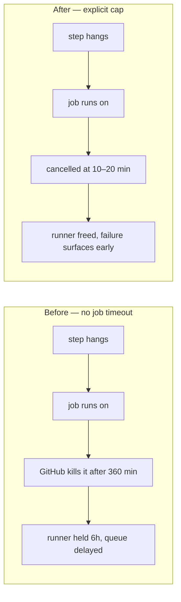

## Summary

None of the seven jobs across `.github/workflows/*.yml` declared a job-level
`timeout-minutes:`, so each inherited GitHub's 360-minute default. A hung step
(a stuck `sudo apt-get install`, an unresponsive gitleaks/semgrep download, a
wedged deploy retry) could hold a runner for six hours before GitHub killed it,
burning Actions minutes and delaying every other queued run for no useful
signal.

Every job now declares a cap sized to what it actually does:

| Workflow | Job | `timeout-minutes` |
| --- | --- | --- |
| `bump-deps.yml` | `bump-deps` | 20 |
| `dependency-review.yml` | `dependency-review` | 10 |
| `deploy.yml` | `deploy` | 20 |
| `gitleaks.yml` | `gitleaks` | 10 |
| `markdown-lint.yml` | `markdownlint` | 10 |
| `semgrep.yml` | `semgrep` | 15 |
| `shellcheck.yml` | `shellcheck` | 10 |

`deploy` and `bump-deps` get the extra headroom the issue called for — the
former runs three deploy attempts with 30s + 60s backoff (issue #151), the
latter runs `./bump-deps.sh` including its audit gate. `semgrep` sits at 15
because it pulls the `p/default` ruleset inside its own container. Closes #188.

## Evidence

What changes for a wedged job:

This is a CI configuration change with no web interface to screenshot. The
evidence is the test below, which parses the workflow YAML with a real parser
and asserts on the resulting structure.

Red/green, observed on this branch:

- Against the unchanged workflows: `0 passed, 7 failed (7 jobs checked)`,
  exit 1 — one failure per job, each naming the missing `timeout-minutes`.
- After adding the seven caps: `7 passed, 0 failed (7 jobs checked)`, exit 0.

`./quality.sh` was run in full, in the foreground, on this branch and on a
pristine copy of `a28f4bd` for comparison: `23 passed, 45 failed` after,
against `22 passed, 45 failed` before. The new test is the extra pass, and the
failing set is byte-for-byte identical between the two runs (`diff` of the
failing test names is empty). Those 45 failures are pre-existing and
environmental in this sandbox — PyYAML is not installed, so the 10 existing
workflow tests that `import yaml` report "YAML syntax errors", and
`~/.deno/bin/deno` is absent for the tests that source `extract-functions.sh`.
None of them touch the files in this diff, and CI runs the same checks on the
GitHub runners where that tooling is present.

`shellcheck tests/test-workflow-job-timeouts.sh` is clean.

## Test Plan

- Added `tests/test-workflow-job-timeouts.sh`. It walks every file in
  `.github/workflows/`, parses it with Ruby's stdlib YAML parser (the same
  parser `tests/test-pr-workflow-concurrency.sh` uses, available on the runners
  without an extra install), and for every job asserts that `timeout-minutes`
  is declared, is a positive integer, and does not exceed the 30-minute cap
  this repository's jobs need. It fails loudly if Ruby is missing, if a
  workflow is unparseable, if a workflow declares no jobs, or if no job was
  found at all — so the check can never pass vacuously.
- The test covers the general rule rather than the seven named jobs: a workflow
  or job added later is checked automatically, with no test change needed.
- No existing test was modified or removed.
