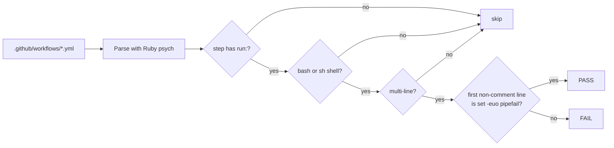

## Summary

Two multi-line `run:` blocks did not enable strict mode, so a failure inside
them could be reported green:

- `.github/workflows/bump-deps.yml` — "Verify jq is available": a failed
  `apt-get install` left the step passing because only `jq --version` was
  checked at the end.
- `.github/workflows/gitleaks.yml` — "Install Gitleaks": `curl ... | tar -xz`
  reports only `tar`'s exit code under `bash -e`, so a broken download could
  leave a truncated or missing `gitleaks` binary while the step succeeded.

Both blocks now start with `set -euo pipefail`, matching the pattern already
used by `bump-deps.yml`'s "Run bump-deps.sh" step. A new test
(`tests/test-workflow-run-strict-mode.sh`) enforces this across every workflow
so the gap cannot reappear. Closes #189.

## Evidence

Backend/CI-only change — no web interface to screenshot. The evidence is the
new test moving from red to green.

Before the fix (against the unmodified workflows):

```
  FAIL: bump-deps.yml job 'bump-deps' step 'Verify jq is available' must start with 'set -euo pipefail', got: 'if ! command -v jq >/dev/null 2>&1; then'
  PASS: bump-deps.yml job 'bump-deps' step 'Run bump-deps.sh' starts with set -euo pipefail
  FAIL: gitleaks.yml job 'gitleaks' step 'Install Gitleaks' must start with 'set -euo pipefail', got: 'GITLEAKS_VERSION="8.27.2"'

Results: 1 passed, 2 failed (3 multi-line run: steps checked)
```

After the fix:

```
  PASS: bump-deps.yml job 'bump-deps' step 'Verify jq is available' starts with set -euo pipefail
  PASS: bump-deps.yml job 'bump-deps' step 'Run bump-deps.sh' starts with set -euo pipefail
  PASS: gitleaks.yml job 'gitleaks' step 'Install Gitleaks' starts with set -euo pipefail

Results: 3 passed, 0 failed (3 multi-line run: steps checked)
```

How the check narrows a workflow down to the blocks it governs:



## Test Plan

- Added `tests/test-workflow-run-strict-mode.sh`. It parses every
  `.github/workflows/*.yml` with a real YAML parser (Ruby's stdlib psych, as
  `tests/test-workflow-job-timeouts.sh` already does), selects the steps that
  actually need strict mode — a `run:` block that is multi-line and uses a
  bash-compatible shell — and asserts the first non-blank, non-comment line is
  `set -euo pipefail`. Single-line `run:` blocks are exempt (`bash -e` already
  fails them), as are non-bash shells (`pwsh`, `python`), which have no such
  directive. It fails loudly when no multi-line block is found at all, so a
  parser or path regression cannot pass as a clean run.
- The test accepts an optional workflow-directory argument, so it can be
  pointed at a fixture directory rather than only the live workflows.
- `./quality.sh` was run before and after: the baseline at `HEAD` is
  68 tests / 23 passed / 45 failed and this branch is
  69 tests / 24 passed / 45 failed — the new test passes and no existing
  result changed. The 45 failures are pre-existing and environmental (this
  container has no python `yaml` module, so every python-based workflow test
  aborts with `ModuleNotFoundError`); they are unrelated to this change and
  reproduce identically on an untouched checkout.
- `shellcheck` at the repository's `severity: warning` level is clean on the
  new test; `tests/test-shellcheck-clean.sh` passes.
