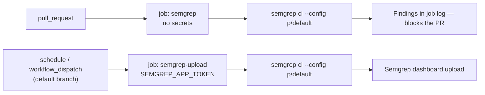

## Summary

`.github/workflows/semgrep.yml` exposed `SEMGREP_APP_TOKEN` as a step-level
`env:` var inside the `pull_request`-triggered job that checks out and scans
PR-controlled code. For same-repo branches GitHub does supply the secret, so
the token was readable by whatever the checked-out code caused the job to
execute (the semgrep container, its rules, any dependency), allowing spoofed
results to be pushed to the Semgrep dashboard under this repository's identity.

The workflow is now split along the trust boundary:

- **`semgrep`** — the PR gate. Runs on `pull_request` only
  (`if: github.event_name == 'pull_request'`) and executes
  `semgrep ci --config p/default` with **no secret in its environment**.
  Findings still block the PR; they are simply not uploaded.
- **`semgrep-upload`** — the authenticated upload. Carries
  `SEMGREP_APP_TOKEN` and runs only on a trusted path (daily `schedule` plus
  `workflow_dispatch`, which check out the default branch, never a PR head),
  guarded by `if: github.event_name != 'pull_request'` as defence in depth.

A daily schedule was chosen over `push: [Develop]` because the health monitor
pushes `docs/**` to Develop every few minutes, and a per-push trigger would
queue a full authenticated scan each time.

Closes #190.

## Evidence

This is a CI/workflow change with no web interface to screenshot. The evidence
is the test run below — `tests/test-semgrep-workflow.sh` was observed failing
against the unfixed workflow and passing after the fix.

Before the fix (token still on the PR path):

```text
  FAIL: SEMGREP_APP_TOKEN is exposed to PR-controlled code in: semgrep
  FAIL: No non-PR job carries SEMGREP_APP_TOKEN — the authenticated upload is gone
  FAIL: Workflow has no push/schedule/workflow_dispatch trigger to run the upload job
Results: 10 passed, 3 failed
```

After the fix:

```text
  PASS: No pull_request-reachable job exposes SEMGREP_APP_TOKEN
  PASS: A pull_request-reachable job still runs 'semgrep ci --config' (semgrep)
  PASS: SEMGREP_APP_TOKEN is scoped to trusted, non-PR job(s): semgrep-upload
  PASS: Workflow declares a trusted (non-pull_request) trigger for the upload job
Results: 13 passed, 0 failed
```

The new assertions are not tied to this particular spelling of the fix: they
model which jobs a `pull_request` event can actually reach (trigger list plus
the job's `if` expression, with any expression the matcher cannot model treated
as reachable so it fails loudly) and then require the token to be absent from
every one of them. Removing the `if` guard from `semgrep-upload` in a scratch
copy was confirmed to turn the check red again.



## Test Plan

- Modified `tests/test-semgrep-workflow.sh`. **Documented test change:** the
  original test 9 asserted that the PR-gate step *exposes* `SEMGREP_APP_TOKEN`
  — the exact behaviour issue #190 identifies as the vulnerability — so that
  assertion is inverted rather than kept. No test was commented out or deleted;
  test 9 is replaced by four assertions:
  - no `pull_request`-reachable job exposes `SEMGREP_APP_TOKEN` at any level
    (workflow env, job env, container env, step env or command line);
  - a `pull_request`-reachable job still runs `semgrep ci --config`, so the
    gate was not silently disabled along with the token;
  - a non-PR job does carry the token, so the authenticated upload survives;
  - a trusted (`push`/`schedule`/`workflow_dispatch`/`workflow_run`) trigger
    exists to actually run that job.
- Re-ran the other workflow-wide gates against the new two-job workflow — all
  pass: `test-workflow-job-timeouts` (the new job declares
  `timeout-minutes: 15`), `test-pr-workflow-concurrency`,
  `test-pr-workflow-branch-filters`, `test-workflow-run-strict-mode`,
  `test-shellcheck-clean`.
- `./quality.sh` was run in full. The 34 failures it reports are pre-existing
  and unrelated: this container has no `deno` binary, so every test routed
  through `tests/extract-functions.sh` fails with
  `/home/vibe/.deno/bin/deno: No such file or directory`. Both files this PR
  touches are covered by passing tests.
