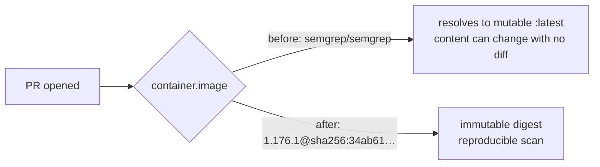

## Summary

`.github/workflows/semgrep.yml` declared `container: { image: semgrep/semgrep }`
in both jobs — no tag, no digest — which Docker resolves to the mutable
`semgrep/semgrep:latest`. The image executing inside every PR scan could change
without any commit to this repository, and two runs of the same PR could produce
different results.

Both jobs now pin the release tag **and** its immutable digest:

```yaml
image: semgrep/semgrep:1.176.1@sha256:34ab619bf1391a24bfda3f05debd0d8a6ce3093c2d5f9d39cfc00f83c1397823
```

The digest is what actually fixes the content; keeping the release tag alongside
it (rather than a bare digest) lets version-bump tooling continue to raise
upgrade PRs. `1.176.1` is the latest semgrep release, published 2026-09-04 —
comfortably past the 24h external-dependency quarantine.

Closes #191.

## Evidence

No web interface is involved — this is a CI workflow change, so there is nothing
to screenshot. The evidence is the digest resolution and the test run.

Digest resolved from the Docker registry (multi-arch OCI index digest, which is
what a GitHub Actions `container.image` must reference):

```
$ curl -sI -H "Authorization: Bearer $TOKEN" \
    -H "Accept: application/vnd.oci.image.index.v1+json, ..." \
    https://registry-1.docker.io/v2/semgrep/semgrep/manifests/1.176.1
content-type: application/vnd.oci.image.index.v1+json
docker-content-digest: sha256:34ab619bf1391a24bfda3f05debd0d8a6ce3093c2d5f9d39cfc00f83c1397823
```

Test run against the **unpinned** workflow (red), then after the pin (green):

```
$ ./tests/test-semgrep-workflow.sh          # before the fix
  FAIL: Container images not pinned to tag + digest: semgrep: semgrep/semgrep; semgrep-upload: semgrep/semgrep
Results: 15 passed, 1 failed

$ ./tests/test-semgrep-workflow.sh          # after the fix
  PASS: Every job container image is pinned to <tag>@sha256:<digest>
  PASS: No job container uses a mutable rolling tag
  PASS: All container jobs share one pinned image
Results: 16 passed, 0 failed
```



## Quality gate

`./quality.sh` was run in full: 71 of 72 checks pass. The single failure is
`test-gpu-collection` (Apple Silicon field parsing), which is **pre-existing and
unrelated** — this change touches only `.github/workflows/semgrep.yml` and
`tests/test-semgrep-workflow.sh`, neither of which the GPU collection test
reads. `./tests/test-shellcheck-clean.sh` passes at warning severity.

## Test Plan

Modified `tests/test-semgrep-workflow.sh`:

- **Test 7 (modified, business-logic change)** — previously asserted
  `container.image == "semgrep/semgrep"` exactly, which pinning makes impossible
  to satisfy. It now accepts any `semgrep/semgrep` reference with a tag and/or
  digest, so the "which image" assertion survives while the new tests below own
  the "is it pinned" assertion. No test was removed or commented out.
- **Test 14 (new)** — every job declaring a `container` pins its image to
  `<tag>@sha256:<64 hex>`; a bare image, a tag-only image or a digest-only image
  all fail. This is the assertion that goes red against the unfixed workflow.
- **Test 15 (new)** — no job pins a mutable rolling tag (`latest`, `canary`, or
  their `-nonroot` variants), even when a digest is present, since the tag is
  what bump tooling reads on the next upgrade.
- **Test 16 (new)** — all container jobs share a single image, so the PR gate
  and the authenticated upload can never drift onto different semgrep versions.

All three new tests parse the workflow YAML and assert on the parsed structure —
they check any job's container, not the two job names that happen to exist
today, so they keep working if a job is added or renamed.
