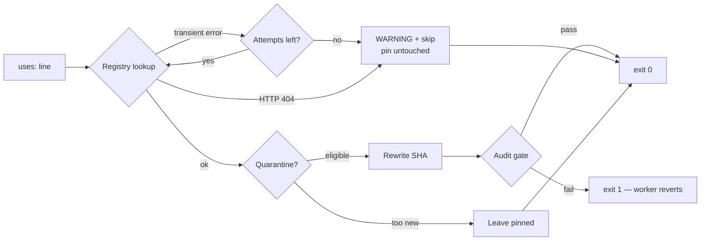

## Summary

`bump-deps.sh` treated an unreachable GitHub API as a repo-level failure. Any
non-zero exit tells the worker *"a bump was written and it is bad — revert
it"*, so a transient `HTTP 403`/`5xx` on the very first lookup
(`actions/checkout`, the first `uses:` line the script walks) aborted the whole
run with status 1. Three of those in a row disabled dependency bumps for this
repo — even though nothing had been written and there was nothing to revert.

The exit status is now a verdict on **this repo**, not on the upstream
registry:

- A failed release/tag lookup skips that one action, leaves its pin exactly as
  it was, warns loudly on stderr, and exits 0. Reachable actions in the same run
  still bump.
- `gh`'s and `jq`'s own diagnostics are captured and reported verbatim instead
  of being sent to `/dev/null`, so an operator can tell a rate limit from a 404.
- Transient errors are retried (`BUMP_DEPS_API_ATTEMPTS`, default 3). An
  `HTTP 404` is a settled answer and is not retried.
- A missing `gh` or `jq` on the unattended `PATH` is a warned no-op, not a
  failure. Both are named in one run.
- Exit 1 is reserved for a *written* bump the audit gate rejected, and for
  usage errors.

The scheduled workflow also ran `./bump-deps.sh` with no GitHub credential, so
`gh api` fell back to GitHub's shared per-IP limit on hosted runners — the most
likely source of the reported error. The step now passes the job's own token,
and re-surfaces any skip list as a `::warning::` annotation so a green run that
bumped nothing is not mistaken for "everything already current".

Closes #195.

## Evidence

Backend/CLI change — no web interface to screenshot. The evidence is the
regression suite plus a live run of the real script against this repo's own
workflow files.



Before the fix, the regression suite reproduced the reported failure verbatim
(exit 1, `ERROR: failed to query latest release for actions/checkout`):

```text
  FAIL: Release lookup failure: rc=1, expected exit 0 with a warning
    ERROR: failed to query latest release for actions/checkout
  FAIL: Diagnosis: gh's own error text was swallowed (rc=1)
  FAIL: Tag resolution failure: rc=1, expected exit 0 with a warning
  FAIL: Partial outage: rc=1, expected setup-node bumped and checkout skipped
  ...
Results: 1 passed, 7 failed
```

After the fix:

```text
Passed: 15  Failed: 0
```

A simulated total outage against this repo's real workflow files now reports
every action and exits 0:

```text
WARNING: skipping actions/checkout -- failed to query the latest release (after 3 attempt(s): gh: HTTP 403: API rate limit exceeded)
...
OK no bumps -- 8 action(s) skipped, upstream state unknown
  actions/checkout: failed to query the latest release (after 3 attempt(s): gh: HTTP 403: API rate limit exceeded)
  ...
EXIT=0
```

A live `./bump-deps.sh --dry-run` against the real registry still resolves
normally (`OK bumped: 3 action(s) [dry-run]`, exit 0), so the healthy path is
unchanged.

### Full quality gate

`./quality.sh` fails in this container both before and after the change with an
**identical** 34-test failure set. Verified against a pristine worktree of
`origin/Develop` (`f154aa0b1a`): 70 tests, 36 passed, 34 failed — versus 71
tests, 37 passed, 34 failed on this branch. The failures are environmental:
`tests/extract-functions.sh:11` hardcodes `DENO="$HOME/.deno/bin/deno"`, which
does not exist in this container (Deno is at `/usr/local/bin/deno`), so every
suite sourcing that helper dies on "No such file or directory". That is a
separate root cause, untouched by this diff, and is filed as
**stSoftwareAU/GRQ-health#198**. This change adds one test file and one pass,
and introduces no new failure. `shellcheck -S warning` and `markdownlint-cli2`
are clean on every file touched.

## Reproduction

- **symptom** — `bump-deps.sh` exited 1 with
  `ERROR: failed to query latest release for actions/checkout`; the worker
  reverted the bump on three consecutive runs and dependency bumps were
  disabled for the repo.
- **status** — `verified` — `tests/test-bump-deps-resilience.sh` was observed
  failing 7 of 8 scenarios against the unfixed script, reproducing that exact
  `ERROR:` line and exit code, and passes 15 of 15 after the fix.
- **regression test** — `tests/test-bump-deps-resilience.sh::Release lookup failure: exits 0, warns, leaves the pin untouched`

## Acceptance Criteria

<!-- vibe-spec-review inputs="diff+issue-body" -->

- **partial** — reproduce with `bash bump-deps.sh` in a clean checkout — evidence: `tests/test-bump-deps-resilience.sh:70-92` — reviewer: partial — reason: the live registry answers normally from this container, so the outage could not be reproduced by simply re-running the script; it is reproduced synthetically by stubbing `gh` to the reported failure, and the likeliest production cause (the scheduled workflow running `gh api` with no credential) is fixed in `.github/workflows/bump-deps.yml`
- **met** — fix the script so it exits 0 on a no-op, covering both named causes (missing tool on the unattended `PATH`, registry error) — evidence: `bump-deps.sh:136-146` (missing tool) and `bump-deps.sh:321-362` + `bump-deps.sh:506-514` (registry error), asserted by `tests/test-bump-deps-resilience.sh` scenarios 1-4, 6 and 9 — reviewer: met
- **missing** — apply the `work-on` label to schedule the fix — reviewer: missing — reason: a label action, not a code change, and the worker account cannot self-apply reserved workflow labels
- **partial** — stated goal: dependency bumps are re-enabled for this repo — evidence: `.github/workflows/bump-deps.yml:49-75` — reviewer: partial — reason: the reviewer noted that stopping the exit-1 loop alone would leave a silent permanent no-op if lookups keep failing; the missing credential on the scheduled step is fixed here and a skip run now raises a `::warning::` annotation, but whether that fully restores bumping can only be confirmed by the next weekly run
- **unrequested** — retry/backoff with `BUMP_DEPS_API_ATTEMPTS` and `BUMP_DEPS_RETRY_DELAY_SECONDS` — evidence: `bump-deps.sh:36-38`, `bump-deps.sh:190-217` — reviewer: unrequested — reason: kept; the issue names "a registry error" as a usual cause and a transient blip is precisely what a bounded retry recovers, otherwise a one-second outage costs a whole week of bumps
- **unrequested** — per-action skip accounting and partial bumping — evidence: `bump-deps.sh:220-236`, `bump-deps.sh:497-524` — reviewer: unrequested — reason: kept; it is the mechanism by which a single unreachable action no longer aborts the run, which is the fix the issue asks for
- **unrequested** — `BUMP_DEPS_JQ` test hook — evidence: `bump-deps.sh:34` — reviewer: unrequested — reason: kept; it mirrors the existing `BUMP_DEPS_GH` hook and is the only way to test the missing-`jq` path without mutating `PATH` globally
- **unrequested** — error plumbing and the `resolve_action` extraction — evidence: `bump-deps.sh:167-186`, `bump-deps.sh:248-256`, `bump-deps.sh:321-362` — reviewer: unrequested — reason: kept; the lookup helpers run inside command substitutions, so carrying the real cause out of the subshell is required to report *why* an action was skipped rather than a generic message
- **unrequested** — README expansion and the workflow annotation — evidence: `README.md:755-757`, `README.md:791-797`, `README.md:839-870`, `.github/workflows/bump-deps.yml:49-75` — reviewer: unrequested — reason: kept; the exit-code contract changed, and a code change owes a docs change — the annotation is where the now-non-fatal failure stays loud

## Standards Review

<!-- vibe-standards-review inputs="diff+CODING-STANDARDS.md" -->

- **violation** — the workflow step comment still claimed "the workflow fails so a human notices", which stopped being true for a registry outage — evidence: `.github/workflows/bump-deps.yml:52` — reason: fixed here; the comment now states the exit-0 contract
- **violation** — a permanent upstream fault would produce a green weekly run forever with no signal, treating absence of failure as success — evidence: `.github/workflows/bump-deps.yml:57` — reason: fixed here; the step greps its own output and raises a `::warning::` annotation when any action was skipped
- **violation** — `json_field` sent `jq`'s diagnostic to `/dev/null`, re-introducing the swallowing this change exists to remove — evidence: `bump-deps.sh:250` — reason: fixed here; `jq`'s stderr is captured and included in the recorded cause, covered by the "Non-JSON body" scenario
- **violation** — `elif` meant only the first missing prerequisite was ever reported — evidence: `bump-deps.sh:139` — reason: fixed here; both are collected and named in one run, covered by the "Both tools missing" scenario
- **violation** — `require_non_negative_integer`, `json_field`'s failure branch and `BUMP_DEPS_API_ATTEMPTS` had no tests — evidence: `bump-deps.sh:119`, `bump-deps.sh:248`, `bump-deps.sh:37` — reason: fixed here; five scenarios added (invalid settings ×3, unparseable body, `BUMP_DEPS_API_ATTEMPTS=1` honoured)
- **violation** — retries were applied to a permanent `HTTP 404`, costing three calls and four seconds of sleep on every future run — evidence: `bump-deps.sh:190-217` — reason: fixed here; a 404 breaks out on the first attempt, asserted by the "Permanent 404" scenario
- **violation** — `gh_api` created an untrapped `mktemp` per call, leaking on an interrupt mid-retry — evidence: `bump-deps.sh:193` — reason: fixed here; one scratch file is created beside `LOOKUP_ERROR_FILE` and covered by the same `trap`
- **violation** — `--help` advertised output strings the script does not print, and omitted the missing-tool line entirely — evidence: `bump-deps.sh:69` — reason: fixed here; the `Output:` block now matches the emitted text exactly
- **violation** — raw upstream error text reached stdout, which the workflow pipes unsanitised into a `$GITHUB_OUTPUT` heredoc — evidence: `bump-deps.sh:502` — reason: fixed here; `set_lookup_error` folds every recorded cause onto a single line, so upstream text cannot introduce a bare delimiter
- **violation** — `run_in_sandbox` was bypassed by hand-rolled invocations in two scenarios, and the skip reporters were declared mid-script away from every other function — evidence: `tests/test-bump-deps-resilience.sh:236`, `bump-deps.sh:518` — reason: fixed here; the helper forwards a `BUMP_TEST_ENV` array so all scenarios share one invocation path, and the reporters moved into the helper region
- **violation** — the retry-setting validators exit 1, which the reviewer read as contradicting the new exit-code contract — evidence: `bump-deps.sh:119-133` — reason: stands; these are usage errors in the same class as an invalid flag or a bad `--quarantine-hours`, which exit 1 on the base branch too, and the worker sets neither variable so the path is unreachable in production. The README table records exit 1 for "invalid flag or option value"
- **clean** — Australian English throughout the added lines; cross-platform bash 3.2 (no GNU-only flags, `${arr[@]+"${arr[@]}"}` guards preserved, POSIX `tr`/`sed`); tests invoke the real script and assert on exit codes, output and the on-disk workflow file rather than grepping source; all four suites run in ≤1s with no wall-clock sleeps or timing thresholds; `gh api "$path"` is a quoted argv element with no `eval`; no hidden files or secrets staged; the README Mermaid flowchart was extended rather than replaced

## Test Plan

- Added `tests/test-bump-deps-resilience.sh` — 15 scenarios, each invoking the
  real `bump-deps.sh` with a stubbed `gh` and `quality.sh`:
  - release lookup failure exits 0, warns, and leaves the pin untouched
  - `gh`'s own error text reaches the operator
  - tag-resolution failure exits 0 and leaves the pin untouched
  - partial outage: the reachable action bumps, the failed one is skipped
  - a one-off 502 is retried and the bump still lands
  - `BUMP_DEPS_API_ATTEMPTS=1` makes exactly one call and skips
  - missing `gh`, missing `jq`, and both missing at once — each a warned no-op
  - a non-JSON body exits 0 and reports `jq`'s own diagnostic
  - a permanent `HTTP 404` is called once, not retried
  - three invalid retry settings are rejected with exit 1
  - an unknown flag still exits 1
- Re-ran `tests/test-bump-deps.sh` (9 passed), `tests/test-bump-deps-workflow.sh`
  (14 passed) and `tests/test-readme-bump-deps.sh` (11 passed) — all unchanged.
- No existing test was modified or removed.
