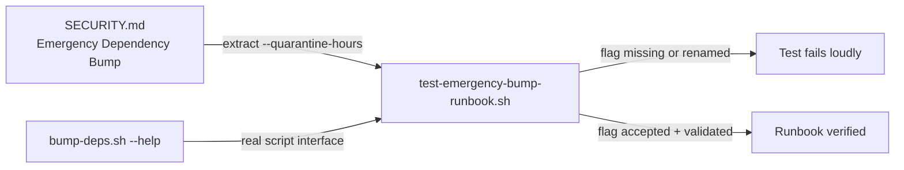

## Summary

`SECURITY.md` already existed at the repo root — PR #208 added it for the
sibling finding #205 (SCR-SEC-ALERTING) — so the disclosure-contact half of
this issue was already satisfied. What was still missing is the half unique to
`SCR-RUNBOOK`: the **emergency-bump procedure**. `grep -n -i 'quarantine'
SECURITY.md` returned nothing on `Develop`, so bypassing the quarantine window
for an actively-exploited CVE was undocumented tribal knowledge.

This PR adds an **Emergency Dependency Bump** section to `SECURITY.md`
documenting the `bump-deps.sh --quarantine-hours` override already partially
described in the script: the concrete command, the fact that the override
applies to a **single run only** (never a lowered committed default), the
advisory-confirmation step, and the PR/issue record each override leaves. The
README's security and quarantine-policy sections are cross-linked to it.

Closes #206.

## Evidence

Backend/docs change — no web interface to screenshot. The evidence is the test
run below.

The new test runs in two directions, which is what keeps the runbook honest: it
extracts the flag name out of `SECURITY.md` and then asserts that flag against
the **real** `bump-deps.sh` interface. A renamed or dropped flag turns the test
red rather than leaving operators following a procedure that no longer works.



Red before the change (section absent from `SECURITY.md` on `Develop`):

```text
  FAIL: No section covers an emergency/urgent bump procedure
  FAIL: Emergency section does not name bump-deps.sh
  FAIL: Emergency section names no quarantine-override flag
  FAIL: Emergency section shows no concrete value for the override
  FAIL: Cannot verify the override flag against bump-deps.sh: none documented
  FAIL: Emergency section names no human gate or record
  FAIL: Emergency section does not state the override is per-run only

Results: 1 passed, 7 failed
```

Green after the change:

```text
  PASS: SECURITY.md exists at the repository root
  PASS: A section covers the emergency bump procedure
  PASS: Emergency section names bump-deps.sh
  PASS: Emergency section names an override flag (--quarantine-hours)
  PASS: Emergency section shows the flag with a concrete value
  PASS: bump-deps.sh --help documents the flag SECURITY.md names
  PASS: bump-deps.sh rejects a non-numeric '--quarantine-hours' value
  PASS: Emergency section names a human gate or record
  PASS: Emergency section states the override is per-run only

Results: 9 passed, 0 failed
```

`markdownlint-cli2` reports `0 issues` across `SECURITY.md` and `README.md`.

### Pre-existing gate failure — not from this PR

`./quality.sh` reports **73 passed, 1 failed**. The one failure is
`test-gpu-collection` ("Apple Silicon fields parsed"), which is **already red on
a pristine `origin/Develop` checkout** — verified by running that test in a
detached worktree of `origin/Develop`, where it fails identically. It is
unrelated to this change (which touches only `SECURITY.md`, `README.md` and a
new test) and is already tracked by **#207** — "Quality gate red on Develop:
Apple Silicon GPU memory parse returns 0 GB". No duplicate follow-up was filed,
and it was left unfixed here per the change-scope rule.

## Test Plan

- **Added** `tests/test-emergency-bump-runbook.sh` — 9 assertions, picked up
  automatically by `quality.sh`'s `tests/test-*.sh` glob:
  - `SECURITY.md` exists at the repo root.
  - An emergency/urgent bump section exists, names `bump-deps.sh`, names the
    override flag, and shows it with a concrete value.
  - **Calls the real `bump-deps.sh`**: `--help` must document the flag the
    runbook names (drift guard), and the script must reject a non-numeric value
    for it (so a fat-finger during an incident fails loudly rather than
    silently widening the window).
  - The section names a human gate/record and states the override is per-run.
- **Verified red then green** — the suite was run against `origin/Develop`'s
  `SECURITY.md` (7 failures) and again after the edit (0 failures).
- **Unchanged** `tests/test-security-policy.sh` still passes (9/9); its parser
  was deliberately left alone. The fence-aware section parser (a `#` inside a
  fenced block is a shell comment, not a heading) lives only in the new test.
- `tests/test-readme-bump-deps.sh` passes (11/11) after the README edits.
