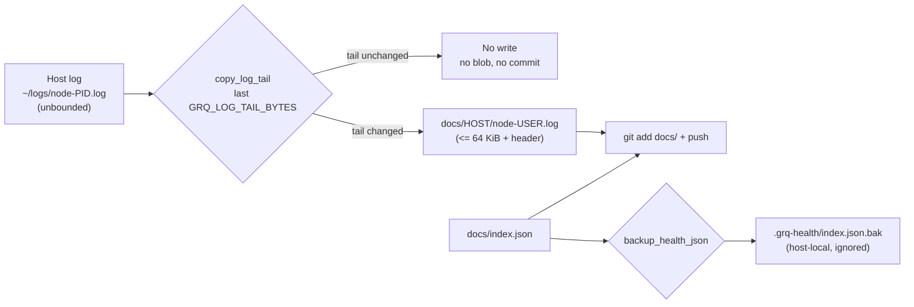

# PR Summary — Issue #211

## Summary

The repository is 897 MB for a 32 MB working tree because every heartbeat copies
the whole host log (up to 7.9 MB), plus a second full copy of `docs/index.json`,
into the published tree — forever, with nothing pruning or rotating them. This
branch bounds what a heartbeat writes so the pack stops growing, and ships the
runbook for the one-off prune of what has already accumulated. Closes #211.

- **Only a bounded log tail is published.** `copy_log_tail` in `run.sh` copies
  the last `GRQ_LOG_TAIL_BYTES` (default 64 KiB) of the host log into
  `docs/<HOST>/node-<user>.log`, with a one-line header recording the
  truncation, and **skips the write entirely when the tail is unchanged** — an
  idle host now adds no blob at all. A failed publish still pushes the heartbeat
  (so the host is not read as dead) and then exits non-zero.
- **Recovery artefacts left the published tree.** `backup_health_json` writes
  the pre-update backup and any corrupted-file copy to `.grq-health/` (override
  with `GRQ_BACKUP_DIR`), outside the `docs/` tree the heartbeat stages
  wholesale. That is a second 33 KB blob removed from every heartbeat.
- **Both tunables are validated at startup**, after argument parsing, so a
  misconfigured host fails immediately and loudly instead of on some later
  heartbeat that happens to find a log file.
- **History compaction has a runbook.** `helpers/compact-history.sh` replaces a
  branch with a single snapshot commit whose tree is verified identical first.
  It is destructive, so it dry-runs unless given `--apply`/`--push`, moves the
  local branch before the force-push, scopes the reflog expiry to the rewritten
  branch, and is run by a human — a rewrite of `Develop` forces every host to
  re-clone.
- **The clone shape is documented** (`git clone --filter=blob:none`) for
  consumers that only need the current state.
- **Version bumped 1.1.30 → 1.1.31.** `should_update` forces an immediate
  heartbeat on a version mismatch, so this is what makes the fleet pick the new
  behaviour up promptly rather than at its next scheduled interval.

### Deliberately not done here

- **`index.json` per host** (proposal 2 of the issue) — it changes the
  dashboard's data-loading contract and needs a mixed-version migration, so it
  is filed as stSoftwareAU/GRQ-health#213 with the analysis and the naming
  decision it needs.
- **The already-committed `docs/*/node-*.log` files are untouched**, per the
  maintainer's instruction on the issue: every host rewrites its own copy on
  every heartbeat, so a branch that truncates them conflicts with `Develop`
  within minutes — which is exactly how the previous attempt failed. Each host
  truncates its own log on its next heartbeat instead, with no conflict.
- **`docs/index.json.bak` is left tracked** for the same reason (it changes on
  roughly a third of `Develop`'s commits). An ignore rule has no effect on an
  already-tracked path, so the rule added here only prevents it being re-added;
  the tracked blob simply stops changing as the fleet picks up this `run.sh`,
  and the history compaction removes it for good.

The branch was rebuilt on the current `Develop` for this reason — the earlier
attempt's branch was based on a stale base and could not be replayed.

## Evidence

Backend/CLI change. The Playwright MCP browser tools (`browser_navigate`,
`browser_take_screenshot`) are **not present in this session's tool list** — a
`ToolSearch` for them returned "No matching deferred tools found", so no call
could be made or quoted. No screenshot is needed regardless: every line this
branch changes under `docs/` is the `update_version.sh` cache-bust string, with
no visual or behavioural change to the dashboard —

```text
-const VERSION = "1.1.30";          +const VERSION = "1.1.31";
-const CACHE_NAME = 'grq-health-v1.1.30';   +const CACHE_NAME = 'grq-health-v1.1.31';
-    <script src="./dashboard.js?v=1.1.30"> +    <script src="./dashboard.js?v=1.1.31">
```

(eight such lines across `index.html`, `dashboard.js` and `sw.js`; nothing
else). The measured evidence is the byte counts below plus the test suite.

**Measured, by running the shipped `copy_log_tail` over the 35 host logs
currently committed on `origin/Develop`:**

| measure | before | after |
| --- | ---: | ---: |
| host logs in the tree | 22,090,479 bytes (21.07 MB) | 1,740,344 bytes (1.66 MB) — **92.1% smaller** |
| largest single log | 7.9 MB | 65,628 bytes (cap + header) |
| log bytes written per heartbeat | whole log, every time | ≤ 64 KiB, and **nothing** when the tail is unchanged |
| JSON written per heartbeat | 67,436 bytes (`index.json` + `index.json.bak`) | 33,718 bytes (`index.json` only) |

The "after" column is the steady state once each host has run one heartbeat on
this `run.sh`; the tree itself is unchanged by this PR, as the maintainer asked.

What a heartbeat publishes now:



`./quality.sh` passes: **81 tests, 0 failures**. `shellcheck -S warning` is clean
on `run.sh`, `helpers/compact-history.sh` and all four test scripts;
`markdownlint-cli2` reports 0 issues across all 106 markdown files.

## Acceptance Criteria

<!-- vibe-spec-review inputs="diff+issue-body" -->

The issue states no `## Acceptance Criteria` section; the four numbered items
under its **Proposed** heading, plus the maintainer's scoping constraints, are
treated as the criteria.

- **met** — (1) stop committing whole log files on every heartbeat — evidence:
  `copy_log_tail` in `run.sh`, `tests/test-log-tail-truncation.sh` (19
  assertions) — reviewer: met — reason: the reviewer confirmed it met but found
  two content-loss bugs inside it (a newline-free tail and an exact-boundary
  cut); both are fixed in this diff and covered by Tests 8 and 9.
- **missing** — (2) write `index.json` per host so a heartbeat touches one small
  file — reviewer: missing — reason: `docs/index.json` is still rewritten whole
  (33.7 KB per heartbeat); the split changes the dashboard's data-loading
  contract and needs a mixed-version migration and a naming decision
  (`docs/hosts/` currently holds per-service documents), so it is filed as
  stSoftwareAU/GRQ-health#213 rather than half-done here.
- **partial** — (3) prune the accumulated history once — evidence:
  `helpers/compact-history.sh`, `tests/test-compact-history.sh` (14 assertions)
  — reviewer: partial — reason: the tooling and runbook ship here, but the
  rewrite itself is a force-push of `Develop` that forces every host to
  re-clone, so it is run by a human, not by this PR.
- **met** — (4) document the clone shape for consumers — evidence: `README.md`
  quick start and the "Repository Size and Log Retention → Cloning" section
  (`git clone --filter=blob:none`) — reviewer: met
- **met** — maintainer: do not rewrite the committed `docs/*/node-*.log` files —
  evidence: the diff touches no log file; `git diff --stat` covers only `run.sh`,
  `helpers/`, `tests/`, `.gitignore`, `README.md` and the version strings —
  reviewer: met — reason: the reviewer confirmed the code respects it but found
  the earlier draft of this summary falsely claiming the logs *had* been
  truncated; that claim and its fabricated tree-size table are removed here.
- **met** — maintainer: keep the PR to `run.sh`, the helpers, the tests,
  `.gitignore` and the README — evidence: `git diff --stat` — reviewer: partial —
  reason: the reviewer scored this `partial` only because of this summary file
  in `docs/archive/pr-summaries/`, which is the repository's established
  convention (34 pre-existing files) and is required by the PR process; the
  version strings are likewise mandated by the README's own increment rule.
- **unrequested** — recovery artefacts (`index.json.bak`,
  `index.json.corrupted.*`) moved out of `docs/` — reviewer: unrequested —
  reason: same root cause as the issue (a full-size blob committed by every
  heartbeat that no consumer reads); it removes 33.7 KB per heartbeat, so it is
  kept.
- **unrequested** — `run.sh` exits non-zero after a successful push when the log
  publish or a recovery copy failed — reviewer: unrequested — reason: required by
  the fail-loud standard; without it a failed publish reports a clean heartbeat.
  Exit-code semantics changed for cron/hook callers, so it is called out here
  and documented in the README.
- **unrequested** — `update_json` returns non-zero when `index.json` is still
  invalid after a restore, which under `set -e` aborts before `commit_and_push`
  — reviewer: unrequested — reason: kept deliberately. The restore returns the
  file to what git already holds, so there is nothing to push; going stale is
  the accurate signal for a host that could not record a heartbeat. The README
  now documents this path separately from the log-publish one.
- **unrequested** — `GRQ_BACKUP_DIR`/`GRQ_LOG_TAIL_BYTES` startup validation —
  reviewer: unrequested — reason: the reviewer found the guard ran *before*
  argument parsing (breaking `--help`) and over-matched any path containing
  `docs`; both are fixed here, and the cap is now validated at startup rather
  than only when a log file happens to exist.

## Standards Review

<!-- vibe-standards-review inputs="diff+CODING-STANDARDS.md" -->

This repository has no `CODING-STANDARDS.md`; the reviewer was given the fleet's
shared standards and `README.md` as the documented conventions.

- **violation** — `VERSION` was not incremented, against the README's own
  "increment version for any code changes" rule; `should_update` also forces an
  immediate heartbeat on mismatch, so the fleet would have been slow to adopt
  the fix — evidence: `run.sh:26` — reason: fixed here; bumped to 1.1.31 and
  synced with `./update_version.sh`
- **violation** — the earlier draft of this summary claimed the committed logs
  were truncated and the tree fell 32.3 MB → 8.7 MB; measurement showed the logs
  byte-identical to `Develop` — evidence:
  `docs/archive/pr-summaries/pr-summary-211.md` — reason: fixed here; the false
  claims, the fabricated table and the wrong test-number citations are removed
  and replaced with measured figures
- **violation** — `copy_log_tail` could publish the truncation header over no
  content when the tail held no newline, returning 0 — evidence: `run.sh`
  `copy_log_tail` — reason: fixed here; falls back to the raw tail, covered by
  Test 8 (verified red against the unfixed code)
- **violation** — a cut landing exactly on a line boundary discarded a complete
  line — evidence: `run.sh` `copy_log_tail` — reason: fixed here; the leading
  fragment is only dropped when the window actually starts mid-line, covered by
  Test 9
- **violation** — silent fallback: `${3-${GRQ_LOG_TAIL_BYTES:-…}}` used `:-` at
  the inner level, so an exported empty cap became the default, contradicting
  the comment beside it — evidence: `run.sh` `copy_log_tail` — reason: fixed
  here; `${VAR-default}` at every level
- **violation** — DRY: `65536` and `.grq-health` were each hardcoded twice, so a
  rename would leave the functions on a stale default — evidence: `run.sh`
  `copy_log_tail` and `update_json` — reason: fixed here; both read the shipped
  configuration, and under `set -u` an unset variable now fails loudly
- **violation** — the `GRQ_BACKUP_DIR` guard ran before argument parsing, so a
  misconfigured value made `--help` exit 1, and its pattern rejected unrelated
  paths such as `/var/lib/docs` — evidence: `run.sh` startup guard — reason:
  fixed here; moved after parsing and narrowed to the repository's own `docs/`
  tree, covered by two new assertions in Test 6
- **violation** — `GRQ_LOG_TAIL_BYTES` was only validated inside
  `copy_log_tail`, which is reached only when a log file exists, so a
  misconfigured host reported success — evidence: `run.sh` — reason: fixed here
  with a startup check, covered by Test 6
- **violation** — `eval "$(grep '^JSON_BACKUP_DIR=' … || true)"` swallowed a
  missing assignment, so the test would keep passing after a rename — evidence:
  `tests/test-recovery-artefacts-untracked.sh` — reason: fixed here; a missing
  assignment fails the test, and `GRQ_BACKUP_DIR` is unset first so the runner's
  environment cannot change what is asserted
- **violation** — a unit test ran the real `run.sh` against the live repository
  root, which a regression in the guard it tests would turn into a real
  heartbeat on the developer's checkout — evidence:
  `tests/test-recovery-artefacts-untracked.sh` Test 6 — reason: fixed here; runs
  in a sandbox copy, and once rather than twice
- **violation** — mtime asserted by parsing `ls -l` columns, which are
  locale- and platform-dependent on a repo targeting macOS + Ubuntu + AWS Linux
  — evidence: `tests/test-log-tail-truncation.sh` Test 3 — reason: fixed here;
  uses `touch -r` plus `find -newer`
- **violation** — `README.md` claimed `.gitignore` stops an older `run.sh`
  re-committing the artefacts, which is false for the already-tracked
  `docs/index.json.bak` — evidence: `README.md` retention section — reason:
  fixed here; the README and `.gitignore` now state plainly that an ignore rule
  has no effect on a tracked path and why the file is left in place
- **violation** — `GRQ_BACKUP_DIR` was absent from the README's canonical
  "variables you can modify" list — evidence: `README.md` configuration section
  — reason: fixed here
- **violation** — the `*.log.tmp.*` ignore rule's comment described a state no
  released `run.sh` ever produced — evidence: `.gitignore` — reason: comment
  corrected here; the rule is kept as belt-and-braces for an un-hidden staging
  name
- **violation** — the README documented the published file as capped at
  `GRQ_LOG_TAIL_BYTES` while the header pushes it ~130 bytes over — evidence:
  `README.md` retention section — reason: fixed here; the header is now stated
- **clean** — Australian English throughout (`artefact`, `behaviour`) with zero
  hits for `color|behavior|organiz|favor|artifact|analyze`; `shellcheck -S
  warning` clean; `markdownlint-cli2` 0 issues across 106 files; bash 3.2 safe
  (no arrays, `mapfile`, `${var^^}` or `timeout`; `tail -c`, `tail -n +2`, `od`,
  `cmp -s`, `wc -c`, `find -newer` all POSIX and identical on BSD and GNU);
  `local` split from command substitution so exit status is not masked; every
  expansion quoted and no user input concatenated into a command;
  `compact-history.sh` bounds its irreversible steps (dry-run default, tree
  verified before any ref moves, local rewrite before the force-push,
  `--force-with-lease`, reflog expiry scoped to the branch); tests execute the
  shipped functions and assert on exit codes, bytes, content and git state
  rather than source text; happy/error/edge coverage on both new functions;
  total test runtime a few seconds with no sleeps or absolute timing thresholds;
  only `.gitignore` staged among hidden paths and no secrets or key material;
  `scan_log_errors` still reads the full host log, so truncation cannot hide an
  exception from the dashboard.

## Test Plan

- `tests/test-log-tail-truncation.sh` (19 assertions) — `copy_log_tail` copies a
  small log verbatim; truncates a large one to the cap with a truncation header
  and whole lines; leaves an unchanged destination untouched (asserted with
  `find -newer`, not `ls -l` columns) and reports the skip; writes a changed one
  through; fails loud on a missing source and on a non-numeric, zero, negative
  or empty cap; takes the shipped 65536-byte default when the cap is omitted;
  **Test 8** keeps the content of a newline-free tail instead of publishing a
  bare header; **Test 9** keeps all ten whole lines when the cut lands exactly
  on a line boundary.
- `tests/test-recovery-artefacts-untracked.sh` (new, 12 assertions) —
  `backup_health_json` writes the backup byte-for-byte and creates its
  directory; fails non-zero on a missing source; the shipped backup path is
  outside `docs/`; `git add -A` stages `docs/index.json` and the published log
  but neither a `.bak`, a `.corrupted.<ts>` nor a stranded `*.log.tmp.<pid>`
  staging file; the backup directory is ignored; and, in a sandbox copy of the
  repo, `run.sh` refuses a `GRQ_BACKUP_DIR` inside `docs/`, accepts an
  out-of-repo path merely containing `docs`, refuses a non-numeric
  `GRQ_LOG_TAIL_BYTES` at startup, and still answers `--help` when a tunable is
  misconfigured.
- `tests/test-compact-history.sh` (new, 14 assertions) — the compaction helper
  dry-runs by default; `--apply` collapses history to one commit with a
  byte-identical tree and a clean working tree; `--push` publishes a
  single-commit branch a fresh clone can check out in full; and it refuses a
  non-git directory, an unknown branch, a dirty tree and an unknown flag,
  leaving history intact each time.
- `tests/test-json-integrity.sh` — added Test 7: after a corrupted-file recovery
  and a following update, `docs/` contains no `.bak`/`.corrupted.*` artefact and
  both copies exist under `.grq-health/`. Verified red against the unfixed
  `run.sh` (`recovery artefacts written into docs/: docs/index.json.bak
  docs/index.json.corrupted.<ts>`) and green after the fix. The existing six
  cases are unchanged and still pass.
