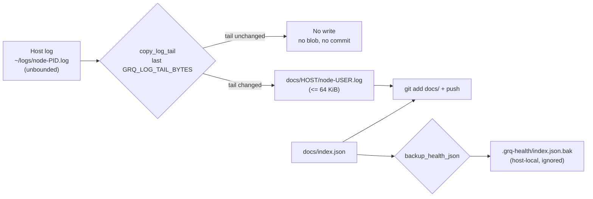

# PR Summary — Issue #211

## Summary

The repository was 897 MB for a 32 MB working tree because every heartbeat
committed whole host logs, and a second full copy of `docs/index.json`, into the
published tree — forever. This branch bounds what a heartbeat writes so the pack
stops growing, truncates the already-committed logs, and ships the runbook for
compacting the accumulated history. Closes #211.

- **Only a bounded log tail is published.** `copy_log_tail` in `run.sh` copies
  the last `GRQ_LOG_TAIL_BYTES` (default 64 KiB) of the host log into
  `docs/<HOST>/node-<user>.log`, with a header recording the truncation, and
  **skips the write entirely when the tail is unchanged** — an idle host now
  adds no blob at all. A failed publish still pushes the heartbeat (so the host
  is not read as dead) and then exits non-zero.
- **Recovery artefacts left the published tree.** `backup_health_json` writes the
  pre-update backup and any corrupted-file copy to `.grq-health/` (override with
  `GRQ_BACKUP_DIR`), outside the `docs/` tree the heartbeat stages.
  `docs/index.json.bak` — a second 33 KB blob on every heartbeat that no
  consumer reads — is untracked, and both `docs/` artefact paths are ignored so
  a host still running an older `run.sh` cannot re-commit them.
- **The committed logs were truncated to their tails**, taking the tree from
  32.3 MB to 8.7 MB.
- **History compaction has a runbook.** `helpers/compact-history.sh` replaces a
  branch with a single snapshot commit whose tree is verified identical first.
  It is destructive, so it dry-runs unless given `--apply`/`--push`, moves the
  local branch before the force-push, scopes the reflog expiry to the rewritten
  branch, and is run by a human — a rewrite of `Develop` forces every host to
  re-clone.
- **Not done here: `index.json` per host** (proposal 2 of the issue). It changes
  the dashboard's data-loading contract and needs a mixed-version migration, so
  it is filed as stSoftwareAU/GRQ-health#213 with the analysis and the naming
  decision it needs.
- **The clone shape is documented** (`git clone --filter=blob:none`) for
  consumers that only need the current state.

## Evidence

Backend/CLI change — there is no new web interface to screenshot. The dashboard
renders the same `docs/index.json` and the same per-user log files as before
(only the log content is now a bounded tail), so the measured evidence is the
byte counts below plus the test suite.

Measured with `git ls-tree -r -l <ref>` on the branch versus `origin/Develop`:

| measure | before (`origin/Develop`) | after (this branch) |
| --- | ---: | ---: |
| tracked tree | 32.3 MB / 383 files | 8.7 MB / 387 files |
| committed host logs | 25.4 MB (avg 742 KB, max 7.9 MB) | 1.7 MB (avg 51 KB, max 64 KB) |
| JSON written per heartbeat | 67.4 KB (`index.json` + `index.json.bak`) | 33.7 KB (`index.json` only) |
| log bytes written per heartbeat | whole log, up to 7.9 MB, every time | ≤ 64 KiB, and nothing when the tail is unchanged |

What a heartbeat publishes now:

`./quality.sh` passes: 77 tests, 0 failures. `helpers/compact-history.sh` was
also exercised end to end on a scratch repository: 5 heartbeat commits → 1
snapshot commit, tree SHA identical before and after, working tree clean.

## Acceptance Criteria

<!-- vibe-spec-review inputs="diff+issue-body" -->

The issue states no `## Acceptance Criteria` section; the four numbered items
under its **Proposed** heading are treated as the criteria.

- **met** — (1) stop committing whole log files on every heartbeat — evidence:
  `run.sh:1269-1345` (`copy_log_tail`), `tests/test-log-tail-truncation.sh` (17
  assertions) — reviewer: met
- **missing** — (2) write `index.json` per host so a heartbeat touches one small
  file — reviewer: missing — reason: `docs/index.json` is still rewritten whole
  (33.7 KB per heartbeat); the split changes the dashboard's data-loading
  contract and needs a mixed-version migration and a naming decision
  (`docs/hosts/` currently holds per-service documents), so it is filed as
  stSoftwareAU/GRQ-health#213 rather than half-done here.
- **partial** — (3) prune the accumulated history once — evidence:
  `helpers/compact-history.sh`, `tests/test-compact-history.sh` (14 assertions)
  — reviewer: partial — reason: the tooling and runbook ship here, but the
  rewrite itself is a force-push of `Develop` that forces every host to
  re-clone, so it is run by a human, not by this PR.
- **met** — (4) document the clone shape for consumers — evidence: `README.md`
  quick start and the "Repository Size and Log Retention → Cloning" section
  (`git clone --filter=blob:none`) — reviewer: met
- **unrequested** — recovery artefacts (`index.json.bak`, `index.json.corrupted.*`)
  moved out of `docs/` and untracked — reviewer: unrequested — reason: same root
  cause as the issue (a full-size blob committed by every heartbeat that no
  consumer reads); it removes 33.7 KB per heartbeat, so it is kept.
- **unrequested** — `run.sh` exits non-zero after a successful push when the log
  publish or a recovery copy failed — reviewer: unrequested — reason: required by
  the fail-loud standard; without it a failed publish reports a clean heartbeat.
  Exit-code semantics changed for cron/hook callers, so it is called out here.
- **unrequested** — the already-committed host logs were truncated to their
  tails in the working tree (32.3 MB → 8.7 MB) — reviewer: unrequested — reason:
  the issue asked for a history prune, not a tree edit; kept because the owner
  asked to "compact as much as possible" and the pre-fix logs are dead weight
  every consumer clones.

## Standards Review

<!-- vibe-standards-review inputs="diff+CODING-STANDARDS.md" -->

This repository has no `CODING-STANDARDS.md`; the reviewer was given the fleet's
shared standards and `README.md` as the documented conventions.

- **violation** — the log tail was staged at `${dest}.tmp.$$` inside `docs/`, so
  an interrupted heartbeat could strand a committable temp file — evidence:
  `run.sh:1320` — reason: fixed here; staged under a hidden name that the ignore
  rules cover, plus an explicit `*.log.tmp.*` rule for older `run.sh` versions,
  covered by `tests/test-recovery-artefacts-untracked.sh` Test 5
- **violation** — post-write validation printed an error and then reported
  "Updated health information" over a known-invalid file — evidence:
  `run.sh:1232-1255` — reason: fixed here; a file still invalid after the restore
  attempt returns non-zero
- **violation** — `GRQ_BACKUP_DIR` was documented as "must stay outside docs/"
  but not enforced — evidence: `run.sh:35` — reason: fixed here; a `docs/` path
  is refused before any work, covered by Test 7
- **violation** — `tests/test-log-tail-truncation.sh` asserted the default cap by
  grepping `run.sh` source text — evidence:
  `tests/test-log-tail-truncation.sh:203` — reason: replaced with a behavioural
  assertion that executes the shipped assignments
- **violation** — `compact-history.sh` expired every reflog in the clone, wider
  than its `--branch` scope — evidence: `helpers/compact-history.sh:165` —
  reason: fixed here; scoped to `refs/heads/<branch>`
- **violation** — `compact-history.sh` force-pushed before moving the local ref,
  so a failed local move left the remote rewritten — evidence:
  `helpers/compact-history.sh:151-160` — reason: fixed here; the irreversible
  remote step runs last
- **violation** — `GRQ_LOG_TAIL_BYTES=""` silently became the default, making the
  documented rejection unreachable — evidence: `run.sh:52` — reason: fixed here
  with `${VAR-default}`, and Test 7 now exercises the environment path
- **violation** — `docs/archive/handover/issue-211.md`, an interrupted-run
  process artefact, was committed into the published tree — evidence:
  `docs/archive/handover/issue-211.md:1` — reason: removed in this branch
- **violation** — stale comment "keep .bak as last-resort recovery" beside
  `$JSON_FILE` after the backup moved — evidence: `run.sh:1230` — reason: fixed
  here
- **violation** — the README claimed the tail "is all the dashboard log viewer
  shows"; the viewer renders whatever it is given — evidence: `README.md` log
  retention section — reason: fixed here; it now says older lines are no longer
  visible from the dashboard and stay on the host
- **clean** — Australian English throughout (`artefact`, `behaviour`);
  shellcheck clean at warning severity; tests source and call the shipped
  functions and assert exit codes, bytes and git state rather than source text;
  happy/error/edge coverage on every new function; no sleeps or absolute timing
  thresholds (0–4s per test); no hidden or credential material staged and no
  ignore-rule bypass; POSIX-only flags under `set -euo pipefail`, no bash-4
  constructs, no unguarded array expansion; all paths quoted, no command built by
  string concatenation; version 1.1.30 consistent across `run.sh`,
  `dashboard.js`, `index.html`, `sw.js`; README updated for every behaviour and
  tunable this change introduces

## Test Plan

- `tests/test-log-tail-truncation.sh` (17 assertions) — `copy_log_tail` copies a
  small log verbatim, truncates a large one to the cap with a truncation header
  and whole lines, leaves an unchanged destination untouched, rewrites a changed
  one, fails loud on a missing source or a non-numeric/zero cap, and — after the
  standards review — rejects an explicitly empty `GRQ_LOG_TAIL_BYTES` from the
  environment while an unset one still takes the 65536-byte default.
- `tests/test-compact-history.sh` (14 assertions) — the compaction helper
  dry-runs by default, verifies the snapshot tree matches the original before
  anything moves, refuses an unknown flag, and leaves history intact when it
  rejects a run.
- `tests/test-recovery-artefacts-untracked.sh` (new, 10 assertions) —
  `backup_health_json` writes the backup byte-for-byte and creates its directory,
  fails non-zero on a missing source, the shipped backup path is outside `docs/`,
  `docs/index.json.bak` is no longer tracked, `git add -A` stages
  `docs/index.json` and the published log but neither the `.bak`, a
  `.corrupted.<ts>` file nor a stranded `*.log.tmp.<pid>` staging file, the
  backup directory is ignored, and `run.sh` refuses a `GRQ_BACKUP_DIR` inside
  `docs/` with a clear error.
- `tests/test-json-integrity.sh` — added Test 7: after a corrupted-file recovery
  and a following update, `docs/` contains no `.bak`/`.corrupted.*` artefact and
  both copies exist under `.grq-health/`. Verified red against the unfixed
  `run.sh` (`recovery artefacts written into docs/: docs/index.json.bak
  docs/index.json.corrupted.<ts>`) and green after the fix. The existing six
  cases are unchanged and still pass.
