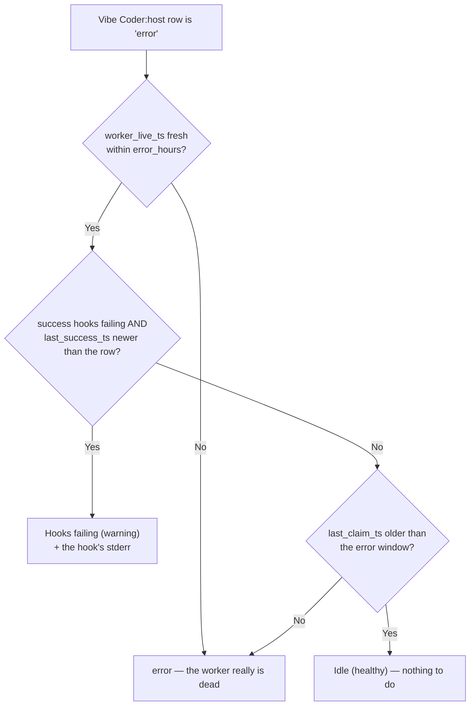

# PR Summary — Issue #212

## Summary

The `Vibe Coder:<host>` row is fed only by a heartbeat hook that runs inside the
worker's container, so it goes red for four unrelated causes — host down,
nothing claimable, hooks broken, every issue failing — and the board called all
four **dead**. On GRQ-25 a worker completed ~50 issues over two days while the
board said it was dead, because a work-volume reset had wiped the hooks'
GRQ-health checkout.

`run.sh` runs on the same host as the worker, so it now reads what the worker
says about itself and publishes it into the host record; the dashboard uses that
to diagnose a red row instead of merely reporting it. Closes #212.

**run.sh** — `collect_vibe_coder_state()` emits a `vibe_coder` block into
`docs/index.json` (omitted entirely on hosts with no worker):

| Field | Source |
| --- | --- |
| `worker_live_ts`, `last_success_ts`, `last_claim_ts` | newest `[liveness] … live_epoch= last_productive= last_idle_claimed=` line in `~/logs/worker.log` |
| `run_pid_alive` | `kill -0` on the PID in `~/logs/.run.pid` |
| `hook_failures` | `~/logs/callback-failure-streaks.json` when the worker publishes it (stSoftwareAU/VibeCoder#2297), otherwise the `callback … failed` lines in `~/logs/worker.log`; `last_stderr` is always the newest hook stderr |
| `volume_reset_ts` | newest `work-volume: recreating` line in `~/logs/run_core.log` |

`VIBE_LOG_DIR` overrides the log directory (used by the tests). A malformed
block is dropped with a warning on stderr rather than poisoning the whole host
record.

**dashboard.js** — only a row `getRepoStatus` already calls `error` is
reinterpreted, and only when the host saw the worker alive inside the same
window that declared the row dead:

Anything unexplained stays `error` — an unexplained silence must stay loud. The
counters above the repo list use the same diagnosis, so rows and totals agree.

## Evidence

EVIDENCE_PLACEHOLDER

## Test Plan

- Added `tests/test-vibe-coder-worker-state.sh` (16 assertions) — extracts
  `collect_vibe_coder_state` and its helpers from `run.sh` and runs them against
  fabricated log directories built from real worker-log lines: liveness parsing,
  per-event hook-failure counts, `since_ts`, the newest hook stderr, live/dead
  launcher PID, work-volume reset, the published streak file winning over the
  log scan, no output when no worker is installed, JSON stays valid when the
  stderr contains quotes and backslashes, and the cross-platform timestamp
  parser returning `0` rather than guessing.
- Added `tests/test-vibe-coder-hooks-failing.sh` (12 assertions) — the companion
  the issue asked for beside `test-vibe-coder-dead-after-8h.sh`: host fresh, row
  stale, hook failures present ⇒ `Hooks failing`; nothing claimed all window ⇒
  `Idle`; stale liveness, a live worker whose issues all fail, a success older
  than the row, a healthy row, and a host with no `vibe_coder` block all stay as
  they were; the stats counters follow the diagnosis; the stderr excerpt is
  bounded.
- `./quality.sh` — 76/76 passed (74 existing + the 2 new suites), JSON valid,
  versions consistent at 1.1.29.
