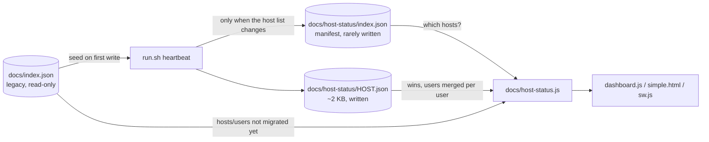

# Split `docs/index.json` into per-host documents

## Summary

A heartbeat rewrote the whole fleet-wide `docs/index.json` (33,718 bytes) to
change a few fields of one host — roughly 250 commits a day across the fleet.
`run.sh` now writes only this host's own document, `docs/host-status/<HOST>.json`
(~1.5–2.6 KB measured), plus `docs/host-status/index.json`, a manifest that is
rebuilt from the directory and written **only when the host list changes**.

`docs/index.json` becomes read-only: it seeds a host's first per-host document
(so hand-edited `location`/`emoji` and other users' heartbeats survive) and the
dashboard merges it underneath the per-host documents, so hosts still running an
older checkout of `run.sh` keep showing for the whole migration. The merge is
per **user**, not per host — on a multi-user host each unix account runs its own
checkout, so one user can be writing the per-host document while another still
writes the fleet file.

**Naming decision** (the product question the issue raised): `docs/hosts/`
already holds per-*service* documents (`FX.json`, `Vibe-Coder-GRQ-3.json`, …),
so the per-host documents live in a new `docs/host-status/` directory and
`docs/hosts/` is untouched.

Closes #213.

## Evidence

### Data flow



### Measured size of a heartbeat's write

| File | Bytes |
| --- | --- |
| `docs/index.json` (rewritten by every heartbeat before this change) | 33,718 |
| `docs/host-status/GRQ-10.json` (seeded from that file's GRQ-10 entry) | 2,627 |
| `docs/host-status/<HOST>.json` written by a real `run.sh` run | 1,496 |

A second heartbeat with an unchanged host list rewrites the host document only —
the manifest is byte-identical and is not touched
(`tests/test-per-host-status.sh`, "manifest not rewritten when the host list is
unchanged").

### End-to-end runs

- **`run.sh` end to end** in a scratch copy (`bash run.sh --no-git --force`):
  wrote `docs/host-status/<HOST>.json` + the manifest, left `docs/index.json`
  byte-identical (`cksum` unchanged), and left no `.bak`/`.tmp`/`.corrupted`
  debris under `docs/` — recovery copies now go to `.health-state/` at the
  repository root, which is gitignored.
- **Loader over real HTTP**: served a copy of `docs/` (with two hosts migrated)
  on `127.0.0.1` and ran the real `docs/host-status.js` against it with Deno's
  `fetch`:

  ```text
  hosts loaded: 26
  sources: {"manifest":true,"perHost":2,"legacy":true}
  errors: []
  GRQ-10 heart_beat_ts (per-host doc): 1789999999
  GRQ-11 heart_beat_ts (legacy index): 1789716980
  ```

  — the two migrated hosts come from their own documents, the other 24 from the
  legacy file.
- **Fails loud**: with the write broken, the heartbeat prints
  `ERROR: jq update failed — restoring from backup, no heartbeat recorded` and
  exits 1 instead of printing "Updated health information" and pushing a stale
  document (observed: `exit=1`).

### Screenshots

Captured with the container's headless Chromium against
`python3 -m http.server 8931 --bind 127.0.0.1 --directory docs`, after running
`bash run.sh --no-git --force` so this host (`vibe-coder-13673`) had a real
per-host document while every other host still came from the legacy
`docs/index.json`.


The dashboard loads and renders normally — header, warning section and the four
fleet stat cards — with **0 console errors** (1 unrelated warning). The network
log shows the new read path in order, all `200`:

```text
GET /host-status/index.json?t=…            200   (manifest)
GET /host-status/vibe-coder-13673.json?t=… 200   (per-host document)
GET /index.json?t=…                        200   (legacy, merged underneath)
```


This is the migration proof in one frame. `vibe-coder-13673` (top card) is
rendered from its own `docs/host-status/vibe-coder-13673.json` and badges
**v1.1.31**; directly beneath it GRQ-25, Mac-Ultra-M2 and GRQ-3 are rendered
from the legacy `docs/index.json` and badge **v1.1.30** — an unmigrated host
running an older `run.sh` is complete and current, not frozen or dropped. Every
field a card shows (OS, uptime, disk, memory, CPU load, network, GPU, timezone,
config, last seen) is populated on both shapes. The per-user heartbeat table is
shown only on hosts with 2 or more expected users (`showUserTable` in
`docs/dashboard.js`) — a pre-existing, shape-agnostic rule, not a migration gap
— which is why `vibe-coder-13673`, a single-user host, correctly shows no
table in the screenshot above.

No CSS, markup or card layout was changed by this diff — only where the same
host objects are fetched from — which is what the screenshots confirm.

## Acceptance Criteria

<!-- vibe-spec-review inputs="diff+issue-body" -->

- **met** — `run.sh` writes `docs/<dir>/<HOST>.json` (~2 KB) for the host it runs on, plus a small manifest — evidence: `run.sh` `update_json`/`update_host_manifest`, `tests/test-per-host-status.sh::Test 1, Test 6` — reviewer: met
- **met** — the naming question settled before the split (`docs/hosts/` holds per-service documents) — evidence: new `docs/host-status/` directory, `docs/hosts/` untouched; README "Per-Host Status Documents (Issue #213)" — reviewer: met
- **met** — `docs/dashboard.js` fetches the manifest and then the per-host documents instead of one `index.json` — evidence: `docs/dashboard.js` `loadData`/`loadDataIncremental` via `GRQHostStatus.loadHostStatus`; `tests/test-host-status-load.sh` — reviewer: met
- **met** — `docs/simple.html` does the same — evidence: `docs/simple.html` `checkHealth` — reviewer: met
- **met** — `docs/sw.js` caching follows the new data paths — evidence: `docs/sw.js` `isHealthDataPath`, versioned `importScripts`, background sync via the shared loader — reviewer: met — reason: the reviewer's original finding (offline snapshot stored under a key nothing reads; health responses cached unboundedly behind the `?t=` buster) is fixed — snapshot moved to `OFFLINE_SNAPSHOT_URL`, cache-busted health responses are no longer written through
- **met** — migration period: the dashboard reads both sources — evidence: `docs/host-status.js` `mergeHostStatus`; `tests/host-status-load-check.js::legacy-only-fallback, per-host-only, merge-both-sources` — reviewer: met — reason: the reviewer's original finding (the first implementation merged whole hosts, so on a multi-user host a user still writing `index.json` was shown frozen or dropped) is fixed — the merge is now per user with the roll-ups recomputed, covered by `tests/host-status-load-check.js::legacy-user-heartbeat-kept, legacy-only-user-not-dropped, aggregates-recomputed`
- **partial** — an exit for the migration period — evidence: README "Finishing the migration" — reviewer: missing — reason: it is a documented manual procedure (check every host has a document, then delete `docs/index.json`), not code; nothing automatically retires the legacy file, because deciding a host is migrated rather than dead is a human call
- **met** — the per-host documents have a JSON syntax gate — evidence: `quality.sh` "Checking JSON syntax in docs/host-status/" — reviewer: missing — reason: the reviewer was right that the gate still only covered the now-unwritten `docs/index.json`; added after the review
- **unrequested** — hostname sanitisation (`host_slug`) and manifest-entry validation (`SAFE_HOST_NAME`) — reviewer: unrequested — reason: `uname -n` now names a file and a URL path, so it is untrusted input; the two grammars are pinned to each other by `tests/test-per-host-status.sh::Test 7`
- **unrequested** — recovery copies moved from `docs/` to `.health-state/` — reviewer: unrequested — reason: the old `.bak`/`.corrupted` writes landed inside `docs/` and were committed by `git add docs/`; keeping that for the new document would have re-added the churn this issue removes
- **unrequested** — a `host` field inside each document — reviewer: unrequested — reason: the filename is a slug, so the document has to name its real hostname for the dashboard to key on
- **unrequested** — `read_recorded_user_field` (heartbeat cadence read from the per-host document, falling back to the legacy file) — reviewer: unrequested — reason: without it every migrating host would force an update on every run
- **unrequested** — version bump 1.1.30 → 1.1.31 and `update_version.sh` / `tests/test-version-consistency.sh` extended for the new asset — reviewer: unrequested — reason: repository convention; a cached old `dashboard.js` would not know about the new data source
- **unrequested** — `tests/health-harness.sh` shared between the two shell suites — reviewer: unrequested — reason: the harness was duplicated across `test-json-integrity.sh` and the new suite; extracted rather than copied

## Standards Review

<!-- vibe-standards-review inputs="diff+CODING-STANDARDS.md" -->

- **violation** — a failed manifest fetch was swallowed, making a 500 or a corrupt manifest indistinguishable from "no manifest yet" — evidence: `docs/host-status.js` `fetchPerHost` — reason: fixed here; only a 404 is silent (the pre-migration state), everything else is pushed to `errors`
- **violation** — a malformed manifest degraded silently to zero hosts — evidence: `docs/host-status.js` `fetchPerHost` — reason: fixed here; reports "Malformed host-status manifest"
- **violation** — a failed legacy fetch was dropped on the success path, so hosts that had not migrated vanished with no message — evidence: `docs/host-status.js` `loadHostStatus` — reason: fixed here; a non-404 legacy failure is reported
- **violation** — producer and validator disagreed: `host_slug` could emit names (`_build`, leading `-`, >64 chars) that the dashboard's `SAFE_HOST_NAME` rejects, silently dropping the host — evidence: `run.sh` `host_slug` vs `docs/host-status.js` `SAFE_HOST_NAME` — reason: fixed here; `host_slug` now guarantees the dashboard's grammar, asserted for eight inputs in `tests/test-per-host-status.sh::Test 7`
- **violation** — a failed write still printed "Updated health information" and returned 0, so `commit_and_push` would push a stale document as a fresh heartbeat — evidence: `run.sh` `update_json` — reason: fixed here; returns 1, asserted by `tests/test-per-host-status.sh::Test 8`
- **violation** — the manifest error went to stdout and its wording ("leaving the manifest unchanged") misdescribed an aborting path — evidence: `run.sh` `update_host_manifest` — reason: fixed here; stderr, and the message says the heartbeat wrote nothing
- **violation** — host names from untrusted JSON were used as keys on a plain `{}`, so a host named `__proto__` mutated `Object.prototype` — evidence: `docs/host-status.js` `mergeHostStatus` — reason: fixed here; all merged maps are `Object.create(null)`, asserted by `tests/host-status-load-check.js::no-prototype-pollution`
- **violation** — the ~48-line test harness was duplicated between `test-json-integrity.sh` and the new suite — evidence: `tests/test-per-host-status.sh` vs `tests/test-json-integrity.sh` — reason: fixed here; extracted to `tests/health-harness.sh` and both suites source it
- **violation** — the harness's exit status was discarded, so a crashing heartbeat was invisible — evidence: `tests/test-per-host-status.sh` `run_harness` — reason: fixed here; `run_health_harness` returns and records the status and two tests assert on it
- **violation** — README told operators the example below was one host's document while the example still showed the fleet-wide shape — evidence: `README.md` "Manual Host Management" — reason: fixed here; the prose now says the examples are the `docs/index.json` shape and describes what changes for the per-host file
- **violation** — the new `.health-state/` path was undocumented and README still said backups are made "before updates" without saying where — evidence: `README.md` "Health Check Logic" — reason: fixed here
- **violation** — stale comment "index.html — three cache busters" over a four-asset loop — evidence: `tests/test-version-consistency.sh` — reason: fixed here
- **violation** — `read_recorded_user_field` collapsed "jq failed" into "field absent" — evidence: `run.sh` `read_recorded_user_field` — reason: fixed for the host document (warns on stderr); the legacy-file lookup still treats any failure as absent, which forces an update — the safe direction — and the corrupt file is reported by `update_json`'s own recovery path
- **violation** — `importScripts('./host-status.js')` was unversioned while the same file was cached with `?v=` — evidence: `docs/sw.js` — reason: fixed here; versioned, and `tests/test-version-consistency.sh` asserts it
- **violation** — `.corrupted.<timestamp>` copies accumulated without pruning — evidence: `run.sh` `update_json` — reason: fixed here; a single `.corrupted` file, overwritten each time
- **clean** — Australian English throughout; `shellcheck --severity=warning` clean on every changed shell file; bash 3.2 safe (`${#names[@]}` length guard before expanding, no GNU-only flags, `LC_ALL=C sort`); traversal defence asserted against real inputs; tests execute real code (no source-text greps); no secrets or hidden paths staged (`.health-state/` is gitignored and sits outside `git add docs/`); version propagated consistently across `run.sh`, `dashboard.js`, `sw.js`, `index.html`, `simple.html`; no stale `fetch('./index.json')` left in any page

Known limitation, not fixed: two hostnames that differ only by characters
`host_slug` folds (a space vs `_`) would share one document. No such pair exists
in the fleet, and the document names its true host, so the dashboard would show
one of them rather than corrupt both.

## Test Plan

- **Added** `tests/test-per-host-status.sh` (32 checks) — drives the real
  `update_json`, `host_slug`, `seed_host_status` and `update_host_manifest` from
  `run.sh`: the document and manifest are written, `docs/index.json` is
  byte-identical afterwards, the document is a quarter the size or less, the
  first write seeds `location`/`emoji` and other users from the legacy entry,
  corruption is recovered and reported with no debris under `docs/`, the
  manifest is sorted and only rewritten when the host list changes, hostile
  hostnames are sanitised into names the dashboard accepts, and a failed write
  exits non-zero without claiming success.
- **Added** `tests/test-host-status-load.sh` + `tests/host-status-load-check.js`
  (24 checks) — executes the real `docs/host-status.js` against a stub fetch:
  merge precedence, per-user merge on a half-migrated multi-user host with the
  roll-ups recomputed, legacy-only and per-host-only fleets, a missing document
  reported without blanking the fleet, manifest/legacy failures reported, a
  hostile manifest entry never fetched, no prototype pollution, cache busting.
- **Added** `tests/health-harness.sh` — the shared harness both shell suites use.
- **Modified** `tests/test-json-integrity.sh` — **business-logic change**: the
  document a heartbeat writes moved from `docs/index.json` to
  `docs/host-status/<HOST>.json`, so all six Issue #65 checks now target that
  file. Every check is preserved (missing, corrupted, empty, existing hosts
  preserved, post-write validation, corruption reported); none was removed or
  disabled.
- **Modified** `tests/test-version-consistency.sh` — two assertions added for
  the new `host-status.js` cache buster in `index.html` and `sw.js`.
- **Gate**: `./quality.sh` — 80 tests, 80 passed, 0 failed.
