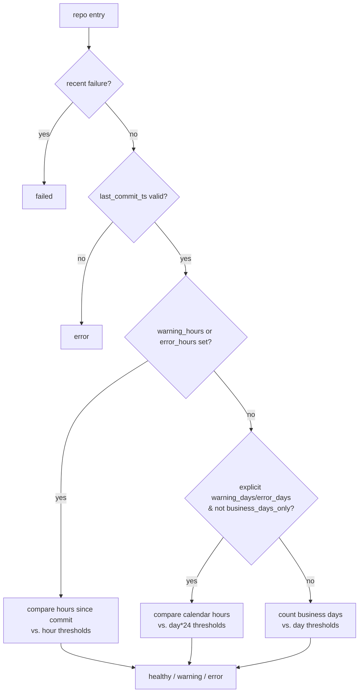

## Summary

Vibe Coders heartbeat hourly, but the dashboard's `getRepoStatus` only
supported day-grain thresholds — so a dead worker stayed green for ~24h
before the default 1-business-day warning fired. This change adds
optional `warning_hours` / `error_hours` fields to `repos.json` entries.
When set, hour-grain thresholds win over day-grain ones, and elapsed
time is compared in calendar hours. The four `Vibe Coder:*` entries in
`docs/repos.json` now use `warning_hours: 2` and `error_hours: 4`, so a
silent worker is flagged `warning` after 2h and `error` after 4h.

Closes #105.

## Evidence

CLI/data-only change with no UI restructure — the existing dashboard
cards simply transition between healthy/warning/error sooner. The Vibe
Coder timestamps in `docs/repos.json` make the new behaviour visible
immediately on the live dashboard once deployed.

Status decision flow after the change:

Quality gate: `./quality.sh` reports `Total tests: 41 / Passed: 41 /
Failed: 0`.

## Test Plan

- Added `tests/test-vibe-coder-hourly-checkin.sh` — 11 assertions
  covering the hour-threshold ladder (healthy/warning/error at 1h, 3h,
  5h with `warning_hours: 2, error_hours: 4`), the dead-worker
  regression case (24h-stale Vibe Coder is `error`, not healthy),
  partial-field fallback, override over `warning_days`/`error_days`,
  backward-compatibility for day-only repos, and a `repos.json`
  sanity check that every `Vibe Coder:*` entry carries hour thresholds.
- Existing tests unchanged (`test-weekend-aware-repos.sh`,
  `test-weekend-grace.sh`, `test-thresholds-constants.sh`,
  `test-repo-failed-classification.sh` still pass).
- Version bumped to `1.1.11` and propagated by `./update_version.sh`.
