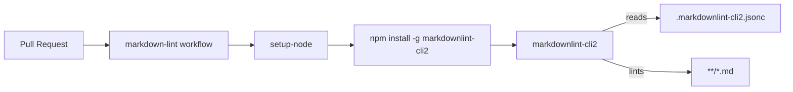

## Summary

Added a Markdown Lint GitHub Actions workflow to keep documentation
consistent across the repository. Closes #109.

The workflow runs `markdownlint-cli2` on every pull request and on
pushes to the default branches. A repo-root `.markdownlint-cli2.jsonc`
config disables the stylistic rules that conflict with the existing
prose so the lint catches real breakage (broken tables, unmatched
fences, malformed lists) without forcing a sweeping reformat.

## Evidence

This is a CI-only change with no UI surface. Verified locally:

- `markdownlint-cli2` against the current repo content: `0 error(s)` over 50 files.
- `tests/test-markdown-lint-workflow.sh`: 12 passed, 0 failed.

## Test Plan

- Added `tests/test-markdown-lint-workflow.sh` covering:
  - workflow file presence and YAML validity
  - workflow name, `pull_request` trigger, read-only `contents` permission
  - `markdownlint` job runs on `ubuntu-latest`
  - `actions/setup-node` step is present
  - `markdownlint-cli2` install and run steps are present
  - all `uses:` references are pinned to 40-char commit SHAs
  - `.markdownlint-cli2.jsonc` config is present
  - `markdownlint-cli2` passes locally against the current repo
- Allowed `.markdownlint-cli2.jsonc` through `.gitignore` (per the
  worker-managed allowlist for in-repo lint config).

## Files Changed

- `.github/workflows/markdown-lint.yml` — new workflow
- `.markdownlint-cli2.jsonc` — lint config tuned to existing prose
- `.gitignore` — allow the lint config through the dotfile ignore rule
- `tests/test-markdown-lint-workflow.sh` — workflow contract tests
- `docs/pr-summary-109.md` — this summary
