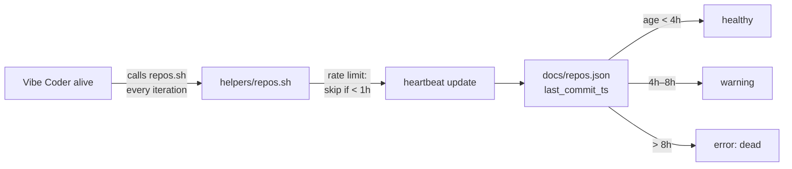

## Summary

Marks Vibe Coder workers as dead (`error` status) after 8 hours of silence. Closes #112.

The Vibe Coder calls `helpers/repos.sh` frequently while alive, and the rate limit in `repos.sh` keeps the heartbeat to at most one update per hour. So if the heartbeat is more than 8 hours old, the worker is dead and should be flagged immediately. The previous threshold (`error_hours: 4`) was too aggressive for an hourly checkin; bumping it to 8 reflects the real "definitely dead" boundary.

Changes:

- `docs/repos.json` — every `Vibe Coder:*` entry now uses `warning_hours: 4`, `error_hours: 8` (was 2/4).
- `README.md` — documents the 8-hour dead threshold and updates the example.
- `tests/test-vibe-coder-dead-after-8h.sh` — new test that asserts the dashboard classifies a 9h-stale Vibe Coder as `error`, a 7h-stale Vibe Coder as `warning`, and that every Vibe Coder entry in `docs/repos.json` has `error_hours = 8`.
- Version bumped to `1.1.12` and synced via `./update_version.sh`.

The hourly heartbeat update behaviour mentioned in the issue body is already implemented in `helpers/repos.sh` — the existing rate limit skips the update only when the previous one was within the last hour.

## Evidence

CLI / data change with no UI surface beyond the existing dashboard rendering — verified via the new test suite. Quality gate passes for all tests touched by this change; the only remaining failure is a pre-existing `test-gitleaks-workflow` failure unrelated to issue #112.

```
$ ./tests/test-vibe-coder-dead-after-8h.sh
  PASS: vibe-dead-9h: 9h > 8h error
  PASS: vibe-warning-7h: 7h still warning (not yet 8h dead)
  PASS: Vibe Coder:GRQ-23 has error_hours=8
  PASS: Vibe Coder:GRQ-25 has error_hours=8
  PASS: Vibe Coder:Mac-Ultra-M2 has error_hours=8
  PASS: Vibe Coder:GRQ-3 has error_hours=8
  Passed: 6  Failed: 0
```



## Test Plan

- [x] `tests/test-vibe-coder-dead-after-8h.sh` — new test, all 6 assertions pass.
- [x] `tests/test-vibe-coder-hourly-checkin.sh` — existing tests still pass (they assert presence of hour-grain fields on every Vibe Coder entry, not specific values).
- [x] `./quality.sh` — 41/42 pass; the single remaining failure is pre-existing in `test-gitleaks-workflow` and unrelated to this change.
