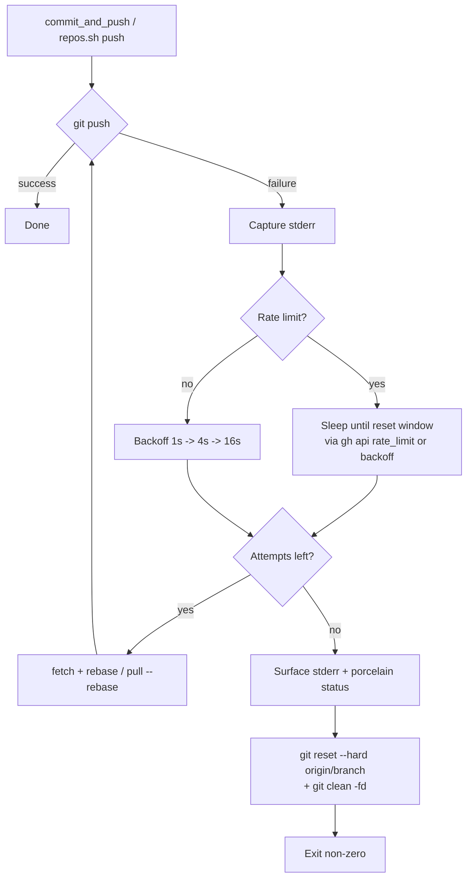

## Summary

Hardens the health-update push path against transient GitHub failures so a
flaky network or rate-limit response cannot falsely mark a service as dead.
The previous behaviour swallowed push errors silently and left a stale
unpushed commit on the local clone — the next service's update would then
commit on top, producing a misleading heartbeat for the failed service.

Both `run.sh::commit_and_push` and `helpers/repos.sh` now share a small
`helpers/git-retry.sh` library that:

- Retries up to 3 attempts with **exponential backoff** (1s, 4s, 16s).
- Wraps every git invocation in a **120s timeout** (`gtimeout`/`timeout`)
  to bound slow-network hangs.
- Detects GitHub **rate-limit / abuse-detection** responses in stderr
  (`429`, `rate limit`, `too many requests`, `secondary rate limit`) and
  sleeps until the reset window. When `gh` is available the reset epoch
  is read from `gh api rate_limit`; otherwise the standard backoff is used.
- After exhausting retries, **resets the local clone to `origin/<branch>`
  and runs `git clean -fd`**, then **exits non-zero** so the failure is
  itself observable instead of being silently swallowed.

Closes #117.

## Evidence

CLI/backend change — no UI to screenshot.

Verified by the new `tests/test-graceful-failure-recovery.sh` (19 assertions,
all passing) plus the updated `tests/test-push-retry.sh` and
`tests/test-repos-push-rebase.sh`. `./quality.sh` reports 42 passed / 3
pre-existing failures unrelated to this change (`test-gitleaks-workflow`,
`test-scan-log-errors`, `test-vibe-coder-dead-after-8h` — the last is
Issue #118's tracked work).

## Test Plan

- **New** `tests/test-graceful-failure-recovery.sh` covering:
  - `git-retry.sh` helpers: timeout default + override, backoff defaults,
    rate-limit detection true/false, override sleep value.
  - `repos.sh` exits non-zero when push retries are exhausted.
  - `repos.sh` resets the working clone (HEAD, index, working tree) to
    `origin/main` after exhausted retries — no stale unpushed commit
    remains, working tree is clean, recovery action is logged.
  - Rate-limit response triggers a sleep matching
    `GRQ_RATE_LIMIT_SLEEP_OVERRIDE`, then succeeds on the next attempt.
  - Backoff sleeps follow the configured `GRQ_PUSH_RETRY_DELAYS_OVERRIDE`
    sequence.
  - `run.sh::commit_and_push` exits non-zero on persistent push failure
    and resets the local clone to `origin/<branch>`.
- **Updated** `tests/test-push-retry.sh` (Issue #51 regression):
  - Now sources `helpers/git-retry.sh` (new dependency of `commit_and_push`).
  - Test 3 captures the exit code so `set -e` does not abort, and
    additionally asserts `commit_and_push` returns non-zero on exhausted
    retries — this is the new business-logic contract from this issue.
- **Updated** `tests/test-repos-push-rebase.sh` (Issue #1862 regression):
  - The setup helpers now also copy `helpers/git-retry.sh` into the
    fixture clones so the embedded `repos.sh` can source it. No assertions
    changed; existing 11 assertions still pass.

### Tunables (defaults shown)

| Env var | Default | Purpose |
| --- | --- | --- |
| `GRQ_PUSH_MAX_ATTEMPTS` | `3` | Push attempt budget |
| `GRQ_PUSH_RETRY_DELAYS_OVERRIDE` | `1 4 16` | Backoff seconds (space-separated) |
| `GRQ_GIT_TIMEOUT_OVERRIDE` | `120` | Per-git-call timeout (seconds) |
| `GRQ_RATE_LIMIT_SLEEP_OVERRIDE` | _unset_ | Test hook to bypass `gh api rate_limit` |
