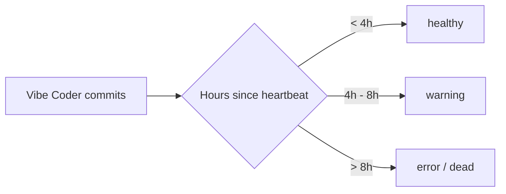

## Summary

Raise the Vibe Coder warning threshold from 2 hours to 4 hours and the
dead/error threshold from 4 hours to 8 hours, matching the documented
behaviour in `README.md` and the existing dead-after-8h test (Issue #112).

The earlier 2-hour warning was firing on healthy Vibe Coders that were
mid-task — refining, building, and testing a single issue can quietly
burn well over an hour between heartbeats. Closes #118.

## Evidence

This is a backend/config change with no UI to screenshot. Verification
is via the test suite:

- Existing `tests/test-vibe-coder-dead-after-8h.sh` (Issue #112) was
  already encoded with `error_hours = 8` but was failing because
  `docs/repos.json` had drifted to `error_hours = 4`. After this change
  it passes 6/6.
- New `tests/test-vibe-coder-warning-4h.sh` enforces the 4-hour warning
  threshold and asserts every `Vibe Coder:*` entry in `docs/repos.json`
  has `warning_hours = 4`. Passes 6/6 after the change.

## Test Plan

- Added `tests/test-vibe-coder-warning-4h.sh` covering:
  - 3h-stale Vibe Coder is still `healthy` under the new 4h warning.
  - 5h-stale Vibe Coder is `warning` (past 4h, before 8h dead).
  - Every `Vibe Coder:*` entry in `docs/repos.json` has
    `warning_hours = 4`.
- Re-ran `tests/test-vibe-coder-dead-after-8h.sh` — now passes (was
  failing before this change due to the `repos.json` drift).
- Ran `./quality.sh` — the two remaining failures
  (`test-gitleaks-workflow`, `test-scan-log-errors`) are pre-existing
  and unrelated to this change.
