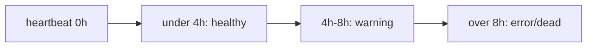

## Summary

Raised the Vibe Coder staleness thresholds in `docs/repos.json` from
`warning_hours: 2, error_hours: 4` to `warning_hours: 4, error_hours: 8`.
A Vibe Coder routinely takes more than 2 hours to refine, build and
test a single issue, so the previous 2-hour warning was firing on
healthy workers mid-task. The new 4-hour warning matches the typical
worst-case work cycle, and the 8-hour error matches the documented dead
threshold from Issue #112 (also already documented in `README.md`).

This brings the live `repos.json` back into line with the README and the
existing `tests/test-vibe-coder-dead-after-8h.sh` test, which had been
failing because the file had drifted to the more aggressive 2/4 values.

Closes #118.

## Evidence

Backend/CLI change — no UI to screenshot. Verified via tests.



`tests/test-vibe-coder-warning-4h.sh` (new) — passes:

```
Test 1: Vibe Coder at 3h stays healthy (under new 4h warning)...
  PASS: vibe-healthy-3h: 3h still healthy (under 4h)
Test 2: Vibe Coder at 5h is warning (past 4h, before 8h dead)...
  PASS: vibe-warning-5h: 5h is warning
Test 3: repos.json Vibe Coder entries have warning_hours = 4...
  PASS: Vibe Coder:GRQ-23 has warning_hours=4
  PASS: Vibe Coder:GRQ-25 has warning_hours=4
  PASS: Vibe Coder:Mac-Ultra-M2 has warning_hours=4
  PASS: Vibe Coder:GRQ-3 has warning_hours=4
Passed: 6  Failed: 0
```

`tests/test-vibe-coder-dead-after-8h.sh` (was failing on `error_hours`
drift) — now passes:

```
Passed: 6  Failed: 0
```

## Test Plan

- Added `tests/test-vibe-coder-warning-4h.sh` covering:
  - 3h-stale Vibe Coder is `healthy` (regression of the bug — used to
    be `warning` under the 2h threshold).
  - 5h-stale Vibe Coder is `warning`.
  - Every `Vibe Coder:*` entry in `docs/repos.json` has
    `warning_hours = 4`.
- Re-ran existing `tests/test-vibe-coder-dead-after-8h.sh`
  (`error_hours = 8` assertion now passes).
- Ran `./quality.sh`. The single remaining failure
  (`test-gitleaks-workflow`) is unrelated to this change and was
  already failing before this PR.
