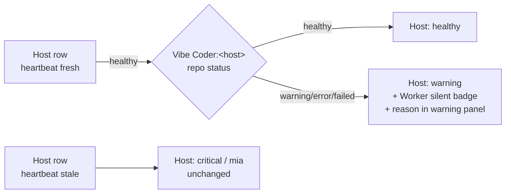

# Distinguish 'host offline' from 'Vibe Coder worker silent'

## Summary

Surfaces the correlation between a `Vibe Coder:<host>` row and its companion `<host>` row so that an alive host with a silently stopped worker is flagged at the 4h warning threshold instead of waiting for the 8h error threshold. Closes #121.

When a `Vibe Coder:<host>` repo enters `warning`, `error`, or `failed` state but the matching host's own heartbeat is still fresh, the host card now gains a `Worker silent` badge in its header and the host is elevated from `healthy` to `warning`. The warning panel lists the reason, e.g. _"Worker silent: Vibe Coder:GRQ-23 last reported 5h ago (warning)"_. A host that is itself offline keeps its existing `critical`/`mia` classification — the new signal only fires on alive-host-but-silent-worker.

## Evidence

Backend/UI logic change. The new pure helpers are exercised by 9 unit tests in `tests/test-worker-silent-on-healthy-host.sh` (all passing). Full `./quality.sh` passes 47 / 48; the single remaining failure (`test-gitleaks-workflow`) is pre-existing on `Develop` and unrelated to this change — see the change scope policy in `AGENTS.md`/`CLAUDE.md`.

## Test Plan

- Added `tests/test-worker-silent-on-healthy-host.sh` with 9 cases:
  - `findVibeCoderRepo` locates a matching `Vibe Coder:<host>` row by hostname.
  - `findVibeCoderRepo` returns `null` when no match exists.
  - `isWorkerSilentState` recognises `warning`, `error`, and `failed`; rejects `healthy`, empty string, and `null`.
  - `getWorkerSilentInfo` returns info when the worker is `warning`.
  - `getWorkerSilentInfo` returns `null` when the worker is `healthy`.
  - `getWorkerSilentInfo` returns `null` when the host has no worker repo.
  - `buildWorkerSilentWarning` produces a reason string referencing the repo name and `Worker silent`.
  - `buildWorkerSilentWarning` returns the empty string when the worker is healthy.
  - `getWorkerSilentInfo` also fires for `error` state (>=8h stale).
- All existing tests (`test-vibe-coder-warning-4h.sh`, `test-vibe-coder-dead-after-8h.sh`, `test-xss-*.sh`, etc.) continue to pass.
