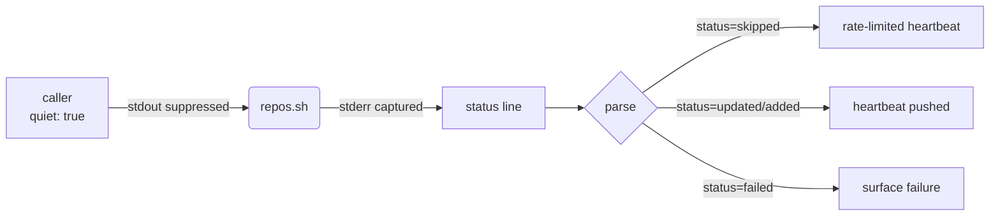

## Summary

`helpers/repos.sh` now emits a one-line machine-readable status to **stderr** on every exit so callers that suppress stdout (e.g. the Deno worker's `runWithTimeout(..., { quiet: true })`) can distinguish *pushed*, *skipped*, and *failed* outcomes without parsing localised user-facing strings. Closes #122.

The line format is:

```
repos.sh status=<status> reason=<reason> name='<repo_name>'
```

| status            | reason             | When emitted                                            |
|-------------------|--------------------|---------------------------------------------------------|
| `updated`         | `success`          | Existing repo's `last_commit_ts` was updated.           |
| `added`           | `success`          | New repo entry was created.                             |
| `skipped`         | `rate-limited`     | Within the 1-hour rate-limit window — no update.        |
| `failed-recorded` | `failure-recorded` | `--failed` mode recorded an upstream failure.           |
| `failed`          | `push-failed`      | All git-push retries exhausted.                         |
| `failed`          | `validation-failed`| Bad repo name, missing `--log`, bad log path, no args.  |

Existing stdout messages (`Updated repo …`, `Added repo …`, `Skipping update for …`) are unchanged, so cron logs, dashboards, and humans on a terminal see no difference.



## Evidence

CLI-only change (no UI). Verified with:

- `tests/test-repos-status-line.sh` — 9 new assertions covering all status/reason combinations and the back-compat stdout contract.
- `tests/test-repos-failure.sh` — 17 existing assertions still pass.
- `tests/test-repos-validation.sh` — 56 existing assertions still pass.
- `tests/test-graceful-failure-recovery.sh` — 19 existing assertions (incl. push-failed path) still pass.

Sample stderr captured during a rate-limit skip:

```
Skipping update for 'Quality' - last updated 0 minutes ago (within 1 hour threshold)
repos.sh status=skipped reason=rate-limited name='Quality'
```

## Test Plan

- [x] New file `tests/test-repos-status-line.sh` — failing first, passing after implementation (TDD).
- [x] `./quality.sh` — only pre-existing `test-gitleaks-workflow` failure remains (unrelated to this change; verified by stashing and re-running on the base branch).
- [x] Sanity-checked no-args, `--validate`, success, skip, and `--failed` invocations against the documented format.
