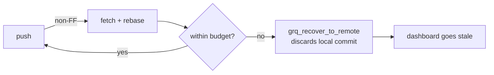

## Summary

Expand the git push retry budget so a busy stretch with 12+ concurrent Vibe
Coder writers racing on `docs/repos.json` can clear before the failure path
discards the local commit. Closes #125.

- `grq_backoff_delays` default: `1 4 16` → `1 4 16 30 60` (~111s budget).
- `grq_max_push_attempts` default: `3` → `5`.
- Both remain configurable via `GRQ_PUSH_RETRY_DELAYS_OVERRIDE` and
  `GRQ_PUSH_MAX_ATTEMPTS` (unchanged contract).
- Fixed a latent bash 3.2 bug: the existing `${arr[-1]}` fallback in
  `helpers/repos.sh` and `run.sh` errors under `set -u` on macOS bash 3.2
  when a test override supplies fewer entries than the attempt count.
  Replaced with an explicit `LAST_IDX=$(( ${#arr[@]} - 1 ))`.

## Evidence

CLI/bash change — no UI surface to screenshot.

Before vs after retry budget:

| | Attempts | Backoff (s) | Total wall-clock |
|---|---|---|---|
| Before | 3 | 1, 4, 16 | ~21s |
| After  | 5 | 1, 4, 16, 30, 60 | ~111s |

Flow on a busy host (12+ concurrent writers):

The old 21s budget often expired in three races before the rebase + push
could land, hitting D. The new ~111s budget over five attempts gives the
loop room to win the race during a busy minute.

Test runs:

- `tests/test-graceful-failure-recovery.sh` — 22 passed, 0 failed
  (added explicit assertions for the new defaults plus override sanity).
- `tests/test-push-retry.sh` — 6 passed.
- `tests/test-repos-push-rebase.sh` — 11 passed.

## Test Plan

- Updated `tests/test-graceful-failure-recovery.sh`:
  - Asserts `grq_backoff_delays` default is now `1 4 16 30 60`.
  - Asserts `grq_max_push_attempts` default is now `5`.
  - Adds sanity checks that `GRQ_PUSH_RETRY_DELAYS_OVERRIDE` and
    `GRQ_PUSH_MAX_ATTEMPTS` still override the defaults.
- Existing rebase-recovery, rate-limit, and failure-reset tests continue
  to pass against the larger budget.
