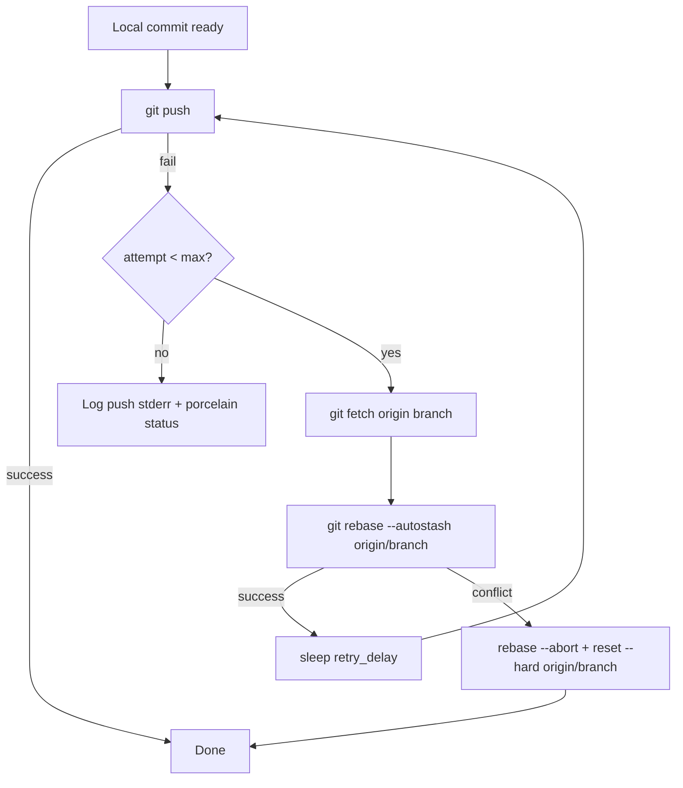

# Harden push retry path in helpers/repos.sh

## Summary

`helpers/repos.sh` previously logged "git push failed (attempt N/3)" three times in a row whenever the remote moved on between pull and push, then gave up with a generic message — leaving an unpushed commit backlog that snowballed (see stSoftwareAU/GRQ#1859).

This PR hardens the retry path:

1. **Fetch + rebase between push retries.** When push fails, we attempt `git fetch origin <branch>` then `git rebase --autostash origin/<branch>` before retrying. A non-fast-forward push now self-heals on the next attempt instead of failing all three.
2. **Conflict-safe recovery on `repos.json`.** If rebase conflicts (typically on `repos.json`), we mirror the pattern in `worker/shared/health_sync.sh` from GRQ — abort the rebase and reset hard to `origin/<branch>`, discarding the stale local commit. `repos.json` is a regenerated artefact, so the next scheduled run records the timestamp again. This prevents a multi-commit backlog from forming.
3. **Real diagnostics on final failure.** When all three attempts genuinely fail, the script now prints the actual `git push` stderr plus `git status --porcelain=v2 --branch`, so the next operator sees the underlying cause (auth, network, missing remote, etc.) rather than the generic warning.

Closes stSoftwareAU/GRQ#1862.

## Evidence

CLI/script change — no UI to screenshot. Verified via the new test
`tests/test-repos-push-rebase.sh` which spins up real bare repos and asserts
end-to-end behaviour against the actual `helpers/repos.sh` script.

### Test results

`bash tests/test-repos-push-rebase.sh` — 11 passed, 0 failed
`bash quality.sh` — 32 passed, 0 failed

## Test Plan

Added `tests/test-repos-push-rebase.sh` covering:

- **Test 1 — Non-fast-forward recovery.** Sets up a clone whose local branch
  is 1 ahead of origin and 1 behind origin (genuine divergence with
  `pull.ff = only`), then runs `helpers/repos.sh`. Asserts that:
  - local HEAD ends matching remote HEAD
  - the new `TestRepo` entry reaches the remote
  - the remote-only commit was preserved (rebase did not clobber it)
  - the local-only commit was rebased onto origin and pushed
  - no unpushed backlog remains
  - the script output mentions the rebase recovery
- **Test 2 — Diagnostics on final failure.** Points origin at a non-existent
  remote and asserts the final output includes both the actual git stderr
  and the `git status --porcelain=v2 --branch` block.
- **Test 3 — Conflict-safe discard.** Forces a rebase conflict on
  `repos.json` and asserts the script aborts + resets to remote, leaving
  zero unpushed commits.

The existing `tests/test-repos-failure.sh`, `tests/test-repos-validation.sh`,
and `tests/test-push-retry.sh` continue to pass unchanged.
