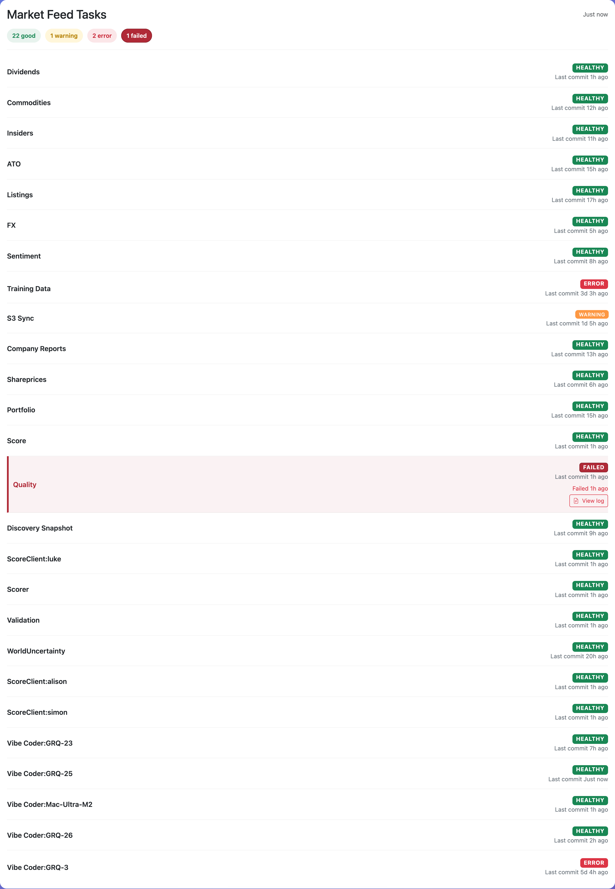
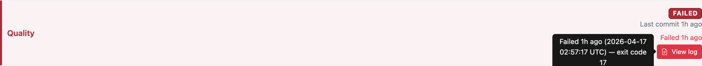

# Dashboard UI: distinguish "ran and failed" from "stale" and add a View log link

Closes #77

## Summary

Introduces a dedicated `failed` classification for repo tasks so that a run
which actually executed and failed is visually and semantically distinct from
a task that is simply stale ("no recent commit").

Previously both situations rendered identically as a red **ERROR** pill, and
there was no obvious way to jump to the captured log. With this change:

- A new `failed` status is detected when `last_failure_ts >= last_commit_ts`.
  It supersedes `ok`, `warning`, and stale `error` classifications so a
  genuine failure is never masked by a healthy-looking commit timestamp.
- A new **FAILED** pill and a dedicated `failed` counter appear in the Market
  Feed Tasks header. The pill uses a deeper, more saturated red than the
  stale-error pink to signal "attention: this actually broke".
- Each failed task row renders a **View log** button pointing at
  `./log-viewer.html?file=./<last_failure_log>` (new tab), so operators can
  inspect captured output in one click.
- A Bootstrap tooltip on **View log** shows:
  `Failed <relative> (<ISO UTC>) — exit code <N> — <message>`
  revealing the absolute failure time, exit code and message without cluttering
  the card.
- The overall page-title/status logic treats any `failed` repo as Unhealthy,
  matching the existing treatment of critical hosts and stale-error repos.
- `docs/simple.html` mirrors the same logic in text form: a `25 good • 1 failed
  (Quality)` summary with the failed task name rendered as a link to the
  captured log, and the aggregate status flips to **ERROR** when any repo is
  failed.
- Version bumped to 1.1.9 via `./update_version.sh`.

## Evidence

- Failed task in the Market Feed Tasks list (note the deep-red **FAILED**
  badge, the highlighted row and the **View log** button):
  
- Tooltip hover showing failure time, exit code and relative age:
  
- Pill counters in the section header, including the new `1 failed` pill:
  
- Mirrored behaviour in `simple.html` with the task name linked to its log:
  

## Tests

New spec: `tests/test-repo-failed-classification.sh` (10 assertions, all
passing). Exercises real functions via the `run_js_test` harness — no
pattern-grepping:

| # | Assertion |
|---|-----------|
| 1 | failure timestamp more recent than commit → `failed` |
| 2 | `failed` overrides `ok` even when commit is fresh |
| 3 | old failure before the latest commit → not `failed` |
| 4 | missing/zero failure timestamp → not `failed` |
| 5 | `failed` supersedes stale `error` |
| 6 | failure timestamp equal to commit timestamp → `failed` |
| 7 | `getRepoStats` exposes a `failed` counter |
| 8 | `getRepoFailureLogUrl` builds `./log-viewer.html?file=./...` |
| 9 | segments with spaces are URI-encoded; `/` separators preserved |
| 10 | absent `last_failure_log` returns empty string (defensive) |

Also fixed `tests/test-xss-prevention.sh` — its hard-coded `createHostCard`
line range was out of date once the pure-function block grew. The test now
detects the function's start/end lines dynamically. `tests/extract-functions.sh`
had the same hard-coded range for the pure block and has been made dynamic as
well, so future additions to the pure section don't silently break tests.

Full quality gate:

```
./quality.sh < /dev/null
# Total tests: 29
# Passed: 29
# Failed: 0
# QUALITY CHECK PASSED
```

## Test plan

- [x] Added unit tests for the new `failed` classification and log-URL builder
- [x] Ran `./quality.sh` — all 29 checks pass (includes the new test)
- [x] Version bumped via `./update_version.sh` (1.1.8 → 1.1.9)
- [x] Captured Playwright evidence in `docs/evidence/issue-77-*.png`
- [ ] Manual verification on GitHub Pages once deployed: a failed repo shows
      the red **FAILED** pill, the View log link opens `log-viewer.html` in a
      new tab, and the overall page title reads "Unhealthy".
