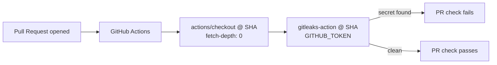

## Summary
Added a Gitleaks Secrets Detection workflow at `.github/workflows/gitleaks.yml` that scans every pull request for committed secrets. The workflow follows the supply-chain hardening rules in this project's guidelines: third-party actions are pinned to 40-char commit SHAs (not version tags), and the job runs with `contents: read` only. Closes #89.

## Evidence
This is a CI/workflow change with no UI surface, so there is no screenshot. Evidence is the new test suite `tests/test-gitleaks-workflow.sh` (9 assertions) and a clean `./quality.sh` run (33/33 tests passing).

### SHA pinning
| Action | Version | Pinned SHA |
| --- | --- | --- |
| `actions/checkout` | v4 | `34e114876b0b11c390a56381ad16ebd13914f8d5` |
| `gitleaks/gitleaks-action` | v2 | `ff98106e4c7b2bc287b24eaf42907196329070c7` |

## Test Plan
- Added `tests/test-gitleaks-workflow.sh` covering:
  - workflow file presence
  - YAML validity
  - workflow name (`Gitleaks`)
  - `pull_request` trigger
  - top-level `permissions.contents: read`
  - `gitleaks` job runs on `ubuntu-latest`
  - checkout step uses `fetch-depth: 0`
  - gitleaks-action step passes `GITHUB_TOKEN`
  - every `uses:` is pinned to a 40-char commit SHA (no `@v4`-style tags)
- Verified with `./quality.sh < /dev/null` — all 33 tests pass.
