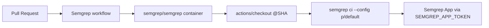

## Summary
Adds the Semgrep SAST scanning GitHub Actions workflow at `.github/workflows/semgrep.yml`. The workflow runs on every pull request, executes `semgrep ci --config p/default` inside the official `semgrep/semgrep` container, and forwards `SEMGREP_APP_TOKEN` so results can be posted to the Semgrep app when the secret is configured. `actions/checkout` is pinned to a 40-character commit SHA in line with the repository's supply-chain policy. Closes #90.

## Evidence
Backend/CI change with no UI surface — verified via the new BATS-style shell test.

```
$ ./tests/test-semgrep-workflow.sh
Testing Issue #90: Semgrep workflow
===================================
  PASS: semgrep.yml exists at .github/workflows/semgrep.yml
  PASS: semgrep.yml is valid YAML
  PASS: Workflow name is 'Semgrep'
  PASS: Workflow triggers on pull_request
  PASS: Top-level permissions grant contents: read
  PASS: semgrep job runs on ubuntu-latest
  PASS: semgrep job runs in semgrep/semgrep container
  PASS: Step runs 'semgrep ci --config <ruleset>'
  PASS: semgrep step exposes SEMGREP_APP_TOKEN env
  PASS: All uses: references are pinned to 40-char commit SHAs

Results: 10 passed, 0 failed
```

`./quality.sh` passes cleanly: 34/34 tests.



## Test Plan
- Added `tests/test-semgrep-workflow.sh` — 10 assertions covering file presence, YAML validity, workflow name, `pull_request` trigger, read-only `contents` permission, `ubuntu-latest` runner, `semgrep/semgrep` container, `semgrep ci --config` invocation, `SEMGREP_APP_TOKEN` env wiring, and SHA-pinning of every `uses:` reference.
- Verified the test fails before the workflow exists and passes after it is added (TDD).
- Ran the full `./quality.sh` suite — all 34 tests pass.
