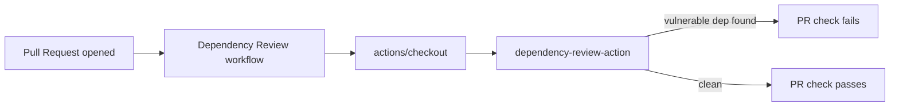

## Summary

Adds the GitHub Actions **Dependency Review** workflow at `.github/workflows/dependency-review.yml`. On every pull request, the workflow runs `actions/dependency-review-action` to flag vulnerable or disallowed dependencies before they merge — a layer of supply-chain defence requested by the workflow sync. Closes #91.

Both `uses:` references are pinned to 40-character commit SHAs in line with the project's supply-chain policy:

- `actions/checkout` → `34e114876b0b11c390a56381ad16ebd13914f8d5` (v4)
- `actions/dependency-review-action` → `2031cfc080254a8a887f58cffee85186f0e49e48` (v4.9.0, published 2026-03-03 — well past the 24h quarantine window)

Top-level `permissions:` grants only `contents: read`, satisfying the principle of least privilege.

## Evidence

CLI/workflow change with no UI surface to screenshot. Verified via `./quality.sh`:

```
Total tests: 34
Passed: 34
Failed: 0
QUALITY CHECK PASSED
```



## Test Plan

- Added `tests/test-dependency-review-workflow.sh` covering 9 assertions:
  1. Workflow file exists at the expected path.
  2. File is valid YAML.
  3. `name:` is `Dependency Review`.
  4. Triggers on `pull_request`.
  5. Top-level `permissions.contents` is `read`.
  6. `dependency-review` job runs on `ubuntu-latest`.
  7. `actions/checkout` step present.
  8. `actions/dependency-review-action` step present.
  9. Every `uses:` is pinned to a 40-char commit SHA.
- Ran `./quality.sh < /dev/null` — all 34 tests pass.
