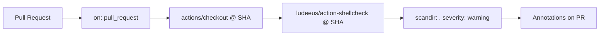

## Summary

Added the **ShellCheck Lint** GitHub Actions workflow to scan all shell scripts on every pull request. The workflow runs `ludeeus/action-shellcheck` against the repository root with `severity: warning`, matching the template suggested in the issue. Closes #92.

Both `uses:` references are pinned to 40-char commit SHAs per the supply-chain policy:

- `actions/checkout` → `34e114876b0b11c390a56381ad16ebd13914f8d5` (v4)
- `ludeeus/action-shellcheck` → `00cae500b08a931fb5698e11e79bfbd38e612a38` (v2.0.0)

## Evidence

This is a CI/workflow change with no UI surface, so no screenshot is provided. Local verification:

- `./quality.sh` reports **35 passed, 0 failed** with the new workflow test included.
- `tests/test-shellcheck-workflow.sh` parses the new YAML and asserts on its structure (name, trigger, permissions, job, scandir/severity inputs, SHA pinning).

## Test Plan

- Added `tests/test-shellcheck-workflow.sh` — verifies:
  - File exists at `.github/workflows/shellcheck.yml` and parses as valid YAML
  - `name: ShellCheck`
  - Triggers on `pull_request`
  - Top-level `permissions.contents: read`
  - `shellcheck` job runs on `ubuntu-latest`
  - `ludeeus/action-shellcheck` step is present with `scandir` and `severity` inputs
  - Severity is `warning` (matching the issue template)
  - Every `uses:` reference is pinned to a 40-char commit SHA
- All 35 existing tests in `quality.sh` continue to pass.

## Notes

The new workflow surfaces pre-existing ShellCheck warnings (mostly `SC2034`, `SC2154`, `SC2155`) in scripts under `tests/` and `run.sh`. Those are out of scope for this issue (which only adds the workflow) and should be addressed in follow-up issues — the workflow is doing its job by flagging them.
