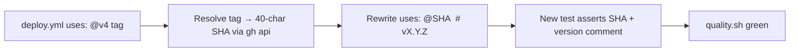

## Summary
Pinned every `uses:` reference in `.github/workflows/deploy.yml` to a 40-character commit SHA, with a trailing `# vX.Y.Z` comment recording the human-readable version. Added a header comment block documenting the supply-chain pin convention so future contributors keep the format. The four other workflow files (`dependency-review.yml`, `gitleaks.yml`, `semgrep.yml`, `shellcheck.yml`) were already SHA-pinned and required no changes.

This is the security baseline required by VibeCoding #1613 ("Pin GitHub Actions to commit SHAs") and a prerequisite for the auto-bump work in #88. Closes #93.

Resolved SHAs (pinned at the version currently in use — no version bumps):

| Action | Tag | SHA |
| --- | --- | --- |
| `actions/checkout` | `v4.3.1` | `34e114876b0b11c390a56381ad16ebd13914f8d5` |
| `actions/configure-pages` | `v4.0.0` | `1f0c5cde4bc74cd7e1254d0cb4de8d49e9068c7d` |
| `actions/upload-pages-artifact` | `v3.0.1` | `56afc609e74202658d3ffba0e8f6dda462b719fa` |
| `actions/deploy-pages` | `v4.0.5` | `d6db90164ac5ed86f2b6aed7e0febac5b3c0c03e` |

## Evidence
Backend / CI-only change; no UI to screenshot. Verified by:

- `tests/test-deploy-workflow-pinned.sh` — new test, fails against the unpinned `deploy.yml` and passes after the change.
- `./quality.sh` — full suite: 37 passed, 0 failed.

## Test Plan
- Added `tests/test-deploy-workflow-pinned.sh` covering:
  - workflow file exists and is valid YAML
  - every `uses:` reference is pinned to a 40-character commit SHA
  - every pinned line carries a trailing `# vX.Y.Z` comment
  - no third-party action references a moving tag (`@main`, `@master`, `@vN`)
  - the pin convention is documented via comments in `deploy.yml`
- Confirmed the existing `test-{dependency-review,gitleaks,semgrep,shellcheck}-workflow.sh` tests still pass — those workflows were already pinned and were not modified.
- Ran `./quality.sh < /dev/null` end-to-end: 37 passed, 0 failed.
