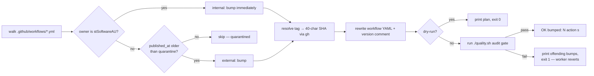

## Summary
Adds `bump-deps.sh` to refresh GitHub Action commit SHAs in `.github/workflows/*.yml`, with quarantine for external actions and `./quality.sh` as the audit gate. Closes #94.

The script walks every `uses: <owner>/<repo>@<sha>` line, classifies each action as **internal** (`stSoftwareAU/*` — bump immediately) or **external** (everything else — only bump to releases older than `VIBE_BUMP_QUARANTINE_HOURS`, default 24h). Tags are resolved to 40-char commit SHAs via `gh api`, the workflow files are rewritten in lock-step with their `# vX.Y.Z` trailing comments, and `./quality.sh` is run as the audit gate. Any audit failure prints the offending bump diff and exits non-zero so the worker can revert per VibeCoding#1613.

## Evidence
This is a CLI/shell change with no UI surface to screenshot.

### Tests
`tests/test-bump-deps.sh` covers all five required scenarios plus three extras (existence/exec, `--help`, shellcheck, live-repo smoke):

```
Testing Issue #94: bump-deps.sh
===============================

  PASS: bump-deps.sh exists at repo root and is executable
  PASS: --help prints a usage block mentioning --dry-run and quarantine
  PASS: bump-deps.sh passes shellcheck
  PASS: Happy path: --dry-run reports planned bump and does not write
  PASS: Quarantine: a 1h-old release is skipped under 24h quarantine
  PASS: No-op: pinned SHA matches latest in-quarantine release
  PASS: Audit gate failure: script exits non-zero and prints offending bump
  PASS: Internal: stSoftwareAU/* action bumps under quarantine
  PASS: Live workflow files parse cleanly under --dry-run

Results: 9 passed, 0 failed
```

### Live dry-run smoke
Run against the actual repo with the real `gh` CLI:

```
$ ./bump-deps.sh --dry-run
OK bumped: 8 action(s) [dry-run]
  actions/checkout: 34e1148... -> de0fac2... (v4.3.1 -> v6.0.2)
  actions/configure-pages: 1f0c5cd... -> 45bfe01... (v4.0.0 -> v6.0.0)
  actions/upload-pages-artifact: 56afc60... -> fc324d3... (v3.0.1 -> v5.0.0)
  actions/deploy-pages: d6db901... -> cd2ce8f... (v4.0.5 -> v5.0.0)
  ... (one entry per `uses:` line across the five workflows)
```

Quality gate: `./quality.sh` reports 38/38 passing.

### Flow


## Test Plan
- Added `tests/test-bump-deps.sh` with all five issue-mandated scenarios:
  - **Happy path** — `--dry-run` reports a planned bump and does not mutate the workflow file.
  - **Quarantine** — a 1h-old release is skipped under a 24h quarantine.
  - **No-op** — pinned SHA already matches latest in-quarantine release.
  - **Audit gate failure** — when the stubbed `quality.sh` exits non-zero, the script exits non-zero and prints the offending bump.
  - **Internal classification** — a `stSoftwareAU/*` action with a 1h-old release bumps despite the 24h quarantine.
- Test isolation: each scenario builds a temp sandbox with a fake `gh` (reading fixtures keyed by API path) and a fake `quality.sh` whose exit code is controlled by `$FAKE_QUALITY_EXIT` — no real network calls.
- Confirmed `./quality.sh` passes 38/38 with the new test in place.
- Confirmed `shellcheck -x bump-deps.sh` is clean.
- Confirmed `./bump-deps.sh --help` prints a usage block.
- Confirmed `./bump-deps.sh --dry-run` against the real repo exits 0.
