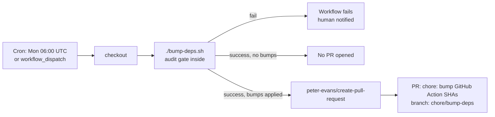

## Summary

Adds `.github/workflows/bump-deps.yml` so `bump-deps.sh` (issue #94) runs
weekly and on demand, opens a PR with any GitHub Action SHA bumps via
`peter-evans/create-pull-request`, and keeps GRQ-health on top of upstream
action releases without manual chasing. Closes #95.

The workflow follows the supply-chain policy from issue #93: the only two
third-party `uses:` references (`actions/checkout` and
`peter-evans/create-pull-request`) are pinned to 40-char commit SHAs with
trailing `# vX.Y.Z` comments. It does not run on `pull_request` so the PR
it opens cannot re-trigger it.

## Evidence

This is a CI-config change with no UI surface; evidence is the new test
that exercises the workflow file and the green `quality.sh` run:

```
$ ./quality.sh < /dev/null
...
Total tests: 39
Passed: 39
Failed: 0
QUALITY CHECK PASSED
```

The new `tests/test-bump-deps-workflow.sh` checks 14 properties of
`bump-deps.yml`: existence, valid YAML, the Monday-06:00-UTC cron,
`workflow_dispatch`, absence of `pull_request`, the exact
`contents: write` + `pull-requests: write` permissions, every `uses:`
SHA-pinned with a `# vX.Y.Z` comment, the call to `./bump-deps.sh`, the
`peter-evans/create-pull-request` step with branch `chore/bump-deps`,
title `chore: bump GitHub Action SHAs`, `delete-branch: true`, the body
link back to #88, and that `bump-deps.sh`'s exit code is not swallowed
(`continue-on-error` / `|| true`).



## Test Plan

- Added `tests/test-bump-deps-workflow.sh` covering the 14 acceptance
  criteria for the workflow file (triggers, permissions, SHA pinning,
  PR options, audit-gate exit-code handling).
- All 39 existing `quality.sh` tests still pass alongside the new one.
