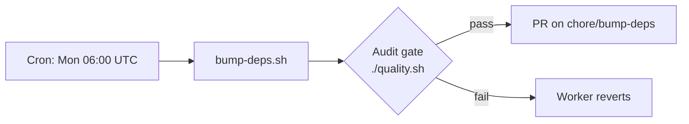

## Summary

Documented the auto-bump dependency workflow in `README.md` so future
contributors and operators understand the SHA-pinning convention,
`bump-deps.sh`, the scheduled workflow, the quarantine policy, the audit
gate, and reviewer responsibilities. Closes #96.

## Evidence

CLI/documentation change — no UI to screenshot. The new section was
verified by a TDD test (`tests/test-readme-bump-deps.sh`) that asserts
each behavioural point is present in the README. Quality gate output:

```
Total tests: 40
Passed: 40
Failed: 0
QUALITY CHECK PASSED
```

The new section embeds a Mermaid flow diagram so reviewers can see the
end-to-end pipeline at a glance:



## Test Plan

- Added `tests/test-readme-bump-deps.sh` — 11 assertions covering:
  - `## Dependency Maintenance` heading present
  - SHA pinning convention described (40-char SHAs)
  - Example pinned `uses:` line with `# vX.Y.Z` comment
  - `bump-deps.sh` documented with `--dry-run`, `--quarantine-hours`,
    `--help` flags
  - Local-usage example `./bump-deps.sh --dry-run` shown
  - Schedule documented (Mondays 06:00 UTC)
  - PR branch `chore/bump-deps` and `workflow_dispatch` referenced
  - Quarantine policy (`VIBE_BUMP_QUARANTINE_HOURS=24`,
    `stSoftwareAU/*` exemption) covered
  - Audit gate (`./quality.sh`) documented
  - Reviewer responsibilities listed
  - Australian English spelling enforced for the new section
- All 40 tests in `./quality.sh` pass.
